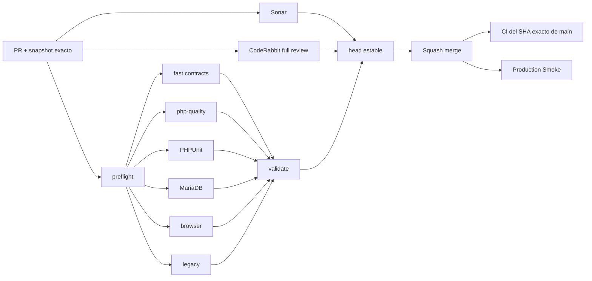

# GrindFlow — Último deploy

  
  
  

> **Development dashboard** · snapshot profesional de **solo el deploy actual**. CI, deploy y validacion en produccion son evidencias distintas.

## Estado del deploy

| Señal | Estado actual | Evidencia |
| --- | --- | --- |
| Work line | 🟢 **GF-FR-003 · ffprobe metadata** | VALIDATED IN PRODUCTION · CI #235 · Smoke #32 |
| Base exacta | ✅ **main** | `7fa8d350a1e2c53e848f06f01c741002c6735d9c` |
| Produccion actual | ✅ **smoke verde** | Production Smoke #32 sobre el SHA exacto |
| Migraciones | ✅ **0 pendientes** | no hay cambios de schema en este slice |
| Feature gate | 🔒 **off por defecto** | `MEDIA_FFPROBE_ENABLED=false` |

## Huella del cambio

<!-- grindflow:git-delta -->

| Archivos | Inserciones | Eliminaciones | Neto |
| ---: | ---: | ---: | ---: |
| **1** | **+__ADD__** | **−__DEL__** | **__NET__** |

La huella se calcula con `git diff --numstat`; CI rechaza este dashboard si queda desactualizado.

## Calidad y entrega

<!-- grindflow:gate-plan -->

| Control | Estado / contrato |
| --- | --- |
| Gates seleccionados | **preflight · fast[contracts]** |
| GrindFlow CI | `validate` exige success real para cada gate seleccionado |
| Sonar | análisis independiente + comentario estable de detalles del PR |
| CodeRabbit | full review sobre el head estable |
| Exact-main | CI vuelve a validar el SHA exacto despues del squash merge |
| Produccion | ffprobe no se habilita automaticamente aunque el codigo se despliegue |

## Flujo de entrega

## Qué se hizo

- Porta el slice útil del PR #59 sobre la arquitectura actual de GF-FR-003.
- Separa el procesamiento por version: v2 sin ffprobe y v3 con ffprobe, manteniendo idempotencia determinista.
- Añade `FfprobeMediaInspector` detrás de un feature gate apagado por defecto.
- Copia el objeto a un temporal, hace `fflush` y ejecuta `ffprobe` con timeout acotado.
- Limita `ffprobe` con `-show_entries` y persiste solo metadata técnica allowlisted: duración, formato, streams, codecs, resolución y audio básico.
- Rechaza JSON sin secciones `streams`/`format` y entries malformadas; descarta tags arbitrarios y no persiste stderr ni payloads crudos.
- El feature flag usa parsing fail-closed; fallo, salida inválida y timeout se mapean a códigos seguros y acotados.
- Añade cobertura del inspector, incluido un fallo con stderr sensible que no se propaga.

## Archivos modificados en este deploy

- `.env.example` — feature gate, binario y timeout de ffprobe.
- `README.md` — snapshot exacto del slice actual.
- `app/Jobs/ProcessMediaAsset.php` — ejecuta exactamente la version de procesador encolada.
- `app/Services/Media/FfprobeMediaInspector.php` — inspección técnica normalizada y validación estricta.
- `app/Services/Media/MediaAssetProcessor.php` — v2 sin ffprobe y v3 con ffprobe.
- `app/Services/Media/MediaProcessingCoordinator.php` — selecciona version por modo y separa idempotencia/reintentos.
- `app/Services/Media/MediaProcessingException.php` — errores seguros del probe/version.
- `config/grindflow.php` — configuración ffprobe fail-closed.
- `docs/REQUIREMENTS.md` — verificación actualizada de GF-FR-003.
- `tests/Feature/FfprobeMediaInspectorTest.php` — normalización, malformed entries y fallos seguros.
- `tests/Feature/MediaProcessingJobTest.php` — idempotencia y transición v2 → v3.
- `tests/secrets.test.ts` — manipulación AES-GCM determinista para eliminar un flake Base64URL.

## Validación

- Estado actual: **VALIDATED IN PRODUCTION** sobre `main` `7fa8d350a1e2c53e848f06f01c741002c6735d9c`.
- GrindFlow CI #235 pasó preflight, fast, PHP quality, PHPUnit, MariaDB, browser, legacy y validate sobre el SHA exacto de `main`.
- SonarQube Cloud: Quality Gate OK, 0 issues y 0 Security Hotspots en #62.
- Las pruebas usan Laravel Process fakes y bloquean procesos no simulados.
- Production Smoke #32 pasó después del merge; ffprobe permanece deshabilitado por defecto y no requiere binario real para este deploy.

## Qué sigue

| Lane | Trabajo |
| --- | --- |
| **NOW** | Sincronizar este dashboard con el deploy validado y arrancar derivados FFmpeg en una rama separada. |
| **NEXT** | Implementar thumbnails/previews deterministas detrás del contrato de procesamiento existente. |
| **BLOCKED / EXTERNAL** | Object storage S3-compatible sigue sin configurar; disponibilidad real de ffprobe en hosting aun no esta validada. |
| **LATER** | Derivados FFmpeg detrás del mismo contrato y luego continuar P2. |

## Panorama general pendiente

| Lane | Frente | Estado |
| --- | --- | --- |
| **NOW** | Media processing | v2 disabled + v3 ffprobe VALIDATED IN PRODUCTION con gate apagado |
| **NEXT** | Derivados | thumbnails/previews/normalización con FFmpeg |
| **NEXT** | Media Vault producción | Quick Upload disponible; Direct Upload espera object storage |
| **BLOCKED / EXTERNAL** | Hosting / storage | ffprobe real y S3-compatible requieren configuración externa |
| **LATER** | Operacion | queues, scheduler, retries y backups |
| **LATER** | Legacy retirement | solo tras GF-MIG-003 / GF-MIG-004 |
| **LATER** | Producto P2 | distribución, atribución y finanzas |
