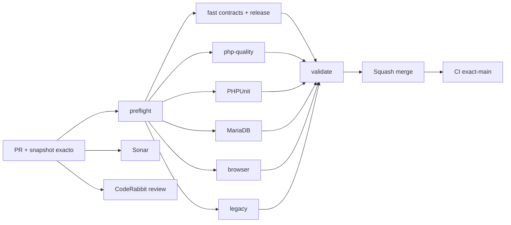

# GrindFlow — Último deploy

  
  
  

> **Snapshot PR v0.1.14: solo el deploy actual es la foto de entrega, no el roadmap historico.** Base `main` v0.1.13 `1dca023d2bda7f75e6be1483b6b873d841bdf185`: exact-main CI #35459345034 y Production Smoke #35459345054 exitosos. SHA del checkout Hostinger no verificado independientemente.

## Progress convention
- ✅ ~~Completado~~ = concluido y verificado por las compuertas aplicables.
- 🚧 Pendiente = por hacer o en curso, sin tachado.

## Estado del deploy
| Señal | Estado | Evidencia |
| --- | --- | --- |
| Work line | 🚧 **GF-FR-004E · Busqueda de opciones de Scheduler** | [Roadmap #88](https://github.com/drpipe1098-commits/GrindFlow/issues/88) |
| Base exacta | ✅ **v0.1.13 · PR #103 fusionado** | `1dca023d2bda7f75e6be1483b6b873d841bdf185` |
| Version | 🚧 **v0.1.14** | seleccionar assets y links mas alla de 100 |
| CI del PR | 🚧 **pendiente** | verificar head estable |
| Sonar | 🚧 **pendiente** | Quality Gate |
| CodeRabbit | 🚧 **pendiente** | review final |
| CI del SHA exacto de main | ✅ **v0.1.13 validado** | #35459345034 |
| Production Smoke | ✅ **v0.1.13 observado** | #35459345054 read-only |
| Deploy v0.1.14 | 🚧 **no confirmado** | Smoke tras fusion |
| Migraciones | ✅ **sin SQL nuevo** | media y links existentes |

## Huella del cambio
<!-- grindflow:git-delta -->
| Archivos | Inserciones | Eliminaciones | Neto |
| ---: | ---: | ---: | ---: |
| **8** | **+637** | **−74** | **+563** |

## Calidad y entrega
<!-- grindflow:gate-plan -->
| Control | Estado / contrato |
| --- | --- |
| Gates seleccionados | **preflight · fast[contracts] · php-quality · PHPUnit · browser** |
| Scheduling | Busqueda de assets elegibles por filename/UUID exacto |
| Traffic | Busqueda de links activos por label/campaign/token exacto |
| Picker | Max 100 opciones por busqueda, conteo total y aviso claro |
| Retention | old() valido y links activos ya asignados aunque esten fuera de ventana |
| Seguridad | tenant/rol, disabled no asignable, POST revalida en manager |
| Calendar | total real, calendario paginado y filtros de busqueda sincronizados |

## Flujo de entrega

## Qué se hizo
- El Scheduler deja de bloquear media y enlaces que caen fuera de los primeros 100 del selector: se pueden buscar por nombre, campana, UUID de asset y token del link.
- Muestra numero real de assets elegibles y resultados coincidentes, aunque solo se carguen 100 opciones por busqueda para mantener la pagina responsiva.
- Preserva un asset/link validamente seleccionado en old() tras validacion y los links activos de publicaciones visibles aunque la busqueda sea diferente; no muestra IDs extranjeros o links disabled como asignables.
- Busquedas y filtros de calendario coexisten sin perderlos al pasar a la siguiente pagina, con conteo de schedules total y no solo las filas visibles.
- 3 pruebas feature: >100 media + links con tenant ajeno, post real de programacion de opciones profundas, vieja seleccion, link disabled, convivencia con paginacion y falta de schema.
- Sin cambios de modelo SQL, acciones a proveedores ni migraciones.

## Archivos modificados en este deploy
- `AGENTS.md` — reglas de busqueda tenant-safe en selectores.
- `README.md` — snapshot exacto v0.1.14.
- `app/Http/Controllers/Scheduling/SchedulerController.php` — GET busca y conserva selecciones autorizadas.
- `config/version.php` — version humana 0.1.14.
- `docs/GRINDFLOW-SPEC.md` — contrato de selector buscable.
- `docs/REQUIREMENTS.md` — GF-FR-004E.
- `resources/views/scheduling/index.blade.php` — formulario buscar, avisos y KPI real.
- `tests/Feature/SchedulerPickerSearchTest.php` — pruebas de >100 y seguridad.

## Validación
- Base v0.1.13: CI #35459345034 y Production Smoke #35459345054 exitosos.
- v0.1.14: CI/Sonar/CodeRabbit pendientes; exact-main/Smoke tras merge.
- Production Smoke es read-only, no crea publicaciones ni prueba el POST nuevo en Hostinger.

## Qué sigue
| Lane | Trabajo |
| --- | --- |
| **NOW** | 🚧 Entregar GF-FR-004E picker buscable v0.1.14. [Roadmap #88](https://github.com/drpipe1098-commits/GrindFlow/issues/88). |
| **NEXT** | 🚧 Media Storage/CORS/FFmpeg runtime #40. |
| **LATER** | 🚧 Mejorar cobertura browser del flujo Scheduler y busqueda de destinos. |
| **BLOCKED / EXTERNAL** | 🚧 Marcador SHA exacto Hostinger. |

## Panorama general pendiente
| Lane | Frente | Estado |
| --- | --- | --- |
| **DONE** | ✅ ~~Traffic link edit + full pagination~~ | ✅ ~~v0.1.13 CI+Smoke~~ |
| **NOW** | 🚧 Scheduler buscar opciones en inventario grande | 🚧 v0.1.14 |
| **NEXT** | 🚧 Media Storage/FFmpeg | 🚧 #40 |
| **LATER** | 🚧 Browser E2E Scheduler/Distribution | 🚧 roadmap #88 |
| **BLOCKED / EXTERNAL** | 🚧 Git SHA Hostinger | 🚧 observabilidad |
