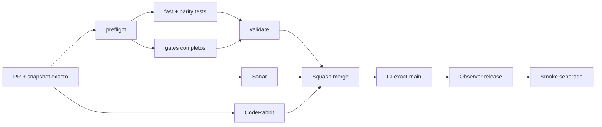

# GrindFlow — Último deploy

> **Candidato v0.1.100: diagnóstico seguro del fallo de login E2E en Production Smoke.** Base exacta `main` v0.1.99 `11ed123a3dbe163ae7c1a346aebba317fe25e654`; clasifica señales ya registradas sin repetir autenticación ni publicar datos de la sesión.

## Progress convention
- ✅ ~~Completado~~ = verificado; 🚧 Pendiente = en curso; ⛔ bloqueado = dependencia externa.

## Fuentes de verdad
[AGENTS.md](AGENTS.md) · [Spec](docs/GRINDFLOW-SPEC.md) · [Requisitos](docs/REQUIREMENTS.md) · [Transición](docs/STACK-TRANSITION-SYMFONY.md) · [Roadmap #2](https://github.com/pl0n3r/GrindFlow/issues/2)

## Estado del deploy
| Señal | Estado | Evidencia |
| --- | --- | --- |
| Version objetivo | 🚧 **v0.1.100** | `config/version.php`; no publicada |
| Base exacta | ✅ ~~main v0.1.99~~ | `11ed123a3dbe163ae7c1a346aebba317fe25e654` |
| CI del PR | 🚧 Pendiente | Revalidar HEAD final |
| Sonar del PR | 🚧 Pendiente | Revalidar HEAD final |
| CodeRabbit del PR | 🚧 Pendiente | Revalidar HEAD final |
| CI del SHA exacto de main | 🚧 v0.1.99 en ejecución | Production Smoke independiente, no validado |
| Deploy Observer | 🚧 Pendiente | No inferir checkout remoto |
| Production Smoke | ⛔ Login E2E no validado | #73 sigue independiente |
| Symfony en Hostinger | ⛔ NO desplegado | Sin cutover |
| Datos productivos | ✅ ~~No tocados~~ | Clasificador offline + pruebas sintéticas; sin peticiones ni credenciales |

## Huella del cambio
<!-- grindflow:git-delta -->
| Archivos | Inserciones | Eliminaciones | Neto |
| ---: | ---: | ---: | ---: |
| **7** | **+517** | **−29** | **+488** |

## Calidad y entrega
<!-- grindflow:gate-plan -->
| Control | Estado / contrato |
| --- | --- |
| Gates seleccionados | **preflight · fast[operational contracts + automation syntax + README dashboard] · php-quality · PHPUnit · MariaDB · browser · real-stack · legacy · symfony-preview** |
| Gate agregador obligatorio | **validate**: todos los seleccionados; Sonar y CodeRabbit aparte |
| Alcance | Issue #73: resumen seguro de login E2E en Production Smoke |
| Revisiones | CI/Sonar/CodeRabbit HEAD; exact-main, Observer y Smoke separados |

## Flujo de entrega

## Qué se hizo
- Nuevo `scripts/production-smoke-auth-triage.py`: clasifica exclusivamente señales de login que el smoke ya emitió. No hace solicitudes ni repite el POST.
- Distingue sesión/CSRF inconsistente antes del POST, login rechazado con recheck estable/cambiado/no disponible, redirección del dashboard y HTTP de autenticación.
- El clasificador mantiene un vocabulario cerrado y nunca imprime HTML remoto, cookies, tokens, credenciales, mensajes libres ni redirects externos.
- La entrada está limitada a 1.000.000 bytes UTF-8; señales contradictorias o no permitidas fallan cerrado sin reproducir el log.
- El workflow `production-smoke.yml` agrega al issue automático solo la salida `--markdown` del clasificador; si falla, publica una frase fija sin suprimir el error del smoke.
- Nueva suite `tests/test_production_smoke_auth_triage.py` con casos de rechazo, recheck, redacción y límites; el gate `fast` la ejecuta con datos sintéticos.
- `docs/PRODUCTION-SMOKE-AUTH-TRIAGE.md` define cada diagnóstico y sus límites: ningún resultado confirma contraseña, cuenta ni rate-limit.
- No se cambia el login de Laravel, usuarios, secretos, Hostinger, MariaDB productiva ni estado del issue #73 antes de un smoke satisfactorio.

## Archivos modificados en esta entrega candidata
Inventario de solo esta entrega candidata: no constituye evidencia de publicación:
<!-- grindflow:changed-files -->
- `.github/workflows/grindflow-ci.yml`
- `.github/workflows/production-smoke.yml`
- `README.md`
- `config/version.php`
- `docs/PRODUCTION-SMOKE-AUTH-TRIAGE.md`
- `scripts/production-smoke-auth-triage.py`
- `tests/test_production_smoke_auth_triage.py`

## Validación
- El candidato debe pasar `validate`, Sonar y full review CodeRabbit sobre el mismo HEAD.
- Por tocar el workflow principal, CI ejecuta el scope completo, incluido `symfony-preview`.
- Probar el clasificador con un log sintético; las salidas solo pueden contener etiquetas/frases predeterminadas.
- El resumen no demuestra que el smoke productivo funcione, ni causa de rechazo de login, ni SHA remoto.
- CI, Production Smoke, Observer y validación productiva siguen siendo señales separadas.

## Qué sigue
[Roadmap canónico #2](https://github.com/pl0n3r/GrindFlow/issues/2)

| Lane | Trabajo | Estado |
| --- | --- | --- |
| **NOW** | 🚧 Diagnóstico seguro de login E2E | 🚧 v0.1.100 candidata |
| **NEXT** | 🚧 Configuración autorizada de cuenta E2E y smoke productivo | 🚧 #73 |
| **LATER** | 🚧 Conmutación Symfony por módulo | 🚧 Sin deploy |
| **BLOCKED / EXTERNAL** | ⛔ Resolver login E2E productivo | ⛔ #73 |

## Panorama general pendiente
| Lane | Frente | Estado |
| --- | --- | --- |
| **DONE** | ✅ ~~v0.1.99 fusionada~~ | ✅ ~~cadena offline single-writer~~ |
| **NOW** | 🚧 Redacted smoke auth triage | 🚧 v0.1.100 |
| **NEXT** | 🚧 Evidencia revisada fuera de banda + autorización separada | 🚧 GF-ARCH-002 sin cutover |
| **LATER** | 🚧 Symfony en Hostinger | 🚧 No desplegado |
| **BLOCKED / EXTERNAL** | ⛔ Smoke autenticado Laravel | ⛔ #73 |
