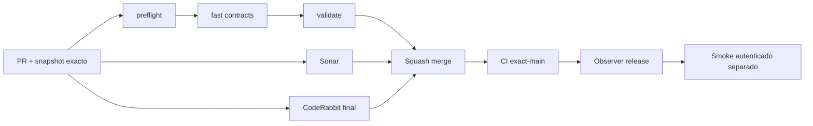

# GrindFlow — Último deploy

> **Candidato v0.1.83: privacidad del throttle del login y regresión de sesión anónima.** Base exacta `main` v0.1.82 `e41cb3245286d407b7e2967fb7ef4f810fcd1e40`; sin migraciones, edición de cuentas ni secretos productivos.

## Progress convention
- ✅ ~~Completado~~ = verificado; 🚧 Pendiente = en curso; ⛔ bloqueado = dependencia externa.

## Fuentes de verdad
[AGENTS.md](AGENTS.md) · [Spec](docs/GRINDFLOW-SPEC.md) · [Requisitos](docs/REQUIREMENTS.md) · [Transición](docs/STACK-TRANSITION-SYMFONY.md) · [Roadmap #2](https://github.com/pl0n3r/GrindFlow/issues/2)

## Estado del deploy
| Señal | Estado | Evidencia |
| --- | --- | --- |
| Version objetivo | 🚧 **v0.1.83** | `config/version.php` |
| Base exacta | ✅ ~~main v0.1.82~~ | `e41cb3245286d407b7e2967fb7ef4f810fcd1e40` |
| CI del PR / Sonar / CodeRabbit | 🚧 Candidato sin validar | Comprobar en HEAD final, no heredar checks anteriores |
| CI del SHA exacto de main | ✅ ~~v0.1.82 success~~ | run `35688491389` |
| Deploy Observer | ✅ ~~v0.1.82 observado~~ | run `35688491348`, release humano, NO SHA Hostinger |
| Production Smoke | ⛔ Fallo autenticado | run `35688491347`, [incidente #73](https://github.com/pl0n3r/GrindFlow/issues/73) |
| Symfony en Hostinger | ⛔ NO desplegado | CI aislado |
| Migraciones | ✅ ~~Sin cambios de esquema~~ | Producción intacta |

## Huella del cambio
<!-- grindflow:git-delta -->
| Archivos | Inserciones | Eliminaciones | Neto |
| ---: | ---: | ---: | ---: |
| **4** | **+0** | **−0** | **+0** |

## Calidad y entrega
<!-- grindflow:gate-plan -->
| Control | Estado / contrato |
| --- | --- |
| Gates seleccionados | **preflight · fast[contracts] · php-quality · PHPUnit · browser · real-stack** |
| Gate agregador obligatorio | **validate**: exige éxito de cada job seleccionado; Sonar y CodeRabbit se revisan aparte |
| Alcance | Hash HMAC de identificador del throttle y contrato HTTP GET×2 → POST válido |
| Revisiones | PR HEAD final, squash, CI exact-main y observación productiva separadas |

## Flujo de entrega

## Qué se hizo
- La clave de limitación de intentos conserva la combinación de email normalizado e IP, pero los datos dejan de aparecer en claro en nombres de claves de caché: HMAC-SHA256 con la clave de aplicación y prefijo `login:`. No cambia el mensaje de validación ni el límite de cinco intentos.
- Un test de regresión crea una cuenta **sintética descartable**, solicita dos veces el formulario de login en la misma sesión, compara el CSRF y verifica un único POST correcto; el test de lockout verifica cinco intentos en la clave privada y ningún contador en la clave legible.
- Las pruebas no usan el usuario E2E productivo ni modifican cuentas/contraseñas del hosting. El cambio de formato deja de consultar contadores temporales previos a esta versión; no resolverá por sí solo el bloqueo de [#73](https://github.com/pl0n3r/GrindFlow/issues/73).

## Archivos modificados en este deploy
Inventario del candidato v0.1.83, no prueba de publicación; solo el deploy actual.
- `README.md`
- `app/Http/Requests/Auth/LoginRequest.php`
- `config/version.php`
- `tests/Feature/AuthenticationTest.php`

## Validación
- Las suites de PHPUnit, browser/real-stack, PHP quality, Sonar y revisión completa CodeRabbit deben comprobarse en el HEAD de este PR. No atribuir el CI verde de v0.1.82 a los cambios aún candidatos.
- Production Smoke es un control independiente y sigue bloqueado hasta demostrar una sesión E2E real de solo lectura. No reintentar credenciales a ciegas.

## Qué sigue
[Roadmap canónico #2](https://github.com/pl0n3r/GrindFlow/issues/2)

| Lane | Trabajo | Estado |
| --- | --- | --- |
| **NOW** | 🚧 Login privado y test de sesión v0.1.83 | 🚧 Revisiones de PR |
| **NEXT** | 🚧 Diagnóstico seguro de auth #73 | 🚧 Causa exacta sin acreditar |
| **LATER** | 🚧 Paridad de seguridad y operación del runtime Symfony | 🚧 Sin cutover |
| **BLOCKED / EXTERNAL** | ⛔ Smoke autenticado #73 | ⛔ Verificación externa de cuenta/configuración |

## Panorama general pendiente
| Lane | Frente | Estado |
| --- | --- | --- |
| **DONE** | ✅ ~~v0.1.82 fusionada en main~~ | ✅ ~~CI exact-main success; Observer vio release humano~~ |
| **NOW** | 🚧 Protección del throttle y regresión E2E | 🚧 Candidato v0.1.83 |
| **NEXT** | 🚧 Aislar causa de login E2E | 🚧 Sin modificar cuentas |
| **LATER** | 🚧 Integración Symfony portable | 🚧 Sin cutover |
| **BLOCKED / EXTERNAL** | ⛔ Smoke autenticado | ⛔ Symfony no desplegado |
