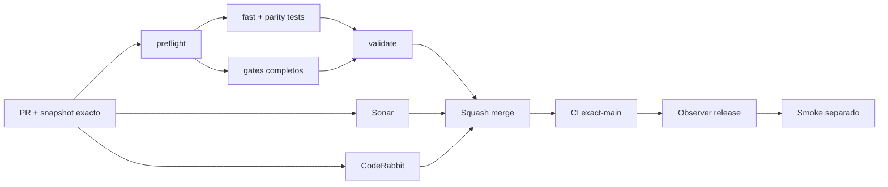

# GrindFlow — Último deploy

> **Candidato v0.1.92: restore drill destructivo y reversible sobre MariaDB + Vault descartables.** Base exacta `main` v0.1.91 `d5e6acfc1ba77e0bef794b3a90b0d556c089fb39`; destruye y restaura únicamente la base CI `grindflow_symfony_ci` y blobs sintéticos temporales.

## Progress convention
- ✅ ~~Completado~~ = verificado; 🚧 Pendiente = en curso; ⛔ bloqueado = dependencia externa.

## Fuentes de verdad
[AGENTS.md](AGENTS.md) · [Spec](docs/GRINDFLOW-SPEC.md) · [Requisitos](docs/REQUIREMENTS.md) · [Transición](docs/STACK-TRANSITION-SYMFONY.md) · [Roadmap #2](https://github.com/pl0n3r/GrindFlow/issues/2)

## Estado del deploy
| Señal | Estado | Evidencia |
| --- | --- | --- |
| Version objetivo | 🚧 **v0.1.92** | `config/version.php`; no publicada |
| Base exacta | ✅ ~~main v0.1.91~~ | `d5e6acfc1ba77e0bef794b3a90b0d556c089fb39` |
| CI / Sonar / CodeRabbit del PR | 🚧 Pendiente | Revalidar HEAD final |
| CI del SHA exacto de main | 🚧 No observado para v0.1.91 | Señal post-merge separada |
| Deploy Observer | 🚧 Pendiente | No inferir checkout remoto |
| Production Smoke | ⛔ Login E2E no validado | #73 sigue independiente |
| Symfony en Hostinger | ⛔ NO desplegado | Sin cutover |
| Datos productivos | ✅ ~~No tocados~~ | Restore drill limitado por guardas a CI descartable |

## Huella del cambio
<!-- grindflow:git-delta -->
| Archivos | Inserciones | Eliminaciones | Neto |
| ---: | ---: | ---: | ---: |
| **8** | **+251** | **−30** | **+221** |

## Calidad y entrega
<!-- grindflow:gate-plan -->
| Control | Estado / contrato |
| --- | --- |
| Gates seleccionados | **preflight · fast[contracts] · php-quality · PHPUnit · MariaDB · browser · real-stack · legacy · symfony-preview** |
| Gate agregador obligatorio | **validate**: todos los seleccionados; Sonar y CodeRabbit aparte |
| Alcance | Backup/restore real de MariaDB CI + stage/restore de Vault sintético |
| Revisiones | CI/Sonar/CodeRabbit HEAD; exact-main, Observer y Smoke separados |

## Flujo de entrega

## Qué se hizo
- Nuevo `scripts/symfony-disposable-restore-drill.sh`: ensaya backup, destrucción y restauración de MariaDB + blobs sobre infraestructura sintética.
- Las guardas exigen `GF_RESTORE_DRILL_APPROVED=1`, `APP_ENV=test`, `CI=true`, host loopback, puerto 3306 y base exacta `grindflow_symfony_ci`.
- El drill crea una fixture mínima, audita el Vault, prepara un stage privado, genera dump completo con triggers, elimina DB/originales y restaura ambos lados.
- Tras restaurar exige `vault:verify-restore`, `doctrine:schema:validate`, paridad estructural y snapshot pre/post idéntico.
- El dump/stage viven en temporales privados y se destruyen al finalizar; no se publican como artefactos ni aceptan Hostinger/remotos.
- Nuevo contrato shell prueba rechazo sin opt-in, entorno no-test, ejecución fuera de CI, host remoto y nombre de DB distinto.
- `ci-scope.sh` selecciona obligatoriamente `symfony-preview` si cambia cualquiera de los scripts del restore drill.
- La prueba corre antes de iniciar el preview HTTP, sobre la MariaDB de servicio descartable de GitHub Actions.

## Archivos modificados en este deploy
Inventario de solo el deploy actual: candidato, no evidencia de publicación:
<!-- grindflow:changed-files -->
- `.github/workflows/grindflow-ci.yml`
- `README.md`
- `config/version.php`
- `docs/DATA-CUTOVER-INVENTORY.md`
- `scripts/ci-scope-contract.sh`
- `scripts/ci-scope.sh`
- `scripts/symfony-disposable-restore-drill-contract.sh`
- `scripts/symfony-disposable-restore-drill.sh`

## Validación
- La rama debe pasar la matriz completa seleccionada por el cambio del workflow, `validate`, Sonar y revisión final CodeRabbit sobre el mismo HEAD.
- El restore drill se ejecuta **solo sobre MariaDB/Vault descartables de CI** y usa datos sintéticos. No acredita backup productivo, RPO/RTO, secretos/configuración restaurados ni SHA Hostinger.
- Ningún dump, stage o snapshot real se incluye en el repositorio por esta entrega.

## Qué sigue
[Roadmap canónico #2](https://github.com/pl0n3r/GrindFlow/issues/2)

| Lane | Trabajo | Estado |
| --- | --- | --- |
| **NOW** | 🚧 Ensayar destrucción/restauración MariaDB + Vault en CI | 🚧 v0.1.92 candidata |
| **NEXT** | 🚧 Snapshot real autorizado + prueba cross-tenant restaurada | 🚧 GF-ARCH-002 |
| **LATER** | 🚧 Conmutación Symfony por módulo | 🚧 Sin deploy |
| **BLOCKED / EXTERNAL** | ⛔ Resolver login E2E productivo | ⛔ #73 |

## Panorama general pendiente
| Lane | Frente | Estado |
| --- | --- | --- |
| **DONE** | ✅ ~~v0.1.91 fusionada~~ | ✅ ~~captura metadata-only + paridad E2E~~ |
| **NOW** | 🚧 Disposable restore drill | 🚧 v0.1.92 |
| **NEXT** | 🚧 Captura real autorizada + aislamiento cross-tenant restaurado | 🚧 Sin cutover |
| **LATER** | 🚧 Symfony en Hostinger | 🚧 No desplegado |
| **BLOCKED / EXTERNAL** | ⛔ Smoke autenticado Laravel | ⛔ #73 |
