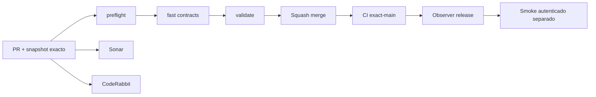

# GrindFlow — Último deploy

> **Candidato v0.1.68: slots semanales derivados en la vista previa S3.** El runtime productivo continúa siendo Laravel en Hostinger; Symfony sigue aislado. Base exacta `main` v0.1.67 `b869d0f6f063d8eed028dc6390a35b58e71789fb`, CI exact-main success (run 35604659763) y Observer success (run 35604659532). Los slots son cálculo de planificación, no publicaciones persistidas ni llamadas externas.

## Progress convention
- ✅ ~~Completado~~ = verificado; 🚧 Pendiente = en curso; ⛔ bloqueado = dependencia externa.

## Fuentes de verdad
[AGENTS.md](AGENTS.md) · [Spec](docs/GRINDFLOW-SPEC.md) · [Requisitos](docs/REQUIREMENTS.md) · [Transición](docs/STACK-TRANSITION-SYMFONY.md) · [Roadmap #2](https://github.com/pl0n3r/GrindFlow/issues/2)

## Estado del deploy
| Señal | Estado | Evidencia |
| --- | --- | --- |
| Version objetivo | 🚧 **v0.1.68** | `config/version.php` |
| Base exacta | ✅ ~~main v0.1.67~~ | `b869d0f6f063d8eed028dc6390a35b58e71789fb` |
| CI del PR | 🚧 Head v0.1.68 por validar | `GrindFlow CI / validate` |
| Sonar | 🚧 Pendiente | SonarCloud PR |
| CodeRabbit | 🚧 Pendiente | PR |
| CI del SHA exacto de main | ✅ ~~v0.1.67 success~~ | run `35604659763` |
| Deploy Observer | ✅ ~~v0.1.67 observado~~ | run `35604659532`; no prueba Symfony remoto ni SHA Hostinger |
| Production Smoke | ⛔ Credencial E2E productiva pendiente | [Issue #1](https://github.com/pl0n3r/GrindFlow/issues/1) |
| Symfony S3 en Hostinger | ⛔ NO desplegado | Solo entorno aislado CI |
| Migraciones | ✅ ~~Sin migración nueva en este candidato~~ | Producción intacta |

## Huella del cambio
<!-- grindflow:git-delta -->
| Archivos | Inserciones | Eliminaciones | Neto |
| ---: | ---: | ---: | ---: |
| **7** | **+131** | **−1** | **+130** |

## Calidad y entrega
<!-- grindflow:gate-plan -->
| Control | Estado / contrato |
| --- | --- |
| Gates seleccionados | **preflight · fast[contracts] · symfony-preview** |
| Alcance | S3: derivar y mostrar el próximo slot futuro por cada día configurado, con hora IANA y UTC |
| Revisiones | CI/Sonar/CodeRabbit, exact-main y Hostinger independientes |

## Flujo de entrega

## Qué se hizo
- El preview S3 deriva el próximo slot futuro de cada día configurado usando la zona IANA y hora local de la regla.
- Cada slot expone fecha/hora local, zona horaria, capacidad diaria y el instante UTC equivalente para planificación determinista.
- Los slots no se persisten ni reservan recursos: no son schedules, entregas ni permisos de publicación.
- El admin móvil muestra los próximos slots y conserva explícitos `review_only`, `can_publish=false` y los bloqueos de distribución.

## Archivos modificados en este deploy
Inventario de solo el deploy actual: cambio candidato en PR, NO prueba de deploy de Symfony en Hostinger.
- `README.md`
- `config/version.php`
- `docs/GRINDFLOW-SPEC.md`
- `symfony/src/Http/Controller/ContentRuleController.php`
- `symfony/frontend/admin/WeeklyPlannerPanel.tsx`
- `symfony/frontend/admin/admin.css`
- `symfony/tests/php/WeeklyRulePreviewTest.php`
- `symfony/tests/e2e/preview.spec.mjs`

## Validación
- CI/Sonar/CodeRabbit del candidato v0.1.68 por verificar; la base v0.1.67 está fusionada y su CI exact-main/Observer son success.
- Sin checkout local; GitHub Actions valida TypeScript/Vite, Symfony/MariaDB y Chromium móvil. Producción intacta.

## Qué sigue
[Roadmap canónico #2](https://github.com/pl0n3r/GrindFlow/issues/2)

| Lane | Trabajo | Estado |
| --- | --- | --- |
| **NOW** | 🚧 Validar slots semanales derivados v0.1.68 | 🚧 CI y revisión |
| **NEXT** | 🚧 Contrato explícito de autorización de distribución | 🚧 Sin publicación externa |
| **LATER** | 🚧 Scheduler Symfony + distribución autorizada + Traffic | 🚧 S3–S5 |
| **BLOCKED / EXTERNAL** | ⛔ Cutover sin paridad/datos migrados; Smoke sin credencial | ⛔ Dependencia externa |

## Panorama general pendiente
| Lane | Frente | Estado |
| --- | --- | --- |
| **DONE** | ✅ ~~Dashboard Laravel v0.1.30~~ | ✅ ~~Vault Symfony clasificación v0.1.63~~ |
| **NOW** | 🚧 Slots semanales derivados S3 v0.1.68 | 🚧 CI y revisión |
| **NEXT** | 🚧 Autorización explícita de distribución | 🚧 S3 |
| **LATER** | 🚧 Paridad del monolito modular | 🚧 S3–S5 |
| **BLOCKED / EXTERNAL** | ⛔ Sin cutover Symfony | ⛔ Sin credencial Smoke |
