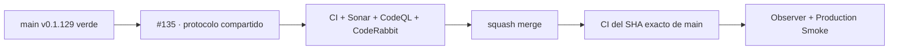

# GrindFlow — Último deploy

> **Candidato v0.1.130: precedencia segura del protocolo Factory.** Base productiva exacta
> `main d0bf0693ec16efff4baa1654fc38104732103654` / v0.1.129, validada con
> CI exact-main `36077101190`, Deploy Observer `36077101295` y Production Smoke
> `36077101214`. Este corte solo cambia gobierno documental, versión y snapshot.

## Progress convention
- ✅ ~~Completado~~ = verificado; 🚧 Pendiente = en curso; ⛔ bloqueado = dependencia externa.

## Fuentes de verdad
[AGENTS.md](AGENTS.md) · [Spec](docs/GRINDFLOW-SPEC.md) · [Requisitos](docs/REQUIREMENTS.md) · [Roadmap #2](https://github.com/pl0n3r/GrindFlow/issues/2)

## Estado del deploy
| Señal | Estado | Evidencia |
| --- | --- | --- |
| SHA exacto de main (base) | ✅ **d0bf0693ec16efff4baa1654fc38104732103654** | release base del candidato |
| Versión observada en producción (base) | ✅ **v0.1.129** | Production Smoke `36077101214` |
| CI del SHA exacto de main (base) | ✅ **success** | GrindFlow CI `36077101190` |
| Deploy Observer base | ✅ **success** | run `36077101295` |
| Production Smoke base | ✅ **success** | run `36077101214`; versión/SHA exactos |
| Version objetivo | 🚧 **v0.1.130** | `config/version.php` |
| CI/Sonar/CodeRabbit del PR | 🚧 pendiente | exigen HEAD final estable |
| Producción objetivo | 🚧 pendiente | solo tras merge, exact-main, observer y smoke |

## Huella del cambio
<!-- grindflow:git-delta -->
| Archivos | Inserciones | Eliminaciones | Neto |
| ---: | ---: | ---: | ---: |
| **3** | **+39** | **−34** | **+5** |

## Calidad y entrega
<!-- grindflow:gate-plan -->
| Control | Estado / contrato |
| --- | --- |
| Gates seleccionados | **preflight · fast[operational contracts + automation syntax + README dashboard]** |
| PR + snapshot exacto | **#135 · v0.1.130**; README y versión deben coincidir con el HEAD final |
| Gate agregador obligatorio | **validate**; privacy-as-code, Sonar, CodeQL y CodeRabbit conservan sus contratos vigentes |
| Alcance | precedencia segura entre PLAN-AGENTES compartido y reglas locales de GrindFlow |
| Rol del PR | **Gobernanza · Arquitectura · Seguridad · QA** |
| Revisiones | CI/Sonar/CodeQL/CodeRabbit terminales antes de merge |

## Flujo de entrega

## Qué se hizo
- AGENTS enlaza el protocolo común de Factory para coordinación, reservas, roles y gates compartidos.
- La precedencia queda acotada: arquitectura, seguridad, datos y producción siguen regidos por las autoridades locales de GrindFlow.
- No cambia runtime, dependencias, datos, secretos, permisos, migraciones ni configuración productiva.

## Archivos modificados en esta entrega candidata
<!-- grindflow:changed-files -->
- `AGENTS.md`
- `README.md`
- `config/version.php`

## Validación
- El README se valida contra el diff exacto y la versión comprometida.
- El finding previo de CodeRabbit queda resuelto al limitar explícitamente la precedencia del plan.
- Ningún CI verde se presentará como deploy hasta Observer + Production Smoke del SHA fusionado.

## Qué sigue
[Roadmap canónico #2](https://github.com/pl0n3r/GrindFlow/issues/2)

## Panorama general pendiente
| Lane | Frente | Estado |
| --- | --- | --- |
| **NOW** | 🚧 #135 · protocolo Factory seguro | 🚧 validación v0.1.130 |
| **NEXT** | 🚧 #129 · adopción Factory TANDA 2 | 🚧 decisiones como código + política reusable |
| **BLOCKED / EXTERNAL** | ⛔ #139 Dependabot + #146 media storage | ⛔ evidencia/configuración externa |
| **LATER** | 🚧 Roadmap #2 | 🚧 trabajo posterior gestionado allí |
