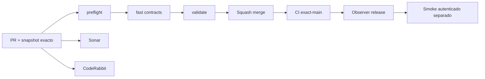

# GrindFlow — Último deploy

> **Snapshot v0.1.32: solo el deploy actual.** Base `main` v0.1.31 `1514e8084a6c87f1d4fcfeb2df369d2f8c500ad2`. La identidad S1 Symfony ahora rechaza en DB cambios de usuario u organización de una membresía, conservando el cambio de rol. **Laravel sigue siendo el runtime público; Symfony S1 es aislado y no tiene login habilitado.** CI ≠ Hostinger.

## Progress convention
- ✅ ~~Completado~~ = verificado; 🚧 Pendiente = en curso; ⛔ bloqueado = dependencia externa.

## Fuentes de verdad
[AGENTS.md](AGENTS.md) · [Spec](docs/GRINDFLOW-SPEC.md) · [Requisitos](docs/REQUIREMENTS.md) · [Transición](docs/STACK-TRANSITION-SYMFONY.md) · [Roadmap #2](https://github.com/pl0n3r/GrindFlow/issues/2)

## Estado del deploy
| Señal | Estado | Evidencia |
| --- | --- | --- |
| Versión objetivo | 🚧 **v0.1.32** | `config/version.php` |
| Base exacta | ✅ ~~main v0.1.31~~ | `1514e8084a6c87f1d4fcfeb2df369d2f8c500ad2` |
| CI del PR | 🚧 Head final pendiente | `GrindFlow CI / validate` |
| Sonar | 🚧 Pendiente | SonarCloud PR |
| CodeRabbit | 🚧 Pendiente | PR |
| CI del SHA exacto de main | 🚧 Después del merge | No inferir del PR |
| Deploy Observer | ⛔ Release remoto v0.1.32 no observado | Hostinger independiente |
| Production Smoke | ⛔ Credencial E2E de solo lectura ausente | [Issue #1](https://github.com/pl0n3r/GrindFlow/issues/1) |
| Producción v0.1.32 | ⛔ Sin verificar | CI ≠ deploy |
| Migraciones productivas | ✅ ~~Ninguna~~ | DB Symfony descartable solo CI |

## Huella del cambio
<!-- grindflow:git-delta -->
| Archivos | Inserciones | Eliminaciones | Neto |
| ---: | ---: | ---: | ---: |
| **6** | **+152** | **−38** | **+114** |

## Calidad y entrega
<!-- grindflow:gate-plan -->
| Control | Estado / contrato |
| --- | --- |
| Gates seleccionados | **preflight · fast[contracts] · php-quality · PHPUnit · MariaDB · browser · real-stack · legacy · symfony-preview** |
| Alcance | Trigger reversible en esquema de identidad Symfony, PHP test con dos tenants y CI de migración |
| Revisiones | CI/Sonar/CodeRabbit y exact-main independientes |

## Flujo de entrega

## Qué se hizo
- Migración adicional aislada impide actualizar `user_id` o `organization_id` de una membresía ya asignada; las FK y unicidad existentes siguen vigentes.
- Dos usuarios y dos organizaciones sintéticos validan ambos rechazos y que el rol sí puede cambiar. Rollback retira el trigger antes de las tablas y CI reaplica el esquema.
- Versión única **0.1.31 → 0.1.32** desde `config/version.php`; no se copian cuentas ni datos reales, ni se despliega Symfony en Hostinger.

## Archivos modificados en este deploy
- `.github/workflows/grindflow-ci.yml`
- `README.md`
- `config/version.php`
- `symfony/README.md`
- `symfony/migrations/Version20260920095500.php`
- `symfony/tests/php/IdentitySchemaTest.php`

## Validación
- CI de Symfony sobre MariaDB desechable, gate global y Sonar; CI exact-main y Hostinger son comprobaciones separadas.
- Sin login/admin, sin credenciales reales, sin mutaciones productivas.

## Qué sigue
| Lane | Trabajo |
| --- | --- |
| **NOW** | 🚧 Validar inmutabilidad S1 v0.1.32, [roadmap #2](https://github.com/pl0n3r/GrindFlow/issues/2) |
| **NEXT** | 🚧 Symfony Security con login/logout, CSRF, sesiones y selector tenant |
| **LATER** | 🚧 Vault móvil → reglas → distribución autorizada → piloto |
| **BLOCKED / EXTERNAL** | ⛔ Producción Symfony no desplegada; smoke autenticado sin credencial |

## Panorama general pendiente
| Lane | Frente | Estado |
| --- | --- | --- |
| **DONE** | ✅ ~~Home SaaS, dashboard Laravel~~ | ✅ ~~Tablas de identidad aisladas S1~~ |
| **NOW** | 🚧 Inmutabilidad de membresía Symfony | 🚧 CI / observación remota |
| **NEXT** | 🚧 Login Symfony y selector de organización | 🚧 S1 |
| **LATER** | 🚧 Automatización | 🚧 S2–S5 |
| **BLOCKED / EXTERNAL** | ⛔ Symfony no desplegado | ⛔ Smoke sin credencial |
