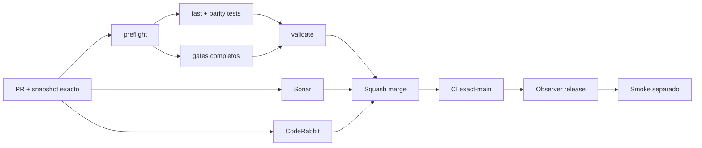

# GrindFlow — Último deploy

> **Candidato v0.1.96: contrato offline de ownership de escritura por módulo.** Base exacta `main` v0.1.95 `755fdc232067de67780b86cd3e74a2f0e7ba7561`; valida propuestas Laravel→Symfony contra las migraciones versionadas sin conectarse a MariaDB ni autorizar cutover.

## Progress convention
- ✅ ~~Completado~~ = verificado; 🚧 Pendiente = en curso; ⛔ bloqueado = dependencia externa.

## Fuentes de verdad
[AGENTS.md](AGENTS.md) · [Spec](docs/GRINDFLOW-SPEC.md) · [Requisitos](docs/REQUIREMENTS.md) · [Transición](docs/STACK-TRANSITION-SYMFONY.md) · [Roadmap #2](https://github.com/pl0n3r/GrindFlow/issues/2)

## Estado del deploy
| Señal | Estado | Evidencia |
| --- | --- | --- |
| Version objetivo | 🚧 **v0.1.96** | `config/version.php`; no publicada |
| Base exacta | ✅ ~~main v0.1.95~~ | `755fdc232067de67780b86cd3e74a2f0e7ba7561` |
| CI del PR | 🚧 Pendiente | Revalidar HEAD final |
| Sonar del PR | 🚧 Pendiente | Revalidar HEAD final |
| CodeRabbit del PR | 🚧 Pendiente | Revalidar HEAD final |
| CI del SHA exacto de main | 🚧 No observado para v0.1.95 | Señal post-merge separada |
| Deploy Observer | 🚧 Pendiente | No inferir checkout remoto |
| Production Smoke | ⛔ Login E2E no validado | #73 sigue independiente |
| Symfony en Hostinger | ⛔ NO desplegado | Sin cutover |
| Datos productivos | ✅ ~~No tocados~~ | Validación source-only; sin conexión a DB |

## Huella del cambio
<!-- grindflow:git-delta -->
| Archivos | Inserciones | Eliminaciones | Neto |
| ---: | ---: | ---: | ---: |
| **8** | **+730** | **−49** | **+681** |

## Calidad y entrega
<!-- grindflow:gate-plan -->
| Control | Estado / contrato |
| --- | --- |
| Gates seleccionados | **preflight · fast[operational contracts + automation syntax + README dashboard] · php-quality · PHPUnit · MariaDB · browser · real-stack · legacy · symfony-preview** |
| Gate agregador obligatorio | **validate**: todos los seleccionados; Sonar y CodeRabbit aparte |
| Alcance | GF-ARCH-002: inventario fuente + ownership offline identity/Vault |
| Revisiones | CI/Sonar/CodeRabbit HEAD; exact-main, Observer y Smoke separados |

## Flujo de entrega

## Qué se hizo
- Nuevo `scripts/cutover-ownership-plan.py`: valida propuestas de ownership Laravel→Symfony completamente offline.
- El contrato solo admite `planning_only`, `source_only=true`, `database_contacted=false` y `production_authorized=false`.
- Los primeros grupos revisados son `identity` y `vault`; no se inventan equivalencias para módulos sin mapeo explícito.
- Cada envelope se coteja de nuevo contra las migraciones del mismo checkout; inventarios fabricados o de otra revisión fallan cerrado.
- El reporte incluye SHA-256 canónico del inventario y enumera tablas fuera de la propuesta para evitar interpretar un cutover parcial como total.
- El catálogo completo rechaza tablas asignadas a más de un módulo y mapeos obsoletos que ya no existan en las migraciones.
- Los flags booleanos exigen tipo exacto; `0`/`1` no pueden suplantar `false`/`true`.
- La entrada está limitada a 1.000.000 de bytes reales, exige UTF-8 estricto y rechaza envelopes UTF-16/UTF-32; los errores nunca reproducen el payload.
- La regresión CLI instala una barrera de auditoría que falla si el proceso intenta abrir sockets o lanzar procesos externos.
- `data-schema-inventory.py --json` ahora emite un único documento JSON limpio para composición entre herramientas.
- La suite `tests/test_cutover_ownership_plan.py` cubre provenance, rollback, autorización, solapamientos, límites de entrada y round-trip de templates.
- `fast` ejecuta compilación y regresiones del nuevo contrato; el cambio del workflow fuerza validación completa del PR.
- No ejecuta SQL, migraciones, freezes, escrituras, cambios de owner ni operaciones en Hostinger.

## Archivos modificados en esta entrega candidata
Inventario de solo esta entrega candidata: no constituye evidencia de publicación:
<!-- grindflow:changed-files -->
- `.github/workflows/grindflow-ci.yml`
- `README.md`
- `config/version.php`
- `docs/DATA-CUTOVER-INVENTORY.md`
- `scripts/cutover-ownership-plan.py`
- `scripts/data-schema-inventory.py`
- `scripts/readme-dashboard.py`
- `tests/test_cutover_ownership_plan.py`

## Validación
- La rama debe pasar `validate`, Sonar y revisión final CodeRabbit sobre el mismo HEAD.
- Por modificar `.github/workflows/grindflow-ci.yml`, el scope es completo e incluye `symfony-preview`.
- Los ejemplos `--template identity` y `--template vault` deben hacer round-trip por `--json` manteniendo todas las precondiciones en `pending`.
- Un reporte válido sigue declarando `cutover_authorized=false`; no constituye autorización, deploy ni prueba de producción.
- Esta entrega no toca Hostinger, MariaDB productiva ni blobs reales.

## Qué sigue
[Roadmap canónico #2](https://github.com/pl0n3r/GrindFlow/issues/2)

| Lane | Trabajo | Estado |
| --- | --- | --- |
| **NOW** | 🚧 Contrato offline de ownership por módulo | 🚧 v0.1.96 candidata |
| **NEXT** | 🚧 Inventario real autorizado + rehearsal con evidencia | 🚧 GF-ARCH-002 |
| **LATER** | 🚧 Conmutación Symfony por módulo | 🚧 Sin deploy |
| **BLOCKED / EXTERNAL** | ⛔ Resolver login E2E productivo | ⛔ #73 |

## Panorama general pendiente
| Lane | Frente | Estado |
| --- | --- | --- |
| **DONE** | ✅ ~~v0.1.95 fusionada~~ | ✅ ~~UI copy + i18n por locale~~ |
| **NOW** | 🚧 Ownership plan offline | 🚧 v0.1.96 |
| **NEXT** | 🚧 Snapshot real autorizado + rehearsal reversible | 🚧 Sin cutover |
| **LATER** | 🚧 Symfony en Hostinger | 🚧 No desplegado |
| **BLOCKED / EXTERNAL** | ⛔ Smoke autenticado Laravel | ⛔ #73 |
