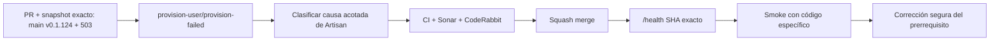

# GrindFlow — Último deploy

> **Candidato v0.1.125: aislar la causa de `provision-failed`.** `main` v0.1.124 SHA `b0468f7dcb468d7a373ab0f78aaaa001de93ba9a`: CI exact-main #35978400569 y Observer #35978400528 pasaron; Production Smoke #35978400551 confirmó `/health` exacto, pero devolvió HTTP 503, etapa `provision-user`, código `provision-failed`, **antes de login**.

## Progress convention
- ✅ ~~Completado~~ = verificado; 🚧 Pendiente = en curso; ⛔ bloqueado = dependencia externa.

## Fuentes de verdad
[AGENTS.md](AGENTS.md) · [Spec](docs/GRINDFLOW-SPEC.md) · [Requisitos](docs/REQUIREMENTS.md) · [Roadmap #2](https://github.com/pl0n3r/GrindFlow/issues/2)

## Estado del deploy
| Señal | Estado | Evidencia |
| --- | --- | --- |
| Version objetivo | 🚧 **v0.1.125** | `config/version.php`; candidata |
| Base exacta | ✅ ~~main v0.1.124~~ | `b0468f7dcb468d7a373ab0f78aaaa001de93ba9a` |
| CI/Sonar/CodeRabbit del PR | 🚧 pendiente | exigen HEAD final |
| CI del SHA exacto de main (base) | ✅ ~~success~~ | #35978400569 |
| Health productivo base | ✅ ~~SHA exacto~~ | Smoke #35978400551 |
| Deploy Observer base | ✅ ~~success~~ | #35978400528 |
| Production Smoke base | ⛔ #73 · HTTP 503 provision-user | #35978400551; código `provision-failed`, sin login |
| Producción objetivo | 🚧 pendiente | aislar prerrequisito de aprovisionamiento y recuperar login |

## Huella del cambio
<!-- grindflow:git-delta -->
| Archivos | Inserciones | Eliminaciones | Neto |
| ---: | ---: | ---: | ---: |
| **9** | **+146** | **−34** | **+112** |

## Calidad y entrega
<!-- grindflow:gate-plan -->
| Control | Estado / contrato |
| --- | --- |
| Gates seleccionados | **preflight · fast[operational contracts + automation syntax + README dashboard] · php-quality · PHPUnit · browser · real-stack** |
| Gate agregador obligatorio | **validate**: todos los seleccionados; Sonar y CodeRabbit aparte |
| Alcance | #121/#73: aislar el fallo de la identidad sintética en Hostinger |
| Rol del PR | **SRE · Backend Laravel · DBA · Application Security** |
| Revisiones | CodeRabbit terminal del HEAD; sin excepciones ni deploy antes de CI exacto |

## Flujo de entrega

## Qué se hizo
- El Smoke #35978400551 observó el checkout productivo exacto v0.1.124 y mostró `provision-user / provision-failed` después de OIDC; no se reintentó 503 ni contraseña.
- El comando Artisan solo publica en memoria un código fijo de precondición, lock, conflicto de membresía, backup o error DB; los errores desconocidos mantienen `provision-failed`.
- El controller limpia códigos previos antes de llamar al comando, valida por lista cerrada y devuelve sólo cabeceras de etapa/código sin exception text ni cuerpo.
- El workflow valida de nuevo el código por allowlist; tests PHPUnit/contrato shell cubren clasificación, invalidación de estado obsoleto y rechazo de valores arbitrarios.
- No se modifica ni reprovisiona una cuenta real como reparación especulativa; el algoritmo existente de backups/rollback y aprovisionamiento idempotente no cambia.

## Archivos modificados en esta entrega candidata
Inventario del diff exacto:
<!-- grindflow:changed-files -->
- `.github/workflows/production-smoke.yml`
- `README.md`
- `app/Console/Commands/ProvisionSmokeUser.php`
- `app/Http/Controllers/Operations/ProductionSmokeBootstrapController.php`
- `config/version.php`
- `docs/DEPLOY-HOSTINGER.md`
- `scripts/production-smoke-contract.sh`
- `tests/Feature/ProductionSmokeBootstrapTest.php`
- `tests/Feature/ProvisionSmokeUserCommandTest.php`

## Validación
- PHPUnit valida comandos fallidos, conflicto de membresía, código efímero y allowlist HTTP; contrato shell exige nuevos códigos seguros.
- CI/Sonar/CodeRabbit deben aprobar HEAD final. Smoke exact-SHA decidirá la siguiente reparación, sin confundir CI verde con Production GREEN.

## Qué sigue
[Roadmap canónico #2](https://github.com/pl0n3r/GrindFlow/issues/2)

## Panorama general pendiente
| Lane | Frente | Estado |
| --- | --- | --- |
| **NOW** | 🚧 #121 / #73 · fallo del comando Artisan en Hostinger | 🚧 v0.1.125 clasificación |
| **NEXT** | 🚧 corregir precondición acreditada y repetir Smoke | 🚧 tras nueva evidencia |
| **BLOCKED / EXTERNAL** | ⛔ error interno todavía no tipificado | ⛔ `provision-failed` en v0.1.124 |
| **LATER** | 🚧 Roadmap de producto | 🚧 tras producción verde |
