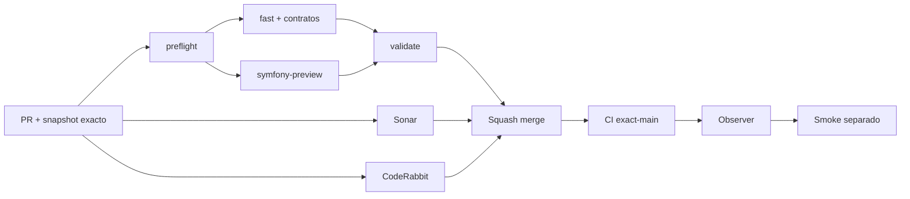

# GrindFlow — Último deploy

> **Candidato v0.1.119: cambios de sección anunciados de forma accesible en la vista previa React.** Base exacta main v0.1.118 `133bcecdb0f0fde3a657f715e14421372ee7b88c`. No modifica datos ni acredita despliegue Symfony.

## Progress convention
- ✅ ~~Completado~~ = verificado; 🚧 Pendiente = en curso; ⛔ bloqueado = dependencia externa.

## Fuentes de verdad
[AGENTS.md](AGENTS.md) · [Spec](docs/GRINDFLOW-SPEC.md) · [Requisitos](docs/REQUIREMENTS.md) · [Transición](docs/STACK-TRANSITION-SYMFONY.md) · [Roadmap #2](https://github.com/pl0n3r/GrindFlow/issues/2)

## Estado del deploy
| Señal | Estado | Evidencia |
| --- | --- | --- |
| Version objetivo | 🚧 **v0.1.119** | `config/version.php`; candidata, no publicada |
| Base exacta | ✅ ~~main v0.1.118~~ | `133bcecdb0f0fde3a657f715e14421372ee7b88c` |
| CI del PR | 🚧 Pendiente | `validate` sobre HEAD final |
| Sonar del PR | 🚧 Pendiente | Quality Gate sobre HEAD final |
| CodeRabbit del PR | 🚧 Pendiente | Revisión terminada del mismo SHA |
| CI del SHA exacto de main | ✅ ~~success~~ | #35903927830 sobre `133bcecd…` |
| Deploy Observer base | ✅ ~~Marcador observado~~ | #35903927866; no acredita SHA remoto |
| Production Smoke | ⛔ Bloqueo externo #73 | #35903927898 failure |
| Symfony en Hostinger | ⛔ NO desplegado | Sin cutover |
| Datos productivos | ✅ ~~No tocados~~ | Solo cambios de UI, test y documentación |

## Huella del cambio
<!-- grindflow:git-delta -->
| Archivos | Inserciones | Eliminaciones | Neto |
| ---: | ---: | ---: | ---: |
| **8** | **+635** | **−48** | **+587** |

## Calidad y entrega
<!-- grindflow:gate-plan -->
| Control | Estado / contrato |
| --- | --- |
| Gates seleccionados | **preflight · fast[operational contracts + automation syntax + README dashboard] · symfony-preview** |
| Gate agregador obligatorio | **validate**: todos los seleccionados; Sonar y CodeRabbit aparte |
| Alcance | GF-UX-003: anuncio accesible de cambios de sección en React |
| Revisiones | CI/Sonar/CodeRabbit HEAD; exact-main, Observer y Smoke separados |

## Flujo de entrega

## Qué se hizo
- La vista previa React anuncia el panel actualizado mediante `aria-live="polite"` y `aria-atomic="true"`, sin interrumpir el foco de teclado.
- Chromium valida activación con Enter/Espacio, selección `aria-pressed` y nombre accesible de la región actualizada.
- GF-UX-003 conserva navegación compartida y prueba responsive; sin cambios en datos, proveedores externos, Laravel ni producción.

## Archivos modificados en esta entrega candidata
Inventario de esta entrega candidata, no prueba publicación:
<!-- grindflow:changed-files -->
- `README.md`
- `config/version.php`
- `docs/GRINDFLOW-SPEC.md`
- `docs/REQUIREMENTS.md`
- `docs/SYMFONY-VAULT-STORAGE.md`
- `symfony/src/Http/Controller/DirectUploadController.php`
- `symfony/tests/php/DirectUploadConfiguredHttpTest.php`
- `symfony/tests/php/DirectUploadHttpTest.php`

## Validación
- Exigir `preflight`, `fast`, `symfony-preview`, `validate`, Sonar y CodeRabbit sobre HEAD final.
- CI exact-main después del squash; Production Smoke #73 sigue independiente.
- No se ejecutan migraciones ni escrituras productivas.

## Qué sigue
[Roadmap canónico #2](https://github.com/pl0n3r/GrindFlow/issues/2)

## Panorama general pendiente
| Lane | Frente | Estado |
| --- | --- | --- |
| **NOW** | 🚧 GF-UX-003: anuncio accesible de panel React | 🚧 v0.1.119 candidata |
| **NEXT** | 🚧 Verificar coherencia responsive, teclado y estados de error entre espacios | 🚧 pendiente |
| **BLOCKED / EXTERNAL** | ⛔ Smoke autenticado Laravel | ⛔ #73 |
| **LATER** | 🚧 Cutover Symfony por módulo | 🚧 sin deploy |
