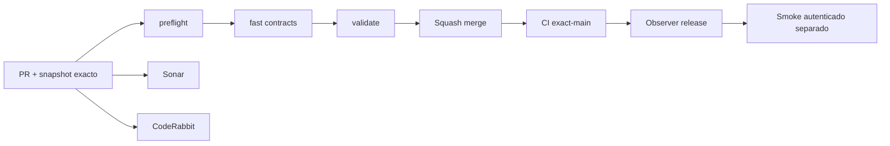

# GrindFlow — Último deploy

> **Candidato v0.1.61: cambio de contraseña personal en Symfony aislado, no desplegado.** El alcance «solo el deploy actual» corresponde al runtime Laravel observado. Base `main` v0.1.60 `04af1f3ad52630e9345db0934a0f59ec29b02f5c`, CI exact-main success; sin migraciones ni cambios productivos.

## Progress convention
- ✅ ~~Completado~~ = verificado; 🚧 Pendiente = en curso; ⛔ bloqueado = dependencia externa.

## Fuentes de verdad
[AGENTS.md](AGENTS.md) · [Spec](docs/GRINDFLOW-SPEC.md) · [Requisitos](docs/REQUIREMENTS.md) · [Transición](docs/STACK-TRANSITION-SYMFONY.md) · [Roadmap #2](https://github.com/pl0n3r/GrindFlow/issues/2)

## Estado del deploy
| Señal | Estado | Evidencia |
| --- | --- | --- |
| Version objetivo | 🚧 **v0.1.61** | `config/version.php` |
| Base exacta | ✅ ~~main v0.1.60~~ | `04af1f3ad52630e9345db0934a0f59ec29b02f5c` |
| CI del PR | 🚧 Validación del nuevo head pendiente | `GrindFlow CI / validate` |
| Sonar | 🚧 Pendiente | SonarCloud PR |
| CodeRabbit | 🚧 Revisión pendiente | PR |
| CI del SHA exacto de main | 🚧 Después del merge | CI PR no lo sustituye |
| Deploy Observer | 🚧 Release humano por observar | No prueba Symfony en remoto |
| Production Smoke | ⛔ Credencial E2E productiva pendiente | [Issue #1](https://github.com/pl0n3r/GrindFlow/issues/1) |
| Symfony S2 en Hostinger | ⛔ NO desplegado | Solo entorno aislado CI |
| Migraciones | ✅ ~~Ningún esquema productivo modificado~~ | DB Symfony descartable |

## Huella del cambio
<!-- grindflow:git-delta -->
| Archivos | Inserciones | Eliminaciones | Neto |
| ---: | ---: | ---: | ---: |
| **11** | **+441** | **−30** | **+411** |

## Calidad y entrega
<!-- grindflow:gate-plan -->
| Control | Estado / contrato |
| --- | --- |
| Gates seleccionados | **preflight · fast[contracts] · symfony-preview** |
| Alcance | Identidad: rotación de contraseña propia, CSRF, cierre de sesión y React móvil |
| Revisiones | CI/Sonar/CodeRabbit, exact-main y Hostinger son independientes |

## Flujo de entrega

## Qué se hizo
- Cambio de contraseña exclusivamente personal: clave actual, confirmación, validación y hash del servicio Symfony. Relee el hash bajo bloqueo SQL; evita reutilización y campos de IDs.
- CSRF dedicado, cuenta activa y cierre de la sesión actual tras éxito; el formulario React limpia contraseñas incluso tras error.
- Pruebas PHPUnit con MariaDB descartable para sesión, CSRF, no reutilización, cuenta ajena, clave vieja/nueva y nueva autenticación; Chromium sintético a 360 px.
- No se cambiaron esquemas, archivos multimedia, integración externa, runtime Laravel ni Hostinger.
## Archivos modificados en este deploy
Inventario del **cambio candidato en el PR**, no archivos desplegados en Hostinger.
- `README.md`
- `config/version.php`
- `docs/GRINDFLOW-SPEC.md`
- `docs/REQUIREMENTS.md`
- `symfony/README.md`
- `symfony/frontend/admin/AdminApp.tsx`
- `symfony/frontend/admin/admin.css`
- `symfony/src/Http/Controller/AccountSecurityController.php`
- `symfony/src/Http/Controller/AdminContextController.php`
- `symfony/tests/e2e/preview.spec.mjs`
- `symfony/tests/php/AccountSecurityTest.php`
## Validación
- Base exact-main v0.1.60 success; CI/Sonar/CodeRabbit del head v0.1.61 y exact-main posterior son independientes.
- Sin checkout local: PHP/MariaDB, TypeScript y Chromium deben verificarse en CI del PR. Producción no se tocó.

## Qué sigue
[Roadmap canónico #2](https://github.com/pl0n3r/GrindFlow/issues/2)

| Lane | Trabajo | Estado |
| --- | --- | --- |
| **NOW** | 🚧 Validar cambio de contraseña v0.1.61 | 🚧 CI y revisión |
| **NEXT** | 🚧 Ensayo restauración aislada MariaDB + blobs; seguridad de sesiones | 🚧 Pendiente |
| **LATER** | 🚧 Vault móvil → reglas → distribución autorizada → piloto | 🚧 Planificado |
| **BLOCKED / EXTERNAL** | ⛔ Cutover sin paridad/datos migrados; Smoke sin credencial | ⛔ Dependencia externa |

## Panorama general pendiente
| Lane | Frente | Estado |
| --- | --- | --- |
| **DONE** | ✅ ~~Dashboard Laravel v0.1.30~~ | ✅ ~~Esquema Symfony S1 v0.1.31~~ |
| **NOW** | 🚧 Seguridad de cuenta v0.1.61 | 🚧 CI y revisión |
| **NEXT** | 🚧 Política de backups y ensayo integral de restauración | 🚧 Retención pendiente |
| **LATER** | 🚧 Automatización de contenido | 🚧 S2–S5 |
| **BLOCKED / EXTERNAL** | ⛔ Sin cutover Symfony | ⛔ Sin credencial Smoke |
