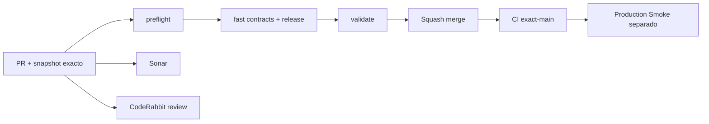

# GrindFlow — Último deploy

> **Snapshot PR v0.1.18: solo el deploy actual.** Base `main` v0.1.17 `ca5f24a9ae9240d6a192ac3379ae857f0f15d65d`: CI exact-main #35464138679 success; Production Smoke #35464138681 **falló**. Incidente [#106](https://github.com/drpipe1098-commits/GrindFlow/issues/106). La etiqueta humana no prueba SHA de checkout Hostinger.

## Progress convention
- ✅ ~~Completado~~ = concluido y verificado por las compuertas aplicables.
- 🚧 Pendiente = por hacer o en curso, sin tachado.
- ⛔ Bloqueado = dependencia externa real.

## Fuentes de verdad
[AGENTS.md](AGENTS.md) · [Gobierno](docs/GOVERNANCE.md) · [Especificaciones](docs/GRINDFLOW-SPEC.md) · [Glosario](GLOSARIO.md) · [Roadmap #88](https://github.com/drpipe1098-commits/GrindFlow/issues/88)

## Estado del deploy
| Señal | Estado | Evidencia |
| --- | --- | --- |
| Work line | 🚧 **Informe seguro de release en Issue #106** | Roadmap #88 |
| Base exacta | ✅ **main v0.1.17** | `ca5f24a9ae9240d6a192ac3379ae857f0f15d65d` |
| Version | 🚧 **v0.1.18 objetivo** | config/version.php |
| Version desplegada | ⚠️ **no confirmada** | Smoke main v0.1.17 falló |
| CI del PR | 🚧 **pendiente** | validate |
| Sonar | 🚧 **pendiente** | Quality Gate |
| CodeRabbit | 🚧 **pendiente** | full review |
| CI del SHA exacto de main | ✅ **base v0.1.17** | #35464138679 |
| Production Smoke | ⚠️ **base v0.1.17 falló** | #35464138681 · #106 |
| Deploy v0.1.18 | 🚧 **no confirmado** | read-only Smoke posterior |
| Migraciones | ✅ **sin SQL nuevo** | cambios operativos solamente |
| ZIP | ✅ **no se generan entregables ZIP** | archivos y GitHub |

## Huella del cambio
<!-- grindflow:git-delta -->
| Archivos | Inserciones | Eliminaciones | Neto |
| ---: | ---: | ---: | ---: |
| **4** | **+0** | **−0** | **+0** |

## Calidad y entrega
<!-- grindflow:gate-plan -->
| Control | Estado / contrato |
| --- | --- |
| Gates seleccionados | **preflight · fast[contracts]** |
| Versión | 0.1.18, patch +1 sobre main v0.1.17 |
| Diagnóstico | Extrae solo release observada/esperada desde log saneado |
| Seguridad | Regex semver o unknown, jamás HTML/cookies/credenciales |
| Producción | Smoke de solo lectura, sin migraciones o POST de negocio |
| Calidad | CI, Sonar y CodeRabbit; Smoke tras merge por separado |

## Flujo de entrega

## Qué se hizo
- AGENTS: el propietario recibe actualizaciones cortas y separadas por inspección, código, pruebas y entrega; manejo seguro de cambios concurrentes.
- El issue automático de fallo de producción informa versión esperada y realmente observada, si el smoke llegó a esa etapa, sin exigir abrir el artifact para esa pregunta.
- Los valores publicados se filtran mediante patrón cerrado vX.Y.Z o unknown; no se revela HTML, cookie ni el diagnóstico sensible.
- Si el Smoke falla antes de medir release, el issue lo aclara; no convierte un CI exitoso en deploy verificado.

## Archivos modificados en este deploy
- `.github/workflows/production-smoke.yml` — resumen seguro de release en issue.
- `AGENTS.md` — mensajes breves y concurrencia.
- `README.md` — foto exacta de esta entrega.
- `config/version.php` — release humana v0.1.18.

## Validación
- Base `main` v0.1.17: CI #35464138679 success; Production Smoke #35464138681 failure; Issue #106.
- Head v0.1.18: CI/Sonar/CodeRabbit pendientes de evidencia final; smoke posterior independiente.
- La release humana observada no establece el SHA de Hostinger.

## Qué sigue
| Lane | Trabajo |
| --- | --- |
| **NOW** | 🚧 Release visible en fallo automático; [Roadmap #88](https://github.com/drpipe1098-commits/GrindFlow/issues/88) |
| **NEXT** | 🚧 Resolver desajuste de producción [#106](https://github.com/drpipe1098-commits/GrindFlow/issues/106) |
| **LATER** | 🚧 Storage/FFmpeg [#40](https://github.com/drpipe1098-commits/GrindFlow/issues/40) |
| **BLOCKED / EXTERNAL** | 🚧 SHA remoto Hostinger sin comprobar |

## Panorama general pendiente
| Lane | Frente | Estado |
| --- | --- | --- |
| **DONE** | ✅ ~~main v0.1.17 CI~~ | ✅ ~~validate verde~~ |
| **NOW** | 🚧 Resumen v0.1.18 | 🚧 CI pendiente |
| **NEXT** | 🚧 Incidente #106 | 🚧 producción no validada |
| **LATER** | 🚧 Media Storage | 🚧 #40 |
| **BLOCKED / EXTERNAL** | 🚧 Checkout SHA de Hostinger | 🚧 no demostrado |
