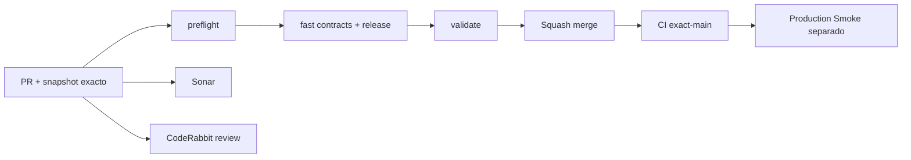

# GrindFlow — Último deploy

> **Snapshot PR v0.1.17: solo el deploy actual.** Base main v0.1.16 `79567348473cfa22cabd76675873dd7cbb739e71`: CI #35463437820 success; Production Smoke #35463437826 falló. Incidente [#106](https://github.com/drpipe1098-commits/GrindFlow/issues/106) abierto. No inferir checkout SHA de Hostinger.

## Progress convention
- ✅ ~~Completado~~ = concluido y verificado por las compuertas aplicables.
- 🚧 Pendiente = por hacer o en curso, sin tachado.
- ⛔ Bloqueado = dependencia externa real.

## Fuentes de verdad
[AGENTS.md](AGENTS.md) · [Gobierno](docs/GOVERNANCE.md) · [Especificaciones](docs/GRINDFLOW-SPEC.md) · [Glosario](GLOSARIO.md) · [Roadmap #88](https://github.com/drpipe1098-commits/GrindFlow/issues/88)

## Estado del deploy
| Señal | Estado | Evidencia |
| --- | --- | --- |
| Work line | 🚧 **Smoke observable y reglas operativas** | Roadmap #88 |
| Base exacta | ✅ **main v0.1.16** | `79567348473cfa22cabd76675873dd7cbb739e71` |
| Version | 🚧 **v0.1.17 objetivo** | config/version.php |
| Version desplegada | ⚠️ **desconocida** | release v0.1.16 no detectada |
| CI del PR | 🚧 **pendiente** | validate |
| Sonar | 🚧 **pendiente** | Quality Gate |
| CodeRabbit | 🚧 **pendiente** | full review head estable |
| CI del SHA exacto de main | ✅ **base v0.1.16** | #35463437820 |
| Production Smoke | ⚠️ **base falló** | #35463437826 · #106 |
| Deploy v0.1.17 | 🚧 **no confirmado** | requiere observación separada |
| Migraciones | ✅ **sin SQL nuevo** | ninguna escritura productiva |

## Huella del cambio
<!-- grindflow:git-delta -->
| Archivos | Inserciones | Eliminaciones | Neto |
| ---: | ---: | ---: | ---: |
| **5** | **+103** | **−73** | **+30** |

## Calidad y entrega
<!-- grindflow:gate-plan -->
| Control | Estado / contrato |
| --- | --- |
| Gates seleccionados | **preflight · fast[contracts]** |
| Version | Objetivo 0.1.17, patch +1 desde main |
| Seguridad | Solo etiqueta visible de versión; no HTML ni credenciales en logs |
| Verificación | Current, stale, missing y ambiguous en mock Smoke |
| Producción | Smoke GET sin migraciones, clicks /l ni writes |

## Flujo de entrega

## Qué se hizo
- Regla AGENTS: mensajes breves de progreso con hitos verificables y sin generar/entregar ZIP.
- Smoke: etiqueta de versión realmente observada, comparación explícita esperada/observada, fallo seguro si falta o es ambigua.
- Contrato: versión actual, antigua, ausente y ambigua en la sesión sintética.
- #106: run #35463437826 mostró Vault correcto y storage pendiente, pero no registró qué versión estaba sirviendo Hostinger.

## Archivos modificados en este deploy
- `AGENTS.md` — regla de comunicación y entregas.
- `README.md` — estado exacto de este PR.
- `config/version.php` — versión 0.1.17.
- `scripts/production-smoke-contract.sh` — regresiones.
- `scripts/production-smoke.sh` — diagnóstico seguro de release.

## Validación
- Base exact-main CI #35463437820 success; Production Smoke #35463437826 failed; Issue #106.
- CI/Sonar/CodeRabbit v0.1.17 pendientes de head final. No afirmar deploy ni SHA checkout remoto.

## Qué sigue
| Lane | Trabajo |
| --- | --- |
| **NOW** | 🚧 Observabilidad Smoke v0.1.17, [roadmap #88](https://github.com/drpipe1098-commits/GrindFlow/issues/88) |
| **NEXT** | 🚧 Investigar desfase de despliegue [#106](https://github.com/drpipe1098-commits/GrindFlow/issues/106) |
| **LATER** | 🚧 Storage/FFmpeg [#40](https://github.com/drpipe1098-commits/GrindFlow/issues/40) |
| **BLOCKED / EXTERNAL** | 🚧 Checkout Hostinger no verificado |

## Panorama general pendiente
| Lane | Frente | Estado |
| --- | --- | --- |
| **DONE** | ✅ ~~CI main v0.1.16~~ | ✅ ~~validate success~~ |
| **NOW** | 🚧 Smoke observable v0.1.17 | 🚧 CI pendiente |
| **NEXT** | 🚧 Incidente producción #106 | 🚧 release remota |
| **LATER** | 🚧 Media Storage | 🚧 #40 |
| **BLOCKED / EXTERNAL** | 🚧 SHA checkout Hostinger | 🚧 no demostrado |
