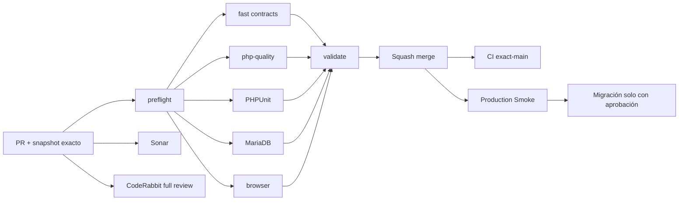

# GrindFlow — Último deploy

  
  
  

> **Development dashboard** · snapshot profesional de **solo el deploy actual**. CI, deploy y validación en producción son evidencias distintas.

## Estado del deploy

| Señal | Estado actual | Evidencia |
| --- | --- | --- |
| Work line | ✅ **GF-OPS · Migration readiness** | MERGED en `main` por PR #79 |
| Feature merge commit | ✅ **main** | `7c364d7b074eb016e6da9f944d350904ce46ccbd` |
| CI del PR | ✅ **GrindFlow CI #344** | fast, PHP quality, PHPUnit, MariaDB, browser y validate |
| Sonar | ✅ **Quality Gate OK** | 0 issues / 0 hotspots en PR #79 |
| CodeRabbit | 🟠 **pending al merge** | no se atribuye revisión final no emitida |
| CI del SHA exacto de main | ⚪ **sin evidencia confirmada** | PR CI y exact-main son distintos |
| Production Smoke | 🟠 **pendiente de evidencia exact-main** | despliegue no inferido del merge |
| Migraciones | 🟠 **sin ejecutar** | inventario y confirmación preparados, backup externo pendiente |

## Huella del cambio

<!-- grindflow:git-delta -->

| Archivos | Inserciones | Eliminaciones | Neto |
| ---: | ---: | ---: | ---: |
| **1** | **+0000** | **−0000** | **+0000** |

La huella se calcula con `git diff --numstat`; CI rechaza este dashboard si queda desactualizado.

## Calidad y entrega

<!-- grindflow:gate-plan -->

| Control | Estado / contrato |
| --- | --- |
| Gates seleccionados | **preflight · fast[contracts]** |
| GrindFlow CI | docs-only: contrato y dashboard exacto |
| Sonar | análisis independiente del PR documental |
| CodeRabbit | review documental no sustituye revisión del feature |
| Migración | no se ejecuta desde este PR |
| Producción | sin cambios desde este PR |

## Flujo de entrega

## Qué se hizo

- Registra el squash merge de Migration Readiness como `7c364d7b…`.
- Preserva CI #344 y Sonar de PR #79 como evidencia de feature, no de exact-main.
- Registra CodeRabbit pendiente al merge sin afirmar aprobación.
- Mantiene backups externos y aplicación de migraciones como acciones del operador.
- El guard disponible en el código exige inventario, fingerprint, confirmación `MIGRAR` y declaración de backup.
- No cambia runtime, schema, secrets, hosting ni contenido productivo desde este PR documental.

## Archivos modificados en este deploy

- `README.md` — snapshot posterior al merge y siguiente frente operativo.

## Validación

- Migration Readiness fue fusionado como `7c364d7b074eb016e6da9f944d350904ce46ccbd`.
- PR #79 pasó GrindFlow CI #344 sobre el head `87a662a76125a556708dcd37700b1d213fbfff61`.
- Sonar reportó Quality Gate OK, 0 issues y 0 hotspots.
- CodeRabbit estaba pending al merge y no había threads abiertos.
- No se ha verificado un backup externo desde GrindFlow ni se ejecutaron migraciones en producción.
- Exact-main CI y Production Smoke siguen como evidencia separada.

## Qué sigue

| Lane | Trabajo |
| --- | --- |
| **NOW** | Verificar exact-main CI y Production Smoke del commit `7c364d7b…`. |
| **NEXT** | Inspeccionar el lote de migraciones en Admin > System tras confirmar despliegue. |
| **NEXT** | Aplicar migraciones solo con aprobación y backup externo restaurable verificado. |
| **BLOCKED / EXTERNAL** | Storage S3, FFmpeg y operaciones del hosting. |
| **LATER** | Provider real en sandbox y conciliación Finance. |

## Panorama general pendiente

| Lane | Frente | Estado |
| --- | --- | --- |
| **NOW** | Exact-main delivery | PR #79 MERGED; CI y Smoke de merge por confirmar |
| **NEXT** | Migration readiness producción | backup externo + inventario + aprobación |
| **NEXT** | Scheduling/Distribution/Traffic/Finance | migraciones productivas pendientes |
| **BLOCKED / EXTERNAL** | Hosting/storage | S3 + FFmpeg |
| **LATER** | Provider adapters | sandbox y credenciales cifradas |
| **LATER** | Legacy retirement | solo tras GF-MIG |
