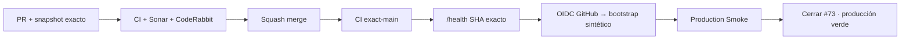

# GrindFlow — Último deploy

> **Candidato v0.1.123: recuperar login sintético mediante GitHub OIDC.** Base exacta main v0.1.122 `a68789c4b6b68e868239a69ee737857c401c3b88`, incluido el guard de memberships fusionado en #132. Production Smoke #35941690701 confirmó versión/SHA, pero el login sigue regresando a `/login`.

## Progress convention
- ✅ ~~Completado~~ = verificado; 🚧 Pendiente = en curso; ⛔ bloqueado = dependencia externa.

## Fuentes de verdad
[AGENTS.md](AGENTS.md) · [Spec](docs/GRINDFLOW-SPEC.md) · [Requisitos](docs/REQUIREMENTS.md) · [Roadmap #2](https://github.com/pl0n3r/GrindFlow/issues/2)

## Estado del deploy
| Señal | Estado | Evidencia |
| --- | --- | --- |
| Version objetivo | 🚧 **v0.1.123** | `config/version.php`; candidata |
| Base exacta | ✅ ~~main v0.1.122~~ | `a68789c4b6b68e868239a69ee737857c401c3b88` |
| CI del PR | 🚧 pendiente | validar HEAD final |
| Sonar del PR | 🚧 pendiente | Quality Gate del HEAD final |
| CodeRabbit del PR | 🚧 pendiente | máximo 3 rondas |
| CI del SHA exacto de main | ✅ ~~success~~ | #35941690696 sobre `a68789c4…` |
| Health productivo base | ✅ ~~v0.1.122 + SHA exacto~~ | Smoke #35941690701 |
| Production Smoke base | ⛔ #73 | #35941690701: login volvió a `/login` |
| Producción objetivo | 🚧 pendiente | bootstrap OIDC + Smoke completo verde |

## Huella del cambio
<!-- grindflow:git-delta -->
| Archivos | Inserciones | Eliminaciones | Neto |
| ---: | ---: | ---: | ---: |
| **13** | **+1330** | **−28** | **+1302** |

## Calidad y entrega
<!-- grindflow:gate-plan -->
| Control | Estado / contrato |
| --- | --- |
| Gates seleccionados | **preflight · fast[operational contracts + automation syntax + README dashboard] · php-quality · PHPUnit · MariaDB · browser · real-stack · legacy** |
| Gate agregador obligatorio | **validate**: todos los seleccionados; Sonar y CodeRabbit aparte |
| Alcance | #121/#73: sincronizar el secreto sintético sin acceso SSH y recuperar Smoke |
| Rol del PR | **SRE · Backend Laravel · Application Security** |
| Revisiones | máximo 3 rondas automáticas; sin polling |

## Flujo de entrega

## Qué se hizo
- Production Smoke obtiene un token OIDC efímero solo con `id-token: write` y espera antes a que `/health` exponga el SHA exacto de `main`.
- El servidor valida firma GitHub, audiencia, repositorio/IDs, `refs/heads/main`, workflow exacto, runner GitHub-hosted y SHA; además exige que ese SHA sea el checkout realmente desplegado.
- Solo en `APP_ENV=production` + `APP_PHASE=construccion` el endpoint interno puede persistir `SMOKE_USER_PASSWORD`.
- Antes de mutar `.env` crea backup cifrado privado; la escritura es atómica y se revierte si falla la reconciliación.
- Tras persistir el secreto invalida `config:cache`, ejecuta `grindflow:provision-smoke-user` y nunca devuelve ni registra password/hash.
- No hay SQL destructivo, borrados, datos de cliente ni cambios de tenant.

## Archivos modificados en esta entrega candidata
Inventario del diff exacto:
<!-- grindflow:changed-files -->
- `.env.example`
- `.github/workflows/production-smoke.yml`
- `README.md`
- `app/Http/Controllers/Operations/ProductionSmokeBootstrapController.php`
- `app/Support/Deployment/GitHubActionsOidcVerifier.php`
- `app/Support/Deployment/ProductionEnvironmentWriter.php`
- `config/cache.php`
- `config/version.php`
- `docs/DEPLOY-HOSTINGER.md`
- `routes/web.php`
- `tests/Feature/ProductionSmokeBootstrapTest.php`
- `tests/Unit/GitHubActionsOidcVerifierTest.php`
- `tests/Unit/ProductionEnvironmentWriterTest.php`

## Validación
- OIDC: firma RSA, repo/IDs/ref/workflow/SHA/audiencia y expiración.
- Bootstrap: rechaza token/SHA inválidos antes de escribir y solo reconcilia la identidad reservada.
- Entorno: backup cifrado, escritura atómica, idempotencia y rollback de `.env`.
- Producción solo se declarará verde con los cinco criterios indicados por el dueño.

## Qué sigue
[Roadmap canónico #2](https://github.com/pl0n3r/GrindFlow/issues/2)

## Panorama general pendiente
| Lane | Frente | Estado |
| --- | --- | --- |
| **NOW** | 🚧 #121 + #73: recuperar Production Smoke | 🚧 v0.1.123 |
| **NEXT** | 🚧 exact-main + Smoke + cierre incidente | 🚧 tras merge |
| **BLOCKED / EXTERNAL** | ⛔ falta revisión terminal del nuevo HEAD | ⛔ no fusionar sin gates |
| **LATER** | 🚧 Roadmap de producto | 🚧 solo después de producción verde |
