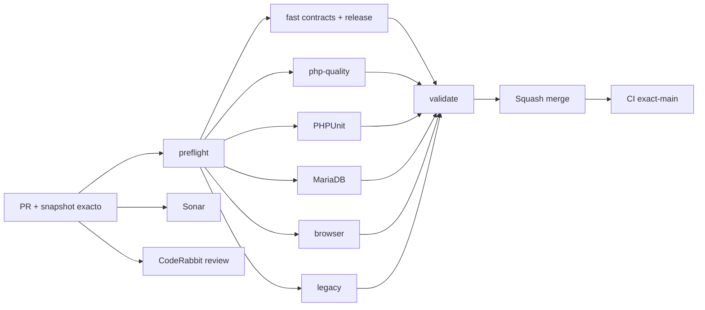

# GrindFlow — Último deploy

  
  
  

> **Snapshot PR v0.1.12: solo el deploy actual se valida con pruebas del entorno, no exclusivamente con GitHub CI.** Base `main` v0.1.11 `23484d5f933e342ebfc1f85e35c99da0816f1657`: CI #35456954310 y Production Smoke #35456954250 success. Git SHA exacto del checkout Hostinger sigue sin marcador independiente.

## Progress convention
- ✅ ~~Completado~~ = concluido y verificado por las compuertas aplicables.
- 🚧 Pendiente = por hacer o en curso, sin tachado.

## Estado del deploy
| Señal | Estado | Evidencia |
| --- | --- | --- |
| Work line | 🚧 **GF-FR-007B · Reconciliacion financiera real** | [Roadmap #88](https://github.com/drpipe1098-commits/GrindFlow/issues/88) |
| Base exacta | ✅ **v0.1.11 · PR #101 fusionado** | `23484d5f933e342ebfc1f85e35c99da0816f1657` |
| Version | 🚧 **v0.1.12** | filtros, conciliacion por beneficiario, CSV |
| CI del PR | 🚧 **pendiente** | validar head final |
| Sonar | 🚧 **pendiente** | Quality Gate |
| CodeRabbit | 🚧 **pendiente** | full review del head final |
| CI del SHA exacto de main | ✅ **v0.1.11 validado** | validate #35456954310 |
| Production Smoke | ✅ **v0.1.11 observado** | #35456954250 |
| Deploy v0.1.12 | 🚧 **no confirmado** | Smoke posterior a fusion |
| Migraciones | ✅ **sin SQL nuevo** | utiliza ledger existente |

## Huella del cambio
<!-- grindflow:git-delta -->
| Archivos | Inserciones | Eliminaciones | Neto |
| ---: | ---: | ---: | ---: |
| **10** | **+771** | **−87** | **+684** |

## Calidad y entrega
<!-- grindflow:gate-plan -->
| Control | Estado / contrato |
| --- | --- |
| Gates seleccionados | **preflight · fast[contracts] · php-quality · PHPUnit · browser** |
| Query | Mismo ledger tenant-scoped en tabla, totales por moneda, reportes y CSV |
| Agrupacion | Moneda + beneficiario; registros y reversas por propia fecha de evento |
| Filtros | currency, beneficiary, from/to UTC; paginas 25 y sin limite 100 |
| CSV | Todos los grupos, sin IDs/notas; escape anti-formula + no-store |
| Acceso | Solo Admin/Studio, fallback 503 schema missing, no write externo |

## Flujo de entrega

## Qué se hizo
- Finance ofrece vista de reconciliacion por moneda y beneficiario, monto asignado, reversado y neto en unidades menores.
- Filtros combinables por moneda, beneficiario y periodo UTC aplican coherentemente a totales, desglose, historial y descarga.
- Una reversa se registra en su propia fecha; el reporte diferencia neto de eventos vs saldos historicos y nunca mezcla monedas.
- Ledger deja de truncar a primeras 100 filas: navegacion estable de 25 con filtro persistente y conteo total.
- Descarga CSV de todos los grupos coincidentes aun si hay multiples paginas en el ledger; sin IDs privados ni notas, nombres anti-inyeccion.
- Acceso seguro por tenant/rol, sin filtrar UUIDs extranjeros, seguro con migracion pendiente.
- Nuevos tests con multiples monedas, reversa entre fechas, >50 asientos, CSV, fraude cross-tenant y filtros invalidos.
- Ningun asiento se edita/elimina; no hay nueva migracion ni pagos a proveedores externos.

## Archivos modificados en este deploy
- `AGENTS.md` — reglas duraderas de reconciliacion.
- `README.md` — snapshot v0.1.12.
- `app/Http/Controllers/Finance/FinanceController.php` — filtros, grupos, paginacion y CSV seguro.
- `app/Services/Finance/FinanceReconciliationReport.php` — consulta tenant-scoped reutilizable.
- `config/version.php` — version 0.1.12.
- `docs/GRINDFLOW-SPEC.md` — modelo event-date.
- `docs/REQUIREMENTS.md` — GF-FR-007B.
- `resources/views/finance/index.blade.php` — UI de conciliacion y navegacion.
- `routes/web.php` — export solo autenticado y schema-ready.
- `tests/Feature/FinanceReconciliationTest.php` — regresiones reportes/privacidad.

## Validación
- Base v0.1.11: CI #35456954310 y Production Smoke #35456954250 passed.
- v0.1.12: CI/Sonar/CodeRabbit pendientes; exact-main/Smoke solo despues de merge.
- Smoke es read-only y NO prueba escribir en Finance ni realizar conciliacion bancaria real.

## Qué sigue
| Lane | Trabajo |
| --- | --- |
| **NOW** | 🚧 Entregar Finance reconciliation v0.1.12. [Roadmap #88](https://github.com/drpipe1098-commits/GrindFlow/issues/88). |
| **NEXT** | 🚧 Media storage/CORS/FFmpeg runtime #40. |
| **LATER** | 🚧 Finance import/reconciliacion contra extractos solo cuando existan datos de pagos y autorizacion. |
| **BLOCKED / EXTERNAL** | 🚧 Marcador SHA exacto del checkout Hostinger. |

## Panorama general pendiente
| Lane | Frente | Estado |
| --- | --- | --- |
| **DONE** | ✅ ~~Scheduler paginado y link-edit~~ | ✅ ~~v0.1.11 CI+Smoke~~ |
| **NOW** | 🚧 Finance reconciliation grouped + CSV | 🚧 v0.1.12 |
| **NEXT** | 🚧 Media Storage / FFmpeg | 🚧 #40 |
| **LATER** | 🚧 Import de cobros/payouts con pruebas | 🚧 roadmap #88 |
| **BLOCKED / EXTERNAL** | 🚧 Git SHA checkout Hostinger | 🚧 observabilidad |
