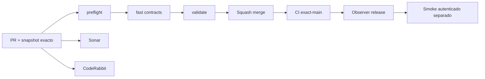

# GrindFlow — Último deploy

> **Snapshot v0.1.33: solo el deploy actual.** Base `main` v0.1.32 `b6cf03b08d158ea517d41615644eae32299d38a6`. S1 aislado: login/logout y selección explícita de organización con Symfony Security, Doctrine y sesiones; admin solo con membresía vigente. Laravel sigue siendo runtime de Hostinger. **Symfony no se ha desplegado ni se han importado cuentas.**

## Progress convention
- ✅ ~~Completado~~ = verificado; 🚧 Pendiente = en curso; ⛔ bloqueado = dependencia externa.

## Fuentes de verdad
[AGENTS.md](AGENTS.md) · [Spec](docs/GRINDFLOW-SPEC.md) · [Requisitos](docs/REQUIREMENTS.md) · [Transición](docs/STACK-TRANSITION-SYMFONY.md) · [Roadmap #2](https://github.com/pl0n3r/GrindFlow/issues/2)

## Estado del deploy
| Señal | Estado | Evidencia |
| --- | --- | --- |
| Version objetivo | 🚧 **v0.1.33** | `config/version.php` |
| Base exacta | ✅ ~~main v0.1.32~~ | `b6cf03b08d158ea517d41615644eae32299d38a6` |
| CI del PR | 🚧 Head final pendiente | `GrindFlow CI / validate` |
| Sonar | 🚧 Pendiente | SonarCloud PR |
| CodeRabbit | 🚧 Revisión por comprobar | PR |
| CI del SHA exacto de main | 🚧 Después del merge | CI PR no lo sustituye |
| Deploy Observer | 🚧 Release humano por observar | No prueba Symfony en remoto |
| Production Smoke | ⛔ Credencial E2E productiva pendiente | [Issue #1](https://github.com/pl0n3r/GrindFlow/issues/1) |
| Symfony S1 en Hostinger | ⛔ NO desplegado | Solo entorno aislado CI |
| Migraciones | ✅ ~~Ningún esquema productivo modificado~~ | DB Symfony descartable |

## Huella del cambio
<!-- grindflow:git-delta -->
| Archivos | Inserciones | Eliminaciones | Neto |
| ---: | ---: | ---: | ---: |
| **19** | **+599** | **−48** | **+551** |

## Calidad y entrega
<!-- grindflow:gate-plan -->
| Control | Estado / contrato |
| --- | --- |
| Gates seleccionados | **preflight · fast[contracts] · symfony-preview** |
| Alcance | Symfony Security, CSRF/rate limit, selector tenant, HTML responsive, pruebas negativas |
| Revisiones | CI/Sonar/CodeRabbit, exact-main y Hostinger son independientes |

## Flujo de entrega

## Qué se hizo
- Acceso privado Symfony con usuarios Doctrine reales de la **base aislada**, contraseñas hash, bloqueo de usuarios inactivos, CSRF y rate limit. No reutiliza los usuarios Laravel hasta una migración decidida y probada.
- Selector explícito de organizaciones: solo membresías del actor; POST CSRF y comprobación SQL de acceso. Admin reautoriza la membresía en cada GET, no confía solo en la sesión o la UI.
- Estado honesto sin organización, cierre de sesión y pantalla accesible/responsive; no presenta Vault ni distribución como implementados en Symfony.
- Versión humana consecutiva **0.1.32 → 0.1.33** desde `config/version.php`, en footer público/privado.

## Archivos modificados en este deploy
- `README.md`
- `config/version.php`
- `symfony/README.md`
- `symfony/config/packages/security.yaml`
- `symfony/config/packages/test/framework.yaml`
- `symfony/public/assets/grindflow.css`
- `symfony/src/Http/Controller/AdminController.php`
- `symfony/src/Http/Controller/LoginController.php`
- `symfony/src/Http/Controller/OrganizationController.php`
- `symfony/src/Identity/Entity/IdentityUser.php`
- `symfony/src/Identity/Security/ActiveUserChecker.php`
- `symfony/templates/base.html.twig`
- `symfony/templates/identity/admin.html.twig`
- `symfony/templates/identity/login.html.twig`
- `symfony/templates/identity/organizations.html.twig`
- `symfony/tests/contract/smoke.sh`
- `symfony/tests/e2e/preview.spec.mjs`
- `symfony/tests/php/IdentityLoginTest.php`
- `symfony/tests/php/PreviewTest.php`

## Validación
- Pruebas HTTP Symfony/Doctrine y Chromium contra fixture sintética; CI y Sonar de PR y exact-main separados.
- No activar deploy/cutover Symfony en Hostinger, ni migrar users/organizations/memberships de Laravel.

## Qué sigue
| Lane | Trabajo |
| --- | --- |
| **NOW** | 🚧 Validar login/organizaciones S1 v0.1.33, [roadmap #2](https://github.com/pl0n3r/GrindFlow/issues/2) |
| **NEXT** | 🚧 Admin React protegido + API tenant-safe y roles por acción |
| **LATER** | 🚧 Vault móvil → reglas → distribución autorizada → piloto |
| **BLOCKED / EXTERNAL** | ⛔ Cutover sin paridad/datos migrados; Smoke sin credencial |

## Panorama general pendiente
| Lane | Frente | Estado |
| --- | --- | --- |
| **DONE** | ✅ ~~Dashboard Laravel v0.1.30~~ | ✅ ~~Esquema Symfony S1 v0.1.31~~ |
| **NOW** | 🚧 Login/selector S1 v0.1.33 | 🚧 Validación y revisión |
| **NEXT** | 🚧 Admin React con autorización | 🚧 S1 continuación |
| **LATER** | 🚧 Automatización de contenido | 🚧 S2–S5 |
| **BLOCKED / EXTERNAL** | ⛔ Sin cutover Symfony | ⛔ Sin credencial Smoke |
