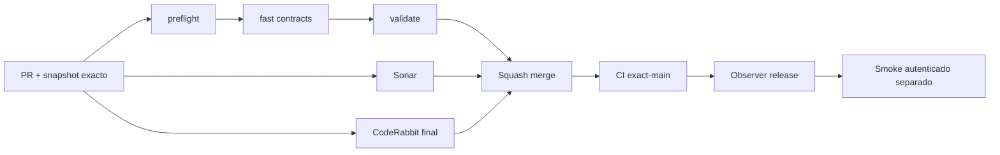

# GrindFlow — Último deploy

> **Candidato v0.1.78: smoke autenticado con diagnóstico determinista.** Base exacta `main` v0.1.77 `4b5ebeba23e535b845caec943e1b713dd5379165`. Corrige tooling/contratos; NO ejecuta migraciones ni despliega Symfony.

## Progress convention
- ✅ ~~Completado~~ = verificado; 🚧 Pendiente = en curso; ⛔ bloqueado = dependencia externa.

## Fuentes de verdad
[AGENTS.md](AGENTS.md) · [Spec](docs/GRINDFLOW-SPEC.md) · [Requisitos](docs/REQUIREMENTS.md) · [Transición](docs/STACK-TRANSITION-SYMFONY.md) · [Roadmap #2](https://github.com/pl0n3r/GrindFlow/issues/2)

## Estado del deploy
| Señal | Estado | Evidencia |
| --- | --- | --- |
| Version objetivo | 🚧 **v0.1.78** | `config/version.php` |
| Base exacta | ✅ ~~main v0.1.77~~ | `4b5ebeba23e535b845caec943e1b713dd5379165` |
| CI del PR | 🚧 Head v0.1.78 por validar | `GrindFlow CI / validate` |
| Sonar | 🚧 Pendiente del head estable | SonarCloud PR |
| CodeRabbit | 🚧 Pendiente del head estable | revisión final obligatoria antes de merge |
| CI del SHA exacto de main | 🚧 v0.1.77 ejecutándose | run `35667874191` |
| Deploy Observer | ✅ ~~v0.1.77 release observado~~ | run `35667874090`; versión humana, NO SHA Hostinger |
| Production Smoke | ⛔ v0.1.77 ejecuta script anterior y sigue en curso | run `35667874103`; [Issue #73](https://github.com/pl0n3r/GrindFlow/issues/73) |
| Symfony en Hostinger | ⛔ NO desplegado | Solo entorno aislado CI |
| Migraciones | ✅ ~~Sin cambios de esquema~~ | candidato solo modifica smoke/contrato/release |

## Huella del cambio
<!-- grindflow:git-delta -->
| Archivos | Inserciones | Eliminaciones | Neto |
| ---: | ---: | ---: | ---: |
| **4** | **+103** | **−46** | **+57** |

## Calidad y entrega
<!-- grindflow:gate-plan -->
| Control | Estado / contrato |
| --- | --- |
| Gates seleccionados | **preflight · fast[contracts]** |
| Alcance | #73: distinguir redirección de login/sesión, sanear `Location` y cortar reintentos deterministas |
| Revisiones | CI + Sonar + **CodeRabbit terminado sobre head final ANTES de merge**; exact-main y Hostinger separados |

## Flujo de entrega

## Qué se hizo
- El smoke captura cabeceras del POST de login y del GET de dashboard, pero solo publica rutas estáticas permitidas; query strings, hosts y rutas con identificadores quedan redactados.
- Respuestas deterministas de autenticación (`/login`, 401/403/419/422/429 o dashboard redirigido) terminan con código 7 y **no repiten credenciales**.
- El contrato sintético cubre login→login, dashboard→login, dashboard→organizaciones, ruta sensible redactada y POST 419; incluso con `ATTEMPTS=3` exige un único POST.
- Los fallos transitorios conservan el retry previo. No cambia Laravel de negocio, cuentas, permisos, base de datos ni datos de producción.

## Archivos modificados en este deploy
Inventario de solo el deploy actual candidato; el texto es marcador contractual del dashboard y NO afirma despliegue en Hostinger.
- `README.md`
- `config/version.php`
- `scripts/production-smoke-contract.sh`
- `scripts/production-smoke.sh`

## Validación
- Pendiente CI/Sonar/CodeRabbit sobre el head final del PR; **no merge hasta revisión final explícita de CodeRabbit**.
- `fast[contracts]` ejecuta `scripts/production-smoke-contract.sh`; el contrato valida fail-fast, redacción y preservación de retries transitorios.
- No se volverá a disparar manualmente el smoke productivo hasta integrar el diagnóstico, para evitar repetir intentos sin señal nueva.

## Qué sigue
[Roadmap canónico #2](https://github.com/pl0n3r/GrindFlow/issues/2)

| Lane | Trabajo | Estado |
| --- | --- | --- |
| **NOW** | 🚧 v0.1.78 diagnóstico auth de Production Smoke | 🚧 PR + CI/Sonar/CodeRabbit |
| **NEXT** | 🚧 Ejecutar un único smoke con v0.1.78 y clasificar #73 | 🚧 Sin asumir credencial inválida |
| **LATER** | 🚧 Continuar S4/S5 Symfony tras cerrar señal operativa | 🚧 Sin cutover |
| **BLOCKED / EXTERNAL** | ⛔ #73 hasta observar destino seguro de redirección | ⛔ Producción no validada |

## Panorama general pendiente
| Lane | Frente | Estado |
| --- | --- | --- |
| **DONE** | ✅ ~~v0.1.77 navegación acceso + gate CodeRabbit~~ | ✅ ~~PR #74 fusionada con revisión final sin hallazgos accionables~~ |
| **NOW** | 🚧 v0.1.78 diagnóstico auth de Production Smoke | 🚧 PR + CI/Sonar/CodeRabbit |
| **NEXT** | 🚧 Ejecutar un único smoke con v0.1.78 y clasificar #73 | 🚧 Sin asumir credencial inválida |
| **LATER** | 🚧 Continuar S4/S5 Symfony tras cerrar señal operativa | 🚧 Sin cutover |
| **BLOCKED / EXTERNAL** | ⛔ #73 hasta observar destino seguro de redirección | ⛔ Producción no validada |
