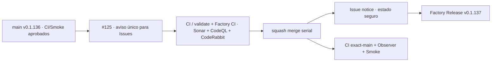

# GrindFlow — Último deploy

> **Candidata v0.1.137 · Issue #125.** Aviso único editable y estado seguro por defecto para Issues, sin ejecutar código de PR.

## Progress convention
- ✅ ~~Completado~~ = verificado; 🚧 Pendiente = en curso; ⛔ bloqueado = dependencia externa.

## Fuentes de verdad
[AGENTS.md](AGENTS.md) · [Spec](docs/GRINDFLOW-SPEC.md) · [Requisitos](docs/REQUIREMENTS.md) · [Roadmap #2](https://github.com/pl0n3r/GrindFlow/issues/2)

## Estado del deploy
| Señal | Estado | Evidencia |
| --- | --- | --- |
| SHA exacto de main (base) | ✅ **b920d87abf71d7d7aa9a55155adf85e1d71915af** | v0.1.136 fusionada (#167) |
| Tag y GitHub Release (base) | ✅ **v0.1.136** | tag anotado apunta a main |
| CI del SHA exacto de main (base) | ✅ **success** | validate job 107984926500 |
| Deploy Observer base | ✅ **success** | job 107984688624 |
| Production Smoke base | ✅ **success** | job 107984689135 |
| Version objetivo | 🚧 **v0.1.137** | PHP, npm y lock en paridad |
| CI/Sonar/CodeRabbit del PR | 🚧 pendiente | HEAD final de #125 |
| Producción objetivo | 🚧 pendiente | verificación independiente tras merge |

## Huella del cambio
<!-- grindflow:git-delta -->
| Archivos | Inserciones | Eliminaciones | Neto |
| ---: | ---: | ---: | ---: |
| **8** | **+227** | **−21** | **+206** |

## Calidad y entrega
<!-- grindflow:gate-plan -->
| Control | Estado / contrato |
| --- | --- |
| Gates seleccionados | **preflight · fast[operational contracts + automation syntax + README dashboard] · php-quality · PHPUnit · MariaDB · browser · real-stack · legacy · symfony-preview** |
| PR + snapshot exacto | **Issue #125 · v0.1.137**; diff y README deben coincidir con HEAD final |
| Gate agregador obligatorio | **validate** conserva gates seleccionados + privacidad; Sonar, CodeQL y CodeRabbit separados |
| Release Factory v1 | Solo push main; tag anotado y GitHub Release sin deploy productivo |
| CI local canónico | `GrindFlow CI / validate` sigue obligatorio, Factory CI corre en paralelo |
| Rol del PR | **Infraestructura · Seguridad · QA** |

## Flujo de entrega

## Qué se hizo
- El catálogo Factory v1 completo llegó en v0.1.136; ahora automatiza el estado inicial de Issues sin sobrescribir otros estados.
- Un aviso con marcador se crea solo si falta clasificación y se edita si cambia la situación; Issues correctos no reciben comentarios.
- Añade pruebas offline de dimensiones, estados existentes, aviso idempotente y contrato del workflow.
- El workflow escucha solo eventos de Issues y ejecuta código confiable de main con permiso `issues: write` acotado al job.
- No automatiza aún herencia PR/barrido diario ni garantiza branch protection; #125 permanece abierto.

## Archivos modificados en esta entrega candidata
<!-- grindflow:changed-files -->
- `.github/workflows/aviso-etiquetas-issues.yml`
- `.github/workflows/grindflow-ci.yml`
- `README.md`
- `config/version.php`
- `package-lock.json`
- `package.json`
- `scripts/issue-label-notice.py`
- `tests/test_issue_label_notice.py`

## Validación
- Regresión offline verifica notificación estable, dimensiones canónicas y preservación del estado existente.
- El aviso nuevo no corre sobre PR ni sobre comentarios; no crea comentario para Issues completamente etiquetados.
- Registro independiente de CI exact-main, Observer y Smoke tras merge; #[146] media storage queda externamente bloqueado.

## Qué sigue
[Roadmap canónico #2](https://github.com/pl0n3r/GrindFlow/issues/2)

## Panorama general pendiente
| Lane | Frente | Estado |
| --- | --- | --- |
| **NOW** | 🚧 #125 · aviso único de Issues | 🚧 candidata v0.1.137 |
| **NEXT** | 🚧 #125/#129 · herencia, barrido y deploy/rollback | 🚧 próximo slice |
| **BLOCKED / EXTERNAL** | ⛔ #139 Dependabot + #146 media storage | ⛔ evidencia/configuración externa |
| **LATER** | 🚧 #122 helper CodeRabbit + #138 Sentry | 🚧 preservados tras TANDA 2 |
