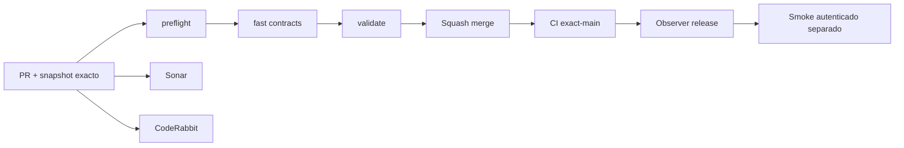

# GrindFlow — Último deploy

> **Candidato v0.1.61: clasificar y filtrar originales privados del Vault, sin autorización de publicación.** El alcance «solo el deploy actual» es el runtime Laravel observado; Symfony NO desplegado en Hostinger. Base exacta `main` v0.1.60 `04af1f3ad52630e9345db0934a0f59ec29b02f5c` y CI exact-main success (run 35568033731). No se ejecutaron migraciones ni operaciones sobre datos productivos.

## Progress convention
- ✅ ~~Completado~~ = verificado; 🚧 Pendiente = en curso; ⛔ bloqueado = dependencia externa.

## Fuentes de verdad
[AGENTS.md](AGENTS.md) · [Spec](docs/GRINDFLOW-SPEC.md) · [Requisitos](docs/REQUIREMENTS.md) · [Transición](docs/STACK-TRANSITION-SYMFONY.md) · [Roadmap #2](https://github.com/pl0n3r/GrindFlow/issues/2)

## Estado del deploy
| Señal | Estado | Evidencia |
| --- | --- | --- |
| Version objetivo | 🚧 **v0.1.61** | `config/version.php` |
| Base exacta | ✅ ~~main v0.1.60~~ | `04af1f3ad52630e9345db0934a0f59ec29b02f5c` |
| CI del PR | 🚧 Nuevo head por validar | `GrindFlow CI / validate` |
| Sonar | 🚧 Pendiente | SonarCloud PR |
| CodeRabbit | 🚧 Pendiente | PR |
| CI del SHA exacto de main | 🚧 Después del merge | CI PR no lo sustituye |
| Deploy Observer | 🚧 Release humano por observar | No prueba Symfony remoto |
| Production Smoke | ⛔ Credencial E2E productiva pendiente | [Issue #1](https://github.com/pl0n3r/GrindFlow/issues/1) |
| Symfony S2 en Hostinger | ⛔ NO desplegado | Solo entorno aislado CI |
| Migraciones | ✅ ~~Ningún esquema productivo modificado~~ | DB Symfony descartable |

## Huella del cambio
<!-- grindflow:git-delta -->
| Archivos | Inserciones | Eliminaciones | Neto |
| ---: | ---: | ---: | ---: |
| **18** | **+405** | **−32** | **+373** |

## Calidad y entrega
<!-- grindflow:gate-plan -->
| Control | Estado / contrato |
| --- | --- |
| Gates seleccionados | **preflight · fast[contracts] · symfony-preview** |
| Alcance | S2: clasificación conservadora, filtro por tenant, preservación en recuperación |
| Revisiones | CI/Sonar/CodeRabbit, exact-main y Hostinger independientes |

## Flujo de entrega

## Qué se hizo
- Clasificación privada por imagen con estado inicial sin clasificar, solo uso interno o requiere revisión. Ninguna opción autoriza distribuir ni acredita derechos.
- API de edición con sesión, CSRF, rol y tenant revalidados en transacción; papelera, recurso ajeno y revocaciones rechazan escritura. API de biblioteca filtra por estado también en papelera, sin distorsionar cuota.
- React móvil muestra clasificación y filtro, permite guardar/deshacer con errores y conserva opción de solo lectura. Migración Doctrine reversible solo para Symfony descartable.
- Auditoría, etapa, verificación offline y recuperación contrastan clasificación y detectan alteración del catálogo. Regresiones PHPUnit/MariaDB y Chromium 360px con aislamiento y permisos.

## Archivos modificados en este deploy
Inventario del **cambio candidato en PR**, NO evidencia de archivos desplegados en Hostinger.
- `README.md`
- `config/version.php`
- `docs/GRINDFLOW-SPEC.md`
- `docs/REQUIREMENTS.md`
- `docs/SYMFONY-VAULT-STORAGE.md`
- `symfony/README.md`
- `symfony/frontend/admin/VaultPanel.tsx`
- `symfony/frontend/admin/admin.css`
- `symfony/migrations/Version20260921070000.php`
- `symfony/src/Http/Controller/VaultController.php`
- `symfony/src/Infrastructure/Storage/VaultAuditCommand.php`
- `symfony/src/Infrastructure/Storage/VaultManifest.php`
- `symfony/src/Infrastructure/Storage/VaultStageCommand.php`
- `symfony/src/Infrastructure/Storage/VaultVerifyRestoreCommand.php`
- `symfony/src/Infrastructure/Storage/VaultVerifyStageCommand.php`
- `symfony/tests/e2e/preview.spec.mjs`
- `symfony/tests/php/VaultAuditCommandTest.php`
- `symfony/tests/php/VaultTrashTest.php`

## Validación
- Pruebas Symfony PHP/MariaDB, TypeScript y Chromium se comprueban con CI de PR; no hubo checkout local en esta sesión.
- `main` v0.1.60 tiene CI exact-main success; CI/Sonar/CodeRabbit del candidato aún no se atribuyen como éxito. No se tocó producción.

## Qué sigue
[Roadmap canónico #2](https://github.com/pl0n3r/GrindFlow/issues/2)

| Lane | Trabajo | Estado |
| --- | --- | --- |
| **NOW** | 🚧 Comprobar clasificación v0.1.61 | 🚧 CI y revisión |
| **NEXT** | 🚧 Reglas de uso y elegibilidad comprobables; ensayo real backup MariaDB + blobs | 🚧 Sin autorización implícita |
| **LATER** | 🚧 Vault móvil → reglas → distribución autorizada → piloto | 🚧 Planificado |
| **BLOCKED / EXTERNAL** | ⛔ Cutover sin paridad/datos migrados; Smoke sin credencial | ⛔ Dependencia externa |

## Panorama general pendiente
| Lane | Frente | Estado |
| --- | --- | --- |
| **DONE** | ✅ ~~Dashboard Laravel v0.1.30~~ | ✅ ~~Esquema Symfony S1 v0.1.31~~ |
| **NOW** | 🚧 Clasificación S2 y preservación del catálogo v0.1.61 | 🚧 CI y revisión |
| **NEXT** | 🚧 Backup MariaDB y ensayo integral de restauración | 🚧 Retención y operación pendientes |
| **LATER** | 🚧 Automatización de contenido | 🚧 S2–S5 |
| **BLOCKED / EXTERNAL** | ⛔ Sin cutover Symfony | ⛔ Sin credencial Smoke |
