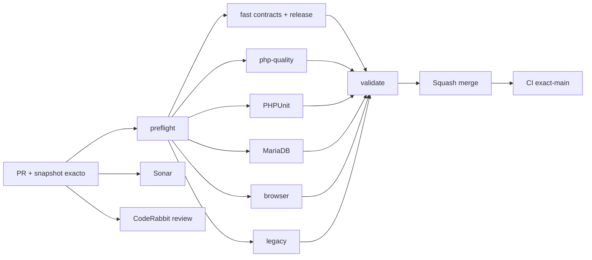

# GrindFlow — Último deploy

  
  
  

> **Snapshot PR v0.1.13: solo el deploy actual se valida en el entorno, no con el CI de GitHub por si solo.** Base `main` v0.1.12 `e8afdea0c1a285034dc33017a6ece2936b68c7bc`: exact-main CI #35457891225 y Production Smoke #35457891216 success. SHA checkout Hostinger no demostrado.

## Progress convention
- ✅ ~~Completado~~ = concluido y verificado por las compuertas aplicables.
- 🚧 Pendiente = por hacer o en curso, sin tachado.

## Estado del deploy
| Señal | Estado | Evidencia |
| --- | --- | --- |
| Work line | 🚧 **GF-FR-006D · Traffic link management completo** | [Roadmap #88](https://github.com/drpipe1098-commits/GrindFlow/issues/88) |
| Base exacta | ✅ **v0.1.12 · PR #102 fusionado** | `e8afdea0c1a285034dc33017a6ece2936b68c7bc` |
| Version | 🚧 **v0.1.13** | editor de enlaces + paginacion + status filters |
| CI del PR | 🚧 **pendiente** | validar head final |
| Sonar | 🚧 **pendiente** | Quality Gate |
| CodeRabbit | 🚧 **pendiente** | full review del head final |
| CI del SHA exacto de main | ✅ **v0.1.12 validado** | #35457891225 |
| Production Smoke | ✅ **v0.1.12 observado** | #35457891216 read-only |
| Deploy v0.1.13 | 🚧 **no confirmado** | comprobar despues de merge |
| Migraciones | ✅ **sin SQL nuevo** | esquema Traffic existente |

## Huella del cambio
<!-- grindflow:git-delta -->
| Archivos | Inserciones | Eliminaciones | Neto |
| ---: | ---: | ---: | ---: |
| **10** | **+0** | **−0** | **+0** |

## Calidad y entrega
<!-- grindflow:gate-plan -->
| Control | Estado / contrato |
| --- | --- |
| Gates seleccionados | **preflight · fast[contracts] · php-quality · PHPUnit · browser** |
| Workflow | crear enlace → editar datos/destino → pausar/reactivar |
| Paging | 25 links, total SQL, orden UTC created_at + UUID, >100 |
| Filters | fecha UTC/canal/campana/status conservados; CSV completo |
| Historico | mismo token, dedupe, asociaciones y clicks; metadatos actuales |
| Security | HTTP(S), tenant/rol, lock, validacion y schema 503 |

## Flujo de entrega

## Qué se hizo
- Traffic permite editar titulo, destino HTTP(S), canal y campana desde cada enlace, activo o deshabilitado.
- Cambiar el destino modifica redirects futuros manteniendo el mismo short URL; un link deshabilitado sigue sin redirigir.
- No se pierden clicks, deduplicacion o asociaciones a programaciones. Los reportes historicos muestran la metadata actual del link, advertencia explicita en la UI.
- El listado ya no corta a 100: paginas de 25, total real, navegacion con filtros y recuperacion fuera de rango.
- Nuevo filtro active/disabled aplica a listado, KPIs, grafica y export CSV completo.
- Tests de edicion y estado, redirects, rol/tenant, validacion HTTP(S), 105 links con tiempos identicos, filtro de estado y migracion ausente.
- Sin SQL nuevo, publicaciones externas ni cambios destructivos.

## Archivos modificados en este deploy
- `AGENTS.md` — reglas duraderas de Traffic y attribution.
- `README.md` — snapshot exacto v0.1.13.
- `app/Http/Controllers/Traffic/TrafficController.php` — pagination, filtros y PATCH.
- `app/Services/Traffic/TrackedLinkManager.php` — edicion transaccional tenant-scoped.
- `config/version.php` — version humana 0.1.13.
- `docs/GRINDFLOW-SPEC.md` — comportamiento de edit y vista completa.
- `docs/REQUIREMENTS.md` — GF-FR-006D.
- `resources/views/traffic/index.blade.php` — UI editor/estado/paginacion.
- `routes/web.php` — PATCH protegido por schema y UUID.
- `tests/Feature/TrafficAttributionTest.php` — tests de lifecycle/volumen/seguridad.

## Validación
- Base v0.1.12: CI #35457891225 y Production Smoke #35457891216 success.
- v0.1.13 necesita exact-head CI/Sonar/CodeRabbit y, tras merge, exact-main/Smoke.
- Production Smoke es read-only: no cambia enlaces ni crea clicks; no verifica desde navegador remoto el PATCH.

## Qué sigue
| Lane | Trabajo |
| --- | --- |
| **NOW** | 🚧 Entregar Traffic links editable/paginado v0.1.13. [Roadmap #88](https://github.com/drpipe1098-commits/GrindFlow/issues/88). |
| **NEXT** | 🚧 Media Storage/CORS/FFmpeg runtime #40. |
| **LATER** | 🚧 Búsqueda y paginacion de opciones del Scheduler para >100 assets/links. |
| **BLOCKED / EXTERNAL** | 🚧 Marcador SHA exacto Hostinger. |

## Panorama general pendiente
| Lane | Frente | Estado |
| --- | --- | --- |
| **DONE** | ✅ ~~Finance reconciliation + Scheduler pagination~~ | ✅ ~~v0.1.12 CI+Smoke~~ |
| **NOW** | 🚧 Traffic link details & full list | 🚧 v0.1.13 |
| **NEXT** | 🚧 Media runtime/storage | 🚧 #40 |
| **LATER** | 🚧 Scheduler searchable selectors | 🚧 roadmap #88 |
| **BLOCKED / EXTERNAL** | 🚧 Git SHA Hostinger | 🚧 observabilidad |
