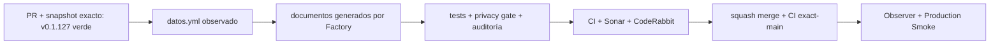

# GrindFlow — Último deploy

> **Candidato v0.1.128: privacidad como código.** Base productiva exacta `main` v0.1.127 `9a166705781835a9caa4bfb00573b4290cb29f23`, con CI exact-main, Deploy Observer y Production Smoke en `success`. #149 incorpora un mapa técnico auditable sin declarar aprobación jurídica.

## Progress convention
- ✅ ~~Completado~~ = verificado; 🚧 Pendiente = en curso; ⛔ bloqueado = dependencia externa.

## Fuentes de verdad
[AGENTS.md](AGENTS.md) · [Spec](docs/GRINDFLOW-SPEC.md) · [Requisitos](docs/REQUIREMENTS.md) · [Roadmap #2](https://github.com/pl0n3r/GrindFlow/issues/2)

## Estado del deploy
| Señal | Estado | Evidencia |
| --- | --- | --- |
| Version objetivo | 🚧 **v0.1.128** | `config/version.php`; candidata |
| Base exacta | ✅ ~~main v0.1.127~~ | `9a166705781835a9caa4bfb00573b4290cb29f23` |
| CI del SHA exacto de main (base) | ✅ ~~success~~ | GrindFlow CI `36027875895` |
| Deploy Observer base | ✅ ~~success~~ | run `36027875891` |
| Production Smoke base | ✅ ~~success~~ | run `36027875912`; versión/SHA exactos |
| CI/Sonar/CodeRabbit del PR | 🚧 pendiente | exigen HEAD final |
| Producción objetivo | 🚧 pendiente | merge, exact-main, observer y smoke |

## Huella del cambio
<!-- grindflow:git-delta -->
| Archivos | Inserciones | Eliminaciones | Neto |
| ---: | ---: | ---: | ---: |
| **13** | **+941** | **−32** | **+909** |

## Calidad y entrega
<!-- grindflow:gate-plan -->
| Control | Estado / contrato |
| --- | --- |
| Gates seleccionados | **preflight · fast[operational contracts + automation syntax + README dashboard] · php-quality · PHPUnit · MariaDB · browser · real-stack · legacy · symfony-preview** |
| Gate agregador obligatorio | **validate**: todos los seleccionados, incluido privacy-as-code; Sonar y CodeRabbit aparte |
| Alcance | #149: `datos.yml`, seis documentos generados, callers de Factory y pruebas de tratamientos observados |
| Rol del PR | **Legal-Privacidad · Ingeniería de Software · Infraestructura · QA** |
| Revisiones | Factory privacy gate + CI/Sonar/CodeRabbit terminal del HEAD; revisión jurídica humana permanece separada |

## Flujo de entrega

## Qué se hizo
- Documenta identidad/membresías, credenciales, conexiones Google Drive/Dropbox, Media Vault, credenciales de publicación y tráfico sin PII real.
- Declara Supabase solo donde el código demuestra procesamiento y **Cloudflare R2** únicamente en `media_vault`, donde el worker de ingesta transmite los bytes mediante `uploadStream`.
- Separa el dedupe Laravel (`visitor_hash`, retención técnica `dedupe_24h`) de los flujos legacy: `link_clicks` guarda referrer/UA sin IP, mientras `upload_link_events` sí registra IP cruda.
- Mantiene responsable, bases, consentimientos y retenciones no demostradas como `review_required` / `[COMPLETAR POR EL DUEÑO]`.
- Añade callers mínimos, sin secretos, fijados a Factory `a33b04cafeabfe0004f01fdf79291a0645a60f0a`.
- Adopta el contrato vigente de Factory de **seis documentos canónicos**, incluyendo aviso de privacidad, términos y canal de derechos.
- Integra privacy-as-code dentro de `GrindFlow CI / validate`, por lo que el squash exacto de `main` también debe pasar el gate de privacidad.
- Corrige la base del privacy gate para `workflow_dispatch`, ramas no-default y el primer push de la rama principal, evitando diffs vacíos o SHAs de ceros.

## Archivos modificados en esta entrega candidata
Inventario del diff exacto:
<!-- grindflow:changed-files -->
- `.github/workflows/auditoria-privacidad.yml`
- `.github/workflows/grindflow-ci.yml`
- `.github/workflows/privacidad.yml`
- `README.md`
- `config/version.php`
- `datos.yml`
- `docs/privacidad/aviso-privacidad.md`
- `docs/privacidad/canal-derechos.md`
- `docs/privacidad/politica-tratamiento.md`
- `docs/privacidad/registro-tratamientos.md`
- `docs/privacidad/retencion.md`
- `docs/privacidad/terminos-condiciones.md`
- `tests/Feature/PrivacyAsCodeTest.php`

## Validación
- `PrivacyAsCodeTest` valida los IDs del mapa y evidencia de proveedores, incluido R2 (`@/lib/r2`, `uploadStream`, `r2_key`); además distingue `visitor_hash`, `link_clicks` e IP cruda de uploads.
- Los seis documentos canónicos quedan congelados contra la salida determinista del kit y los gates vuelven a verificar `datos.yml` contra Factory.
- `validate` depende explícitamente de `privacy`; la misma compuerta corre en PR y en `push main` a través de `GrindFlow CI`.
- Ningún documento se presenta como cumplimiento o revisión jurídica aprobada.

## Qué sigue
[Roadmap canónico #2](https://github.com/pl0n3r/GrindFlow/issues/2)

## Panorama general pendiente
| Lane | Frente | Estado |
| --- | --- | --- |
| **NOW** | 🚧 #149 · privacidad como código | 🚧 validación final |
| **NEXT** | 🚧 Roadmap canónico #2 | 🚧 prioridades gestionadas allí |
| **BLOCKED / EXTERNAL** | ⛔ revisión jurídica humana | ⛔ separada del merge técnico |
| **LATER** | 🚧 Roadmap canónico #2 | 🚧 trabajo posterior gestionado allí |
