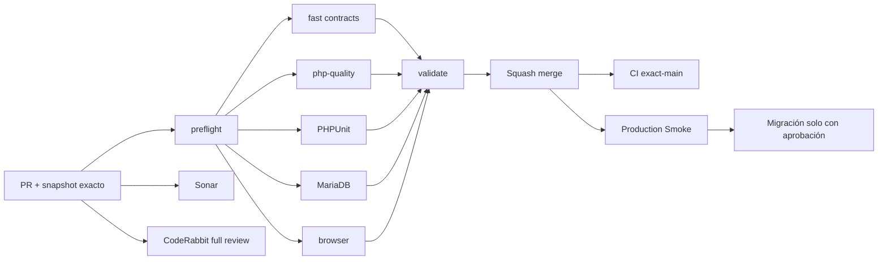

# GrindFlow — Último deploy

  
  
  

> **Development dashboard** · snapshot profesional de **solo el deploy actual**. CI, deploy y validación en producción son evidencias distintas.

## Estado del deploy

| Señal | Estado actual | Evidencia |
| --- | --- | --- |
| Work line | ✅ **GF-FR-006A · Traffic + Distribution handoff** | MERGED en `main` |
| Feature merge commit | ✅ **main base** | `ba758c14bff177277307766a0bfbfea5eab43d23` |
| CI del PR | ✅ **GrindFlow CI #332** | fast, PHP quality, PHPUnit, MariaDB, browser y validate |
| Sonar | ✅ **Quality Gate pasado en PR #77** | 0 issues / 0 hotspots |
| CodeRabbit | 🟠 **pending al merge** | no se atribuye revisión final no emitida |
| CI del SHA exacto de main | ⚪ **sin evidencia confirmada** | CI del PR y exact-main son distintos |
| Production Smoke | 🟠 **pendiente de evidencia exact-main** | no se confunde con validación en CI |
| Migración | 🟠 **tabla nueva sin aplicar** | `scheduled_publication_links`, aprobación operacional requerida |

## Huella del cambio

<!-- grindflow:git-delta -->

| Archivos | Inserciones | Eliminaciones | Neto |
| ---: | ---: | ---: | ---: |
| **1** | **+38** | **−51** | **-13** |

La huella se calcula con `git diff --numstat`; CI rechaza este dashboard si queda desactualizado.

## Calidad y entrega

<!-- grindflow:gate-plan -->

| Control | Estado / contrato |
| --- | --- |
| Gates seleccionados | **preflight · fast[contracts]** |
| GrindFlow CI | docs-only: contratos + dashboard exacto |
| Sonar | análisis independiente del PR documental |
| CodeRabbit | review documental no sustituye el review del feature |
| Migración | no se ejecuta desde este PR |
| Producción | sin cambios desde este PR |

## Flujo de entrega

## Qué se hizo

- Registra el squash merge del handoff Traffic + Distribution como `ba758c14…`.
- Preserva CI #332 y Sonar de PR #77 como evidencia del feature, distinta de exact-main.
- Documenta la nueva tabla de asociación opcional, **sin aplicar en producción**.
- Registra que CodeRabbit estaba pendiente al merge, sin inventar aprobación.
- Avanza la línea activa a cierre operacional de migraciones y Smoke.
- No cambia código, schema, secrets, hosting ni contenido de producción.

## Archivos modificados en este deploy

- `README.md` — snapshot post-merge y siguiente frente operativo.

## Validación

- GF-FR-006A ya está MERGED en `main` como `ba758c14bff177277307766a0bfbfea5eab43d23`.
- PR #77 pasó GrindFlow CI #332 sobre el head `8f191fb013b6660b38871e349e13110bd787eadc`.
- Sonar reportó Quality Gate OK y 0 issues / hotspots en PR #77.
- CodeRabbit estaba `pending` al merge, sin threads abiertos reportados.
- Schedules sin link siguen disponibles cuando falta la nueva tabla; asociar link requiere su migración.
- Las migraciones Scheduling/Distribution/Traffic/Finance/Tracking permanecen como paso operacional separado.
- Producción aún necesita evidencia propia de exact-main y Smoke.

## Qué sigue

| Lane | Trabajo |
| --- | --- |
| **NOW** | Verificar exact-main CI y Production Smoke, y preparar inventario de migraciones pendientes. |
| **NEXT** | Aplicar migraciones únicamente con aprobación y backup verificable. |
| **NEXT** | Implementar primer provider real detrás del contrato con sandbox y gestión segura de credenciales. |
| **BLOCKED / EXTERNAL** | FFmpeg real, S3-compatible, operación de hosting y migraciones productivas. |
| **LATER** | Conciliación Finance, payouts/invoices y retiro progresivo del legacy. |

## Panorama general pendiente

| Lane | Frente | Estado |
| --- | --- | --- |
| **NOW** | Delivery exact-main | CI y Smoke del merge por confirmar |
| **NEXT** | Tracking + Distribution | asociación MERGED; migration approval |
| **NEXT** | Distribution providers | adapters reales + auth/reconnect |
| **NEXT** | Finance | core MERGED; conciliación pendiente |
| **BLOCKED / EXTERNAL** | Producción | migraciones + hosting, FFmpeg y S3 |
| **LATER** | Legacy retirement | solo tras GF-MIG |
