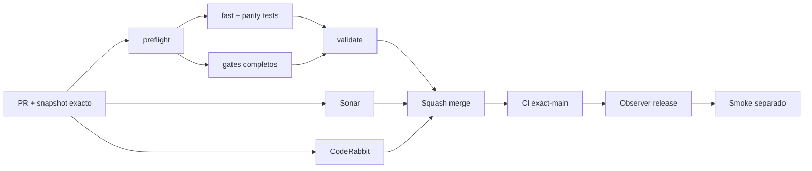

# GrindFlow — Último deploy

> **Candidato v0.1.93: reversión Symfony derivada automáticamente de las migraciones reales.** Base exacta `main` v0.1.92 `372216785f6cc9789a0da0761bce99987e2b6088`; elimina la lista manual que permitió omitir migraciones del restore drill.

## Progress convention
- ✅ ~~Completado~~ = verificado; 🚧 Pendiente = en curso; ⛔ bloqueado = dependencia externa.

## Fuentes de verdad
[AGENTS.md](AGENTS.md) · [Spec](docs/GRINDFLOW-SPEC.md) · [Requisitos](docs/REQUIREMENTS.md) · [Transición](docs/STACK-TRANSITION-SYMFONY.md) · [Roadmap #2](https://github.com/pl0n3r/GrindFlow/issues/2)

## Estado del deploy
| Señal | Estado | Evidencia |
| --- | --- | --- |
| Version objetivo | 🚧 **v0.1.93** | `config/version.php`; no publicada |
| Base exacta | ✅ ~~main v0.1.92~~ | `372216785f6cc9789a0da0761bce99987e2b6088` |
| CI / Sonar / CodeRabbit del PR | 🚧 Pendiente | Revalidar HEAD final |
| CI del SHA exacto de main | 🚧 No observado para v0.1.92 | Señal post-merge separada |
| Deploy Observer | 🚧 Pendiente | No inferir checkout remoto |
| Production Smoke | ⛔ Login E2E no validado | #73 sigue independiente |
| Symfony en Hostinger | ⛔ NO desplegado | Sin cutover |
| Datos productivos | ✅ ~~No tocados~~ | Plan source-only; ejecución solo en DB CI descartable |

## Huella del cambio
<!-- grindflow:git-delta -->
| Archivos | Inserciones | Eliminaciones | Neto |
| ---: | ---: | ---: | ---: |
| **8** | **+194** | **−38** | **+156** |

## Calidad y entrega
<!-- grindflow:gate-plan -->
| Control | Estado / contrato |
| --- | --- |
| Gates seleccionados | **preflight · fast[contracts] · php-quality · PHPUnit · MariaDB · browser · real-stack · legacy · symfony-preview** |
| Gate agregador obligatorio | **validate**: todos los seleccionados; Sonar y CodeRabbit aparte |
| Alcance | Plan automático newest-first para revertir todas las migraciones Symfony |
| Revisiones | CI/Sonar/CodeRabbit HEAD; exact-main, Observer y Smoke separados |

## Flujo de entrega

## Qué se hizo
- Nuevo `scripts/symfony-migration-reversal-plan.py`: descubre todas las migraciones `VersionYYYYMMDDHHMMSS.php` y produce clases Doctrine en orden newest-first.
- El plan es source-only: no conecta ni modifica MariaDB.
- Rechaza nombres de migración inesperados, versiones duplicadas y directorios vacíos.
- Cuatro tests verifican que el plan cubra el directorio real completo, conserve clase↔archivo y falle cerrado ante entradas inválidas.
- `symfony-preview` deja de mantener una lista manual de `doctrine:migrations:execute --down`; consume directamente `--classes` del plan.
- Una migración nueva entra automáticamente a la prueba de reversibilidad y al restore drill, evitando repetir la omisión detectada en v0.1.92.
- `ci-scope.sh` fuerza el gate Symfony cuando cambia el planner y su contrato lo prueba.

## Archivos modificados en este deploy
Inventario de solo el deploy actual: candidato, no evidencia de publicación:
<!-- grindflow:changed-files -->
- `.github/workflows/grindflow-ci.yml`
- `README.md`
- `config/version.php`
- `docs/DATA-CUTOVER-INVENTORY.md`
- `scripts/ci-scope-contract.sh`
- `scripts/ci-scope.sh`
- `scripts/symfony-migration-reversal-plan.py`
- `tests/test_symfony_migration_reversal_plan.py`

## Validación
- La rama debe pasar la matriz completa seleccionada por el cambio del workflow, `validate`, Sonar y revisión final CodeRabbit sobre el mismo HEAD.
- El plan se deriva **solo del árbol de migraciones del repositorio**; el rollback sigue ejecutándose únicamente dentro de `symfony-preview` sobre MariaDB descartable.
- Esta entrega no acredita backup productivo, RPO/RTO, secretos/configuración restaurados ni SHA Hostinger.

## Qué sigue
[Roadmap canónico #2](https://github.com/pl0n3r/GrindFlow/issues/2)

| Lane | Trabajo | Estado |
| --- | --- | --- |
| **NOW** | 🚧 Automatizar cobertura total de reversión Symfony | 🚧 v0.1.93 candidata |
| **NEXT** | 🚧 Prueba cross-tenant/IDOR sobre copia restaurada sintética | 🚧 GF-ARCH-002 |
| **LATER** | 🚧 Conmutación Symfony por módulo | 🚧 Sin deploy |
| **BLOCKED / EXTERNAL** | ⛔ Resolver login E2E productivo | ⛔ #73 |

## Panorama general pendiente
| Lane | Frente | Estado |
| --- | --- | --- |
| **DONE** | ✅ ~~v0.1.92 fusionada~~ | ✅ ~~restore drill MariaDB + Vault descartable~~ |
| **NOW** | 🚧 Automatic migration reversal | 🚧 v0.1.93 |
| **NEXT** | 🚧 Aislamiento cross-tenant sobre copia restaurada | 🚧 Sin cutover |
| **LATER** | 🚧 Symfony en Hostinger | 🚧 No desplegado |
| **BLOCKED / EXTERNAL** | ⛔ Smoke autenticado Laravel | ⛔ #73 |
