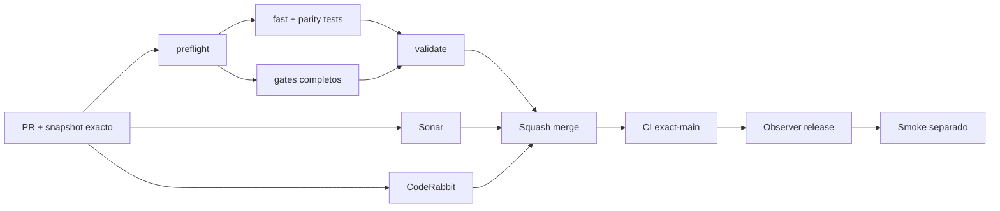

# GrindFlow — Último deploy

> **Candidato v0.1.113: presupuesto estricto de deprecations Symfony.** Base exacta `main` v0.1.112 `1619f1f67c2e5458cbe5acac2aa47f755862b84c`; CI bloquea deprecations propias o llamadas directas a APIs deprecadas.

## Progress convention
- ✅ ~~Completado~~ = verificado; 🚧 Pendiente = en curso; ⛔ bloqueado = dependencia externa.

## Fuentes de verdad
[AGENTS.md](AGENTS.md) · [Spec](docs/GRINDFLOW-SPEC.md) · [Requisitos](docs/REQUIREMENTS.md) · [Transición](docs/STACK-TRANSITION-SYMFONY.md) · [Roadmap #2](https://github.com/pl0n3r/GrindFlow/issues/2)

## Estado del deploy
| Señal | Estado | Evidencia |
| --- | --- | --- |
| Version objetivo | 🚧 **v0.1.113** | `config/version.php`; no publicada |
| Base exacta | ✅ ~~main v0.1.112~~ | `1619f1f67c2e5458cbe5acac2aa47f755862b84c` |
| CI del PR | 🚧 Pendiente | Exigir `validate` del HEAD final |
| Sonar del PR | 🚧 Pendiente | Exigir Quality Gate del HEAD final |
| CodeRabbit del PR | 🚧 Pendiente | Exigir revisión CodeRabbit completada del HEAD final |
| CI del SHA exacto de main | ✅ **VALIDATED IN CODE** | `35845840089` success sobre `1619f1f67c2e5458cbe5acac2aa47f755862b84c` |
| Deploy Observer | ✅ ~~Marcador humano observado~~ | `35845840055` success; no acredita SHA remoto |
| Production Smoke | ⛔ Login E2E no validado | `35845840108` failure, #73; independiente |
| Symfony en Hostinger | ⛔ NO desplegado | Sin cutover |
| Datos productivos | ✅ ~~No tocados~~ | Política CI; sin cuentas ni datos reales |

## Huella del cambio
<!-- grindflow:git-delta -->
| Archivos | Inserciones | Eliminaciones | Neto |
| ---: | ---: | ---: | ---: |
| **4** | **+34** | **−26** | **+8** |

## Calidad y entrega
<!-- grindflow:gate-plan -->
| Control | Estado / contrato |
| --- | --- |
| Gates seleccionados | **preflight · fast[operational contracts + automation syntax + README dashboard] · php-quality · PHPUnit · MariaDB · browser · real-stack · legacy · symfony-preview** |
| Gate agregador obligatorio | **validate**: todos los seleccionados; Sonar y CodeRabbit aparte |
| Alcance | GF-OPS-012: cero deprecations Symfony propias o directas en CI |
| Revisiones | CI/Sonar/CodeRabbit HEAD; exact-main, Observer y Smoke separados |

## Flujo de entrega

## Qué se hizo
- `symfony-preview` cambia de un presupuesto global permisivo a `max[total]=30&max[self]=0&max[direct]=0`.
- Una deprecation originada en GrindFlow o una llamada directa desde GrindFlow a una API vendor deprecada falla CI aunque el total siga por debajo del límite.
- El límite total 30 se conserva para no convertir una actualización transitoria de dependencias indirectas en un bloqueo de trabajo no relacionado.
- GF-OPS-012 documenta la política; no cambia el runtime, autenticación, datos, Laravel, Hostinger ni el cutover Symfony.

## Archivos modificados en esta entrega candidata
Inventario exclusivo de esta entrega candidata; no prueba publicación:
<!-- grindflow:changed-files -->
- `.github/workflows/grindflow-ci.yml`
- `README.md`
- `config/version.php`
- `docs/REQUIREMENTS.md`

## Validación
- Exigir `validate`, Sonar y revisión CodeRabbit completada del HEAD final; después CI exact-main.
- La base v0.1.112 ya pasó `symfony-preview` sin deprecations propias conocidas; la candidata debe pasar con `self=0` y `direct=0` activos.
- Deprecations indirectas/vendor siguen visibles y acotadas por `max[total]=30`; Production Smoke #73 permanece separado.

## Qué sigue
[Roadmap canónico #2](https://github.com/pl0n3r/GrindFlow/issues/2)
