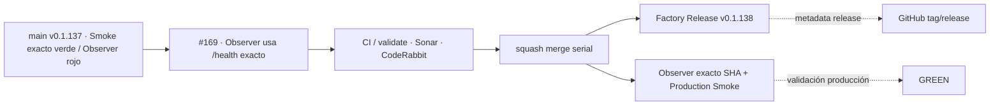

# GrindFlow — Último deploy

> **Candidata v0.1.138 · Issue #169.** Recupera el Deploy Observer usando la señal canónica `/health` con versión y SHA exactos.

## Progress convention
- ✅ ~~Completado~~ = verificado; 🚧 Pendiente = en curso; ⛔ bloqueado = dependencia externa.

## Fuentes de verdad
[AGENTS.md](AGENTS.md) · [Spec](docs/GRINDFLOW-SPEC.md) · [Requisitos](docs/REQUIREMENTS.md) · [Roadmap #2](https://github.com/pl0n3r/GrindFlow/issues/2)

## Estado del deploy
| Señal | Estado | Evidencia |
| --- | --- | --- |
| SHA exacto de main (base) | ✅ **af31ff256c26b529730b6f8145773f0175116bea** | v0.1.137 fusionada |
| Tag y GitHub Release (base) | ✅ **v0.1.137** | Factory Release success |
| CI del SHA exacto de main (base) | ✅ **success** | GrindFlow CI exact-main |
| Deploy Observer base | ⛔ **failure** | run 36118866592: `/_deployment` devolvió 403 |
| Production Smoke base | ✅ **success** | mismo SHA; `/health` exacto + flujo autenticado |
| Version objetivo | 🚧 **v0.1.138** | PHP, npm y lock en paridad |
| CI/Sonar/CodeRabbit del PR | 🚧 pendiente | HEAD final de PR · Issue #169 |
| Producción objetivo | 🚧 pendiente | Observer exacto + Smoke tras merge |

## Huella del cambio
<!-- grindflow:git-delta -->
| Archivos | Inserciones | Eliminaciones | Neto |
| ---: | ---: | ---: | ---: |
| **9** | **+182** | **−78** | **+104** |

## Calidad y entrega
<!-- grindflow:gate-plan -->
| Control | Estado / contrato |
| --- | --- |
| Gates seleccionados | **preflight · fast[operational contracts + automation syntax + README dashboard] · php-quality · PHPUnit · legacy** |
| PR + snapshot exacto | **Issue #169 · v0.1.138**; diff y README deben coincidir con HEAD final |
| Gate agregador obligatorio | **validate** conserva gates seleccionados + privacidad; Sonar, CodeQL y CodeRabbit separados |
| Release Factory v1 | Solo push main; tag anotado y GitHub Release sin sustituir validación productiva |
| CI local canónico | `GrindFlow CI / validate` obligatorio |
| Rol del PR | **Infraestructura · SRE · Seguridad · QA** |

## Flujo de entrega

## Qué se hizo
- Sustituye la dependencia operativa de `/_deployment`, bloqueada con HTTP 403 antes de Laravel, por `/health`.
- El observer exige HTTP 200, `status=ok`, versión esperada, `exact=true` y `commit` igual al SHA exacto de main.
- Mantiene fail-closed: un checkout anterior, SHA distinto o health degradado no se interpreta como deploy válido.
- Añade regresiones que rechazan volver a evidencia release-only y fija `actions/checkout` al SHA aprobado.
- Production Smoke sigue siendo la señal autenticada separada para validar funcionalidad después del checkout exacto.

## Archivos modificados en esta entrega candidata
<!-- grindflow:changed-files -->
- `.github/workflows/production-deploy-observer.yml`
- `AGENTS.md`
- `README.md`
- `config/version.php`
- `docs/DEPLOY-HOSTINGER.md`
- `package-lock.json`
- `package.json`
- `scripts/workflow-syntax-check.rb`
- `tests/test_release_adoption.py`

## Validación
- Regresión del observer exige versión + SHA exactos y prohíbe depender de `/_deployment`.
- El cambio no toca Hostinger, DNS, WAF, secretos, migraciones ni datos.
- Tras merge, Observer y Production Smoke deben pasar sobre el mismo SHA exacto para recuperar VERDE.

## Qué sigue
[Roadmap canónico #2](https://github.com/pl0n3r/GrindFlow/issues/2)

## Panorama general pendiente
| Lane | Frente | Estado |
| --- | --- | --- |
| **NOW** | 🚧 #169 · recuperar Deploy Observer exacto | 🚧 candidata v0.1.138 |
| **NEXT** | 🚧 #125/#129 · completar gobernanza y adopción Factory | 🚧 siguiente slice |
| **BLOCKED / EXTERNAL** | ⛔ #139 Dependabot + #146 media storage | ⛔ dependencias externas |
| **LATER** | 🚧 #127 recuperación admin + #138 Sentry | 🚧 preservados tras TANDA 2 |
