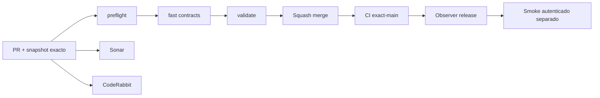

# GrindFlow — Último deploy

> **Snapshot v0.1.29: solo el deploy actual.** Base `main` v0.1.28 `ad9d11a226d95c215109cc452a8fbc14811b4fe2`. Siguiente incremento visible: hasta cinco próximas publicaciones con datos reales por organizaciones autorizadas y acceso al programador. Laravel es runtime actual; Symfony S0 continúa aislado. **CI ≠ deploy remoto Hostinger.**

## Progress convention
- ✅ ~~Completado~~ = verificado; 🚧 Pendiente = en curso; ⛔ bloqueado = dependencia externa.

## Fuentes de verdad
[AGENTS.md](AGENTS.md) · [Spec](docs/GRINDFLOW-SPEC.md) · [Requisitos](docs/REQUIREMENTS.md) · [Transición](docs/STACK-TRANSITION-SYMFONY.md) · [Roadmap #2](https://github.com/pl0n3r/GrindFlow/issues/2)

## Estado del deploy
| Señal | Estado | Evidencia |
| --- | --- | --- |
| Version objetivo | 🚧 **v0.1.29** | `config/version.php` |
| Base exacta | ✅ ~~main v0.1.28~~ | `ad9d11a226d95c215109cc452a8fbc14811b4fe2` |
| CI del PR | 🚧 Head final pendiente | `GrindFlow CI / validate` |
| Sonar | 🚧 Pendiente | SonarCloud PR |
| CodeRabbit | 🚧 Revisión por comprobar | PR de agenda |
| CI del SHA exacto de main | 🚧 Después del merge | No inferir del PR |
| Deploy Observer | ⛔ Release remoto no observado | Hostinger independiente |
| Production Smoke | ⛔ Credencial E2E de solo lectura pendiente | [Issue #1](https://github.com/pl0n3r/GrindFlow/issues/1) |
| Producción v0.1.29 | ⛔ Sin verificar | CI ≠ Hostinger |
| Migraciones | ✅ ~~Sin cambios de esquema~~ | Solo lecturas tenant-safe |

## Huella del cambio
<!-- grindflow:git-delta -->
| Archivos | Inserciones | Eliminaciones | Neto |
| ---: | ---: | ---: | ---: |
| **7** | **+0** | **−0** | **+0** |

## Calidad y entrega
<!-- grindflow:gate-plan -->
| Control | Estado / contrato |
| --- | --- |
| Gates seleccionados | **preflight · fast[contracts] · php-quality · PHPUnit · MariaDB · browser · real-stack** |
| Alcance | Próximas publicaciones reales, aislamiento multi-tenant, HTML responsive, test PHP/Chromium |
| Revisiones | CI/Sonar/CodeRabbit y exact-main independientes |

## Flujo de entrega

## Qué se hizo
- Dashboard muestra cinco próximas publicaciones programadas, nombre del recurso, destino, fecha UTC y enlace a agenda de su organización.
- Backend filtra IDs visibles, estados programados y fechas futuras con joins tenant-safe; el módulo sin esquema se muestra indisponible, no vacío falso.
- Footer y CSS usan `config/version.php`: **0.1.28 → 0.1.29**. No se cambia tabla ni toca producción.

## Archivos modificados en este deploy
- `README.md`
- `app/Http/Controllers/DashboardController.php`
- `config/version.php`
- `public/css/grindflow.css`
- `resources/views/dashboard.blade.php`
- `scripts/browser-smoke.sh`
- `tests/Feature/OrganizationVisibilityTest.php`

## Validación
- CI/PR y exact-main, Observer Hostinger y smoke son evidencias distintas.
- No se afirma que el proveedor haya publicado: se muestra exclusivamente agenda interna de GrindFlow.

## Qué sigue
| Lane | Trabajo |
| --- | --- |
| **NOW** | 🚧 Verificar agenda v0.1.29, [roadmap #2](https://github.com/pl0n3r/GrindFlow/issues/2) |
| **NEXT** | 🚧 S1 identidad y tenant Symfony, entregas pequeñas |
| **LATER** | 🚧 Vault móvil → reglas → distribución autorizada → piloto |
| **BLOCKED / EXTERNAL** | ⛔ Observación Hostinger; credencial smoke pendiente |

## Panorama general pendiente
| Lane | Frente | Estado |
| --- | --- | --- |
| **DONE** | ✅ ~~Home SaaS, footers y CSS versionado~~ | ✅ ~~Dashboard v0.1.27/v0.1.28~~ |
| **NOW** | 🚧 Agenda real v0.1.29 | 🚧 CI y Hostinger |
| **NEXT** | 🚧 Identidad Symfony S1 | 🚧 Por portar |
| **LATER** | 🚧 Automatización completa | 🚧 S2–S5 |
| **BLOCKED / EXTERNAL** | ⛔ Producción v0.1.29 | ⛔ Sin evidencia remota |
