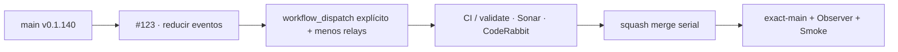

# GrindFlow — Último deploy

> **Candidata v0.1.141 · Issue #123.** Reduce amplificación de GitHub Actions sin debilitar gates ni seguridad productiva.

## Progress convention
- ✅ ~~Completado~~ = verificado; 🚧 Pendiente = en curso; ⛔ bloqueado = dependencia externa.

## Fuentes de verdad
[AGENTS.md](AGENTS.md) · [Spec](docs/GRINDFLOW-SPEC.md) · [Requisitos](docs/REQUIREMENTS.md) · [Roadmap #2](https://github.com/pl0n3r/GrindFlow/issues/2)

## Estado del deploy
| Señal | Estado | Evidencia |
| --- | --- | --- |
| SHA exacto de main (base) | ✅ **40fbb9954b72490612f11a3998633f0debddf4c0** | v0.1.140 |
| CI del SHA exacto de main (base) | ✅ **success** | GrindFlow CI 36192348864 |
| Deploy Observer / Production Smoke base | ✅ **success / success** | 36192348912 / 36192348870 |
| Version objetivo | 🚧 **v0.1.141** | PHP, npm y lock en paridad |
| CI/Sonar/CodeRabbit del PR | 🚧 pendiente | HEAD candidata #123 |
| Producción objetivo | ✅ sin cambio runtime | workflows/gobernanza solamente |

## Huella del cambio
<!-- grindflow:git-delta -->
| Archivos | Inserciones | Eliminaciones | Neto |
| ---: | ---: | ---: | ---: |
| **11** | **+124** | **−179** | **−55** |

## Calidad y entrega
<!-- grindflow:gate-plan -->
| Control | Estado / contrato |
| --- | --- |
| Gates seleccionados | **preflight · fast[operational contracts + automation syntax + README dashboard] · php-quality · PHPUnit · MariaDB · browser · real-stack · legacy · symfony-preview** |
| PR + snapshot exacto | **Issue #123 · v0.1.141**; README debe coincidir con HEAD final |
| Gate agregador obligatorio | **validate** conserva matriz completa; Sonar y CodeRabbit separados |
| Event load | `issue_comment` productivo y relay global `check_run` eliminados de estas superficies |
| CI local canónico | **GrindFlow CI / validate** |
| Rol del PR | **Infraestructura · SRE · QA** |

## Flujo de entrega

## Qué se hizo
- Elimina el relay global `check_run` de Sonar; SonarQube Cloud conserva su Quality Gate/comentario nativo en la PR.
- Diagnóstico y migración productivos dejan de escuchar cada comentario y pasan a `workflow_dispatch` explícito.
- Ambos flujos exigen actor propietario; migración exige además confirmación de backup verificable y conteo pendiente explícito.
- Los estados operativos se publican en `GITHUB_STEP_SUMMARY`, sin escribir comentarios de Issues ni ampliar permisos.
- AGENTS fija anti-polling, push agrupado, un comentario por hito y techo de concurrencia de agentes.
- El contrato nuevo falla si reaparecen triggers globales `issue_comment` / relay Sonar o si se pierden las guardas owner/backup.

## Archivos modificados en esta entrega candidata
<!-- grindflow:changed-files -->
- `.github/workflows/grindflow-ci.yml`
- `.github/workflows/production-diagnostics.yml`
- `.github/workflows/production-migration.yml`
- `.github/workflows/sonar-pr-details.yml`
- `AGENTS.md`
- `README.md`
- `config/version.php`
- `package-lock.json`
- `package.json`
- `tests/test_action_event_load.py`
- `tests/test_sonar_event_load.py`

## Validación
- Contrato offline exige `workflow_dispatch` owner-only, backup confirmado para migración, sin `issues: write` y sin relay `check_run`.
- `grindflow-ci.yml` ejecuta el contrato nuevo dentro de `fast`; por tocar CI se selecciona la matriz completa.
- Cambio limitado a workflows, gobierno, tests y versión; no modifica Laravel/Symfony, DB, DNS, secretos ni Hostinger.
- Estado final exige CI/Sonar/CodeRabbit del mismo HEAD y exact-main + Observer + Smoke tras merge.

## Qué sigue
[Roadmap canónico #2](https://github.com/pl0n3r/GrindFlow/issues/2)

## Panorama general pendiente
| Lane | Frente | Estado |
| --- | --- | --- |
| **NOW** | 🚧 #123/#129 · reducir carga Actions | 🚧 candidata v0.1.141 |
| **NEXT** | 🚧 #129 · cierre adopción Factory | 🚧 tras resolver #125 |
| **BLOCKED / EXTERNAL** | ⛔ #125 branch protection + #139 Dependabot + #146 media storage | ⛔ dependencias externas |
| **LATER** | 🚧 #140 PHPStan/Rector + producto | 🚧 preservado |

