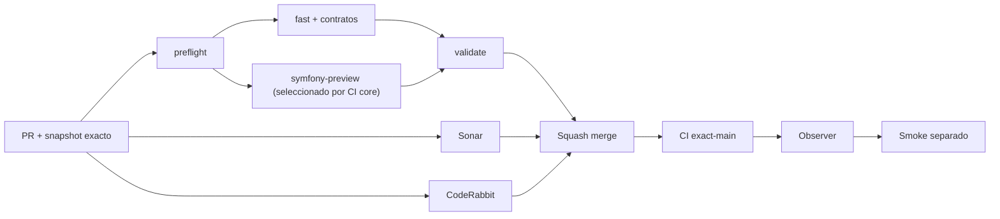

# GrindFlow — Último deploy

> **Candidato apilado v0.1.121: evidencia terminal CodeRabbit del SHA exacto, sin falsos verdes.** Base: PR #120 candidata v0.1.120 `adf5583ab75744561360b52eadf243e6dc86a618`; `main` continúa v0.1.119. No desplegado ni fusionado.

## Progress convention
- ✅ ~~Completado~~ = verificado; 🚧 Pendiente = en curso; ⛔ bloqueado = dependencia externa.

## Fuentes de verdad
[AGENTS.md](AGENTS.md) · [Spec](docs/GRINDFLOW-SPEC.md) · [Requisitos](docs/REQUIREMENTS.md) · [Transición](docs/STACK-TRANSITION-SYMFONY.md) · [Roadmap #2](https://github.com/pl0n3r/GrindFlow/issues/2)

## Estado del deploy
| Señal | Estado | Evidencia |
| --- | --- | --- |
| Version objetivo | 🚧 **v0.1.121** | `config/version.php`; apilada, no publicada |
| Base exacta | ✅ ~~PR #120 v0.1.120~~ | `adf5583ab75744561360b52eadf243e6dc86a618`; aún sin merge |
| CI del PR | 🚧 Pendiente | `validate` sobre HEAD final |
| Sonar del PR | 🚧 Pendiente | Quality Gate sobre HEAD final |
| CodeRabbit del PR | 🚧 Pendiente | Revisión terminada del mismo SHA |
| CI del SHA exacto de main | ✅ ~~success~~ | #35906880198 sobre `62001217…` |
| Deploy Observer base | ✅ ~~Marcador observado~~ | #35906880205; no acredita SHA remoto |
| Production Smoke | ⛔ Bloqueo externo #73 | #35906880233 failure |
| Symfony en Hostinger | ⛔ NO desplegado | Sin cutover |
| Datos productivos | ✅ ~~No tocados~~ | Solo CI, script local, tests, docs y versión |

## Huella del cambio
<!-- grindflow:git-delta -->
| Archivos | Inserciones | Eliminaciones | Neto |
| ---: | ---: | ---: | ---: |
| **7** | **+225** | **−20** | **+205** |

## Calidad y entrega
<!-- grindflow:gate-plan -->
| Control | Estado / contrato |
| --- | --- |
| Gates seleccionados | **preflight · fast[operational contracts + automation syntax + README dashboard] · php-quality · PHPUnit · MariaDB · browser · real-stack · legacy · symfony-preview** |
| Gate agregador obligatorio | **validate**: todos los seleccionados; Sonar y CodeRabbit aparte |
| Alcance | Gobierno: evidencia terminal CodeRabbit exact-head, no confundir `skipped` con `completed` |
| Revisiones | CI/Sonar/CodeRabbit HEAD; exact-main, Observer y Smoke separados |

## Flujo de entrega

## Qué se hizo
- `scripts/coderabbit-final-review.py` verifica evidencia GitHub capturada para un HEAD exacto y falla cerrado si CodeRabbit indica `Review skipped`, `pending`, SHA distinto o hilos sin resolver.
- Ocho tests offline cubren aceptación explícita, rechazo omitido, priorización del último estado, errores de forma y `CHANGES_REQUESTED`; `fast` los ejecuta.
- `docs/CODERABBIT-FINAL-REVIEW.md` y AGENTS explican que es ayuda local, no ruleset, fusión automática ni acreditación productiva.

## Archivos modificados en esta entrega candidata
Inventario de esta entrega candidata, no prueba publicación:
<!-- grindflow:changed-files -->
- `.github/workflows/grindflow-ci.yml`
- `AGENTS.md`
- `README.md`
- `config/version.php`
- `docs/CODERABBIT-FINAL-REVIEW.md`
- `scripts/coderabbit-final-review.py`
- `tests/test_coderabbit_final_review.py`

## Validación
- CI de la PR apilada: scope core completo, `validate`, Sonar y CodeRabbit una vez estabilizada su base.
- PR #120 mantiene su gate CodeRabbit independiente; no fusionar esta candidata antes de integrar y validar v0.1.120 en `main`.
- El helper no consulta producción, no cambia tokens y nunca genera ZIP.

## Qué sigue
[Roadmap canónico #2](https://github.com/pl0n3r/GrindFlow/issues/2)

## Panorama general pendiente
| Lane | Frente | Estado |
| --- | --- | --- |
| **NOW** | 🚧 Revisión final #120; prueba exact-head v0.1.121 apilada | 🚧 sin merge |
| **NEXT** | 🚧 PR v0.1.121 y después diagnóstico read-only de #73/#121 | 🚧 pendiente |
| **BLOCKED / EXTERNAL** | ⛔ Smoke autenticado Laravel | ⛔ #73 |
| **LATER** | 🚧 Cutover Symfony por módulo | 🚧 sin deploy |
