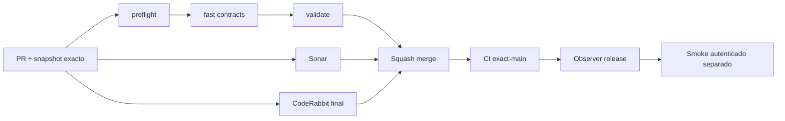

# GrindFlow — Último deploy

> **Candidato v0.1.81: diagnóstico de redirects absolutos same-origin (#73).** Base main v0.1.80 `25fbf66b5ac31255a38405ba03d18bf03bc8a016`; sin migraciones ni mutación productiva.

## Progress convention
- ✅ ~~Completado~~ = verificado; 🚧 Pendiente = en curso; ⛔ bloqueado = dependencia externa.

## Fuentes de verdad
[AGENTS.md](AGENTS.md) · [Spec](docs/GRINDFLOW-SPEC.md) · [Requisitos](docs/REQUIREMENTS.md) · [Transición](docs/STACK-TRANSITION-SYMFONY.md) · [Roadmap #2](https://github.com/pl0n3r/GrindFlow/issues/2)

## Estado del deploy
| Señal | Estado | Evidencia |
| --- | --- | --- |
| Version objetivo | 🚧 **v0.1.81** | `config/version.php` |
| Base exacta | ✅ ~~main v0.1.80~~ | `25fbf66b5ac31255a38405ba03d18bf03bc8a016` |
| CI del PR | ✅ ~~Completado~~ | último HEAD validado `d7528f343be1858e00552b7aca94304f5b41b8e2`, run `35683650514`; cambio userinfo pendiente de CI |
| Sonar | ✅ ~~Completado~~ | Quality Gate OK, 0 issues sobre `d7528f343be1858e00552b7aca94304f5b41b8e2`; cambio userinfo pendiente |
| CodeRabbit | 🚧 Revisión final tras corrección userinfo | Full review en `d7528f3` detectó dos hallazgos menores atendidos aquí; nueva revisión pendiente |
| CI del SHA exacto de main | ✅ ~~v0.1.80 success~~ | run `35683135770`, SHA `25fbf66b5` |
| Deploy Observer | ⛔ Release v0.1.80 NO observado | run `35683135669` failure: `/_deployment` HTTP 403 repetido; no prueba SHA remoto |
| Production Smoke | ⛔ Auth E2E no validada | [#73](https://github.com/pl0n3r/GrindFlow/issues/73), run `35683135795` failure |
| Symfony en Hostinger | ⛔ NO desplegado | S5 solo en CI aislado |
| Migraciones | ✅ ~~Sin cambios de esquema~~ | DB productiva intacta |

## Huella del cambio
<!-- grindflow:git-delta -->
| Archivos | Inserciones | Eliminaciones | Neto |
| ---: | ---: | ---: | ---: |
| **4** | **+116** | **−62** | **+54** |

## Calidad y entrega
<!-- grindflow:gate-plan -->
| Control | Estado / contrato |
| --- | --- |
| Gates seleccionados | **preflight · fast[contracts]** |
| Gate agregador obligatorio | **validate**: exige éxito de todos los jobs seleccionados y Sonar se verifica por separado |
| Alcance | Parser estricto de redirect del mismo origen y contratos negativos |
| Revisiones | CI/Sonar/CodeRabbit del head exacto; squash, exact-main y producción por separado |

## Flujo de entrega

## Qué se hizo
- #73: un `Location` absoluto puede ser legítimo en producción; el parser anterior lo etiquetaba `(redacted)` incluso si era el mismo origen, sin diagnosticar la ruta.
- `safe_redirect_path` permite **solo** rutas estáticas reconocidas cuando un redirect relativo o absoluto coincide en esquema, hostname, puerto efectivo y ausencia de userinfo con `BASE_URL`. Nunca imprime host, query, fragment, URL remota o ruta desconocida.
- Contratos mock: login absoluto same-origin a `/dashboard`, dashboard absoluto a `/login`; rechazos de externo, protocol-relative, esquema, puerto, host y userinfo diferentes; rechazo de userinfo vacío en BASE_URL y equivalencia de puertos HTTP 80/HTTPS 443.
- Conserva fail-fast, privados 0600 e `incident_id` validado de v0.1.79. **No prueba credenciales ni corrige por sí solo la sesión E2E.** #73 sigue abierto.

## Archivos modificados en este deploy
Inventario del candidato v0.1.81; no es prueba de publicación. «solo el deploy actual» conserva el snapshot.
- `README.md`
- `config/version.php`
- `scripts/production-smoke-contract.sh`
- `scripts/production-smoke.sh`

## Validación
- CI/Sonar v0.1.81 success sobre el último HEAD verificado `d7528f343be1858e00552b7aca94304f5b41b8e2` (run `35683650514`); después se corrigió el caso de userinfo vacío y se añadieron contratos de puertos efectivos. Revalidar el HEAD que contiene este README sin fingir autorreferencia del SHA; CodeRabbit final sigue pendiente. Smoke PR usa curl simulado, nunca credenciales productivas.
- El `LOGIN_REDIRECT_PATH=(redacted)` real puede tener otras causas: observar solo la ruta saneada en un smoke posterior al deploy, sin repetir login ciegamente.

## Qué sigue
[Roadmap canónico #2](https://github.com/pl0n3r/GrindFlow/issues/2)

| Lane | Trabajo | Estado |
| --- | --- | --- |
| **NOW** | 🚧 Same-origin v0.1.81 | 🚧 Revisión final y merge |
| **NEXT** | 🚧 Diagnosticar el redirect real #73 | 🚧 Solo lectura |
| **LATER** | 🚧 Paridad Symfony y Traffic | 🚧 Sin cutover |
| **BLOCKED / EXTERNAL** | ⛔ Smoke E2E #73 | ⛔ Credenciales no confirmadas |

## Panorama general pendiente
| Lane | Frente | Estado |
| --- | --- | --- |
| **DONE** | ✅ ~~S5 v0.1.80 PR #79 fusionada~~ | ✅ ~~CodeRabbit y CI PR exitosos~~ |
| **NOW** | 🚧 Smoke seguro v0.1.81 | 🚧 CodeRabbit final pendiente |
| **NEXT** | 🚧 Resolver #73 con diagnóstico real | 🚧 Causa exacta no demostrada |
| **LATER** | 🚧 Distribution y Traffic Symfony | 🚧 Sin cutover |
| **BLOCKED / EXTERNAL** | ⛔ Smoke autenticado | ⛔ Symfony no desplegado |
