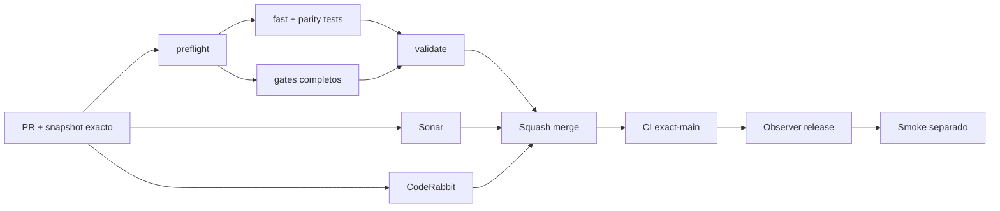

# GrindFlow — Último deploy

> **Candidato v0.1.94: aislamiento cross-tenant/IDOR revalidado después del restore.** Base exacta `main` v0.1.93 `a9ddf45215c50df9397f257f6e822f9fa29816ea`; vuelve a recorrer autorización Symfony+Doctrine sobre la MariaDB y el Vault sintéticos ya restaurados.

## Progress convention
- ✅ ~~Completado~~ = verificado; 🚧 Pendiente = en curso; ⛔ bloqueado = dependencia externa.

## Fuentes de verdad
[AGENTS.md](AGENTS.md) · [Spec](docs/GRINDFLOW-SPEC.md) · [Requisitos](docs/REQUIREMENTS.md) · [Transición](docs/STACK-TRANSITION-SYMFONY.md) · [Roadmap #2](https://github.com/pl0n3r/GrindFlow/issues/2)

## Estado del deploy
| Señal | Estado | Evidencia |
| --- | --- | --- |
| Version objetivo | 🚧 **v0.1.94** | `config/version.php`; no publicada |
| Base exacta | ✅ ~~main v0.1.93~~ | `a9ddf45215c50df9397f257f6e822f9fa29816ea` |
| CI / Sonar / CodeRabbit del PR | 🚧 Pendiente | Revalidar HEAD final |
| CI del SHA exacto de main | ✅ ~~v0.1.93 success~~ | run `#530` · SHA `a9ddf452` |
| Deploy Observer | ✅ ~~v0.1.93 success~~ | versión humana observada; SHA remoto no acreditado |
| Production Smoke | ⛔ Login E2E no validado | #73 sigue independiente |
| Symfony en Hostinger | ⛔ NO desplegado | Sin cutover |
| Datos productivos | ✅ ~~No tocados~~ | pruebas únicamente sobre restore sintético de CI |

## Huella del cambio
<!-- grindflow:git-delta -->
| Archivos | Inserciones | Eliminaciones | Neto |
| ---: | ---: | ---: | ---: |
| **5** | **+48** | **−28** | **+20** |

## Calidad y entrega
<!-- grindflow:gate-plan -->
| Control | Estado / contrato |
| --- | --- |
| Gates seleccionados | **preflight · fast[contracts] · php-quality · PHPUnit · MariaDB · browser · real-stack · legacy · symfony-preview** |
| Gate agregador obligatorio | **validate**: todos los seleccionados; Sonar y CodeRabbit aparte |
| Alcance | IDOR de lectura + mutación cross-tenant + papelera sobre estado restaurado |
| Revisiones | CI/Sonar/CodeRabbit HEAD; exact-main, Observer y Smoke separados |

## Flujo de entrega

## Qué se hizo
- `symfony-preview` ejecuta un segundo bloque de autorización **después** del restore destructivo MariaDB + Vault.
- `VaultTest.php` vuelve a comprobar listado, detalle, preview y descarga: un recurso de otro tenant permanece oculto con semántica 404.
- La misma prueba confirma que el cliente no puede elegir otra organización enviando `organization_id` y que una membresía revocada corta el acceso.
- `VaultBulkUsageTest.php` vuelve a demostrar que un lote con IDs cross-tenant falla completo, sin mutación parcial.
- `VaultTrashTest.php` revalida papelera/restauración, membresía y privacidad del original recuperado.
- Las pruebas usan HTTP Symfony + Doctrine contra **la misma MariaDB que acaba de ser restaurada**, no una base recién migrada distinta.
- GF-ARCH-002 queda avanzado de backup restaurable a recuperación + aislamiento tenant sintético; inventario real y cutover continúan fuera de alcance.

## Archivos modificados en este deploy
Inventario de solo el deploy actual: candidato, no evidencia de publicación:
<!-- grindflow:changed-files -->
- `.github/workflows/grindflow-ci.yml`
- `README.md`
- `config/version.php`
- `docs/DATA-CUTOVER-INVENTORY.md`
- `docs/REQUIREMENTS.md`

## Validación
- La rama debe pasar la matriz completa seleccionada por el cambio del workflow, `validate`, Sonar y revisión final CodeRabbit sobre el mismo HEAD.
- El orden exigido es migración → suite Symfony → reversión/reaplicación → restore drill → **pruebas negativas post-restore**; si el restore rompe ACL o tenant isolation, `symfony-preview` debe fallar.
- La evidencia usa fixtures y blobs sintéticos. No acredita backup productivo, RPO/RTO, aislamiento de datos reales, secretos/configuración restaurados ni SHA Hostinger.

## Qué sigue
[Roadmap canónico #2](https://github.com/pl0n3r/GrindFlow/issues/2)

| Lane | Trabajo | Estado |
| --- | --- | --- |
| **NOW** | 🚧 Revalidar aislamiento cross-tenant después del restore | 🚧 v0.1.94 candidata |
| **NEXT** | 🚧 Contrato de escritor único por módulo + inventario real autorizado | 🚧 GF-ARCH-002 |
| **LATER** | 🚧 Conmutación Symfony por módulo | 🚧 Sin deploy |
| **BLOCKED / EXTERNAL** | ⛔ Resolver login E2E productivo | ⛔ #73 |

## Panorama general pendiente
| Lane | Frente | Estado |
| --- | --- | --- |
| **DONE** | ✅ ~~v0.1.93 fusionada~~ | ✅ ~~reversión de migraciones derivada automáticamente~~ |
| **NOW** | 🚧 Aislamiento cross-tenant sobre copia restaurada | 🚧 v0.1.94 |
| **NEXT** | 🚧 Propiedad de escritura por módulo + metadata real autorizada | 🚧 Sin cutover |
| **LATER** | 🚧 Symfony en Hostinger | 🚧 No desplegado |
| **BLOCKED / EXTERNAL** | ⛔ Smoke autenticado Laravel | ⛔ #73 |
