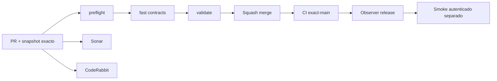

# GrindFlow — Último deploy

> **Snapshot v0.1.36: solo el deploy actual; entrega de infraestructura CI, todavía no fusionada ni desplegada.** Base `main` v0.1.35 `f0340d26a3dc4e89ff01292383f434e64d2eac44`. El selector de pruebas se ajusta por rutas; Chromium reutiliza binarios según lockfile, las suites DB no repiten un fallo y el reporte diario muestra tiempo/fallos. Laravel sigue como runtime; **Symfony no está desplegado ni se migraron cuentas**.

## Progress convention
- ✅ ~~Completado~~ = verificado; 🚧 Pendiente = en curso; ⛔ bloqueado = dependencia externa.

## Fuentes de verdad
[AGENTS.md](AGENTS.md) · [Spec](docs/GRINDFLOW-SPEC.md) · [Requisitos](docs/REQUIREMENTS.md) · [Transición](docs/STACK-TRANSITION-SYMFONY.md) · [Roadmap #2](https://github.com/pl0n3r/GrindFlow/issues/2)

## Estado del deploy
| Señal | Estado | Evidencia |
| --- | --- | --- |
| Version objetivo | 🚧 **v0.1.36** | `config/version.php` |
| Base exacta | ✅ ~~main v0.1.35~~ | `f0340d26a3dc4e89ff01292383f434e64d2eac44` |
| CI del PR | 🚧 Head final pendiente | `GrindFlow CI / validate` |
| Sonar | 🚧 Pendiente | SonarCloud PR |
| CodeRabbit | 🚧 Revisión por comprobar | PR |
| CI del SHA exacto de main | 🚧 Después del merge | CI PR no lo sustituye |
| Deploy Observer | 🚧 Release humano por observar | No prueba Symfony en remoto |
| Production Smoke | ⛔ Credencial E2E productiva pendiente | [Issue #1](https://github.com/pl0n3r/GrindFlow/issues/1) |
| Symfony S1 en Hostinger | ⛔ NO desplegado | Solo entorno aislado CI |
| Migraciones | ✅ ~~Ningún esquema productivo modificado~~ | DB Symfony descartable |

## Huella del cambio
<!-- grindflow:git-delta -->
| Archivos | Inserciones | Eliminaciones | Neto |
| ---: | ---: | ---: | ---: |
| **11** | **+382** | **−35** | **+347** |

## Calidad y entrega
<!-- grindflow:gate-plan -->
| Control | Estado / contrato |
| --- | --- |
| Gates seleccionados | **preflight · fast[contracts] · php-quality · PHPUnit · MariaDB · browser · real-stack · legacy · symfony-preview** |
| Alcance | CI completo por cambios al core; prueba de selección de gates, grupo DB, cache Chromium y reporte diario |
| Revisiones | CI/Sonar/CodeRabbit, exact-main y Hostinger son independientes |

## Flujo de entrega

## Qué se hizo
- Selector de gates preserva matriz completa al editar CI nuclear o pedir workflow manual, pero omite Symfony pesado para documentación Symfony aislada.
- El test DB detecta el grupo `database` y evita repetir toda la suite tras un fallo real. Contrato automatizado verifica ambas rutas.
- Chromium se cachea por sistema operativo y lockfile, con instalación segura en cache miss; sintaxis PHP Symfony usa 4 procesos.
- Health diario de Actions calcula mediana/p90 y alertas de deterioro por evento, sin cambiar pruebas ni ramas por sí solo. Política durable en AGENTS y [guía](docs/CI-PERFORMANCE.md).
- No se cambiaron Laravel, datos de producción ni el cutover Symfony.

## Archivos modificados en este deploy
- `.github/workflows/ci-health.yml`
- `.github/workflows/grindflow-ci.yml`
- `AGENTS.md`
- `README.md`
- `config/version.php`
- `docs/CI-PERFORMANCE.md`
- `scripts/ci-performance-report.py`
- `scripts/ci-scope-contract.sh`
- `scripts/ci-scope.sh`
- `scripts/database-test-runner-contract.sh`
- `scripts/database-test-runner.sh`

## Validación
- Scripts tienen self-test y contratos; CI completo de PR, Sonar/CodeRabbit y CI exact-main se verifican por separado.
- Telemetría de Actions es read-only y no equivale a funcionamiento productivo de Hostinger.

## Qué sigue
| Lane | Trabajo |
| --- | --- |
| **NOW** | 🚧 Verificar CI adaptable v0.1.36, [roadmap #2](https://github.com/pl0n3r/GrindFlow/issues/2) |
| **NEXT** | 🚧 Vault móvil real con contexto tenant-safe |
| **LATER** | 🚧 Vault móvil → reglas → distribución autorizada → piloto |
| **BLOCKED / EXTERNAL** | ⛔ Cutover sin paridad/datos migrados; Smoke sin credencial |

## Panorama general pendiente
| Lane | Frente | Estado |
| --- | --- | --- |
| **DONE** | ✅ ~~Dashboard Laravel v0.1.30~~ | ✅ ~~Esquema Symfony S1 v0.1.31~~ |
| **NOW** | 🚧 Infraestructura CI v0.1.36 | 🚧 CI completo y revisión |
| **NEXT** | 🚧 Vault móvil | 🚧 S2 |
| **LATER** | 🚧 Automatización de contenido | 🚧 S2–S5 |
| **BLOCKED / EXTERNAL** | ⛔ Sin cutover Symfony | ⛔ Sin credencial Smoke |
