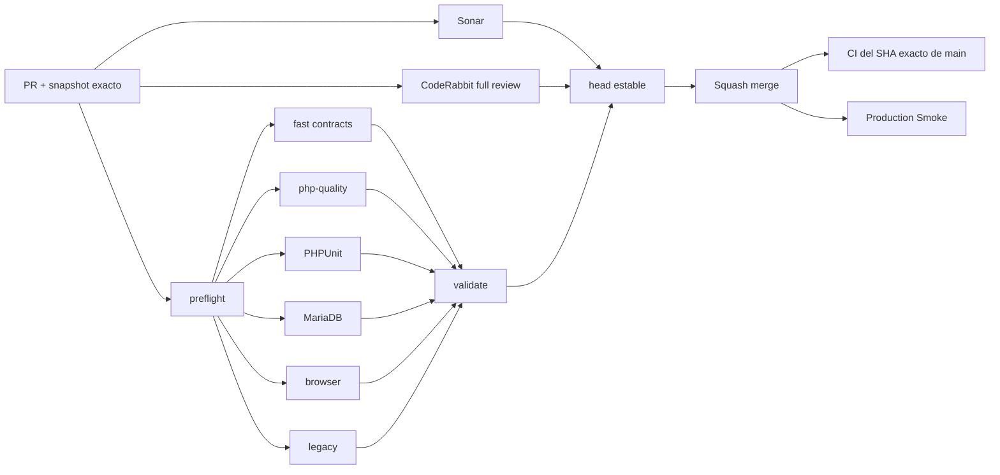

# GrindFlow — Último deploy

  
  
  

> **Development dashboard** · snapshot profesional de **solo el deploy actual**. CI, deploy y validacion en produccion son evidencias distintas.

## Estado del deploy

| Señal | Estado actual | Evidencia |
| --- | --- | --- |
| Work line | 🟠 **GF-FR-003 · FFmpeg thumbnail derivatives** | IMPLEMENTED en rama enfocada |
| Base exacta | ✅ **main** | `2fe691e01fb74de2c9bc60c22c99d0a021a9c292` |
| Produccion actual | ✅ **smoke verde** | Production Smoke #33 · attempt 2 sobre la base exacta |
| Migraciones | ✅ **0 pendientes** | no hay cambios de schema en este slice |
| Feature gates | 🔒 **off por defecto** | `MEDIA_FFPROBE_ENABLED=false` · `MEDIA_FFMPEG_DERIVATIVES_ENABLED=false` |

## Huella del cambio

<!-- grindflow:git-delta -->

| Archivos | Inserciones | Eliminaciones | Neto |
| ---: | ---: | ---: | ---: |
| **__FILES__** | **+__ADD__** | **−__DEL__** | **__NET__** |

La huella se calcula con `git diff --numstat`; CI rechaza este dashboard si queda desactualizado.

## Calidad y entrega

<!-- grindflow:gate-plan -->

| Control | Estado / contrato |
| --- | --- |
| Gates seleccionados | **preflight · fast[contracts] · php-quality · PHPUnit · MariaDB · browser · legacy** |
| GrindFlow CI | `validate` exige success real para cada gate seleccionado |
| Sonar | análisis independiente + comentario estable de detalles del PR |
| CodeRabbit | full review sobre el head estable |
| Exact-main | CI vuelve a validar el SHA exacto despues del squash merge |
| Produccion | FFprobe y FFmpeg no se habilitan automaticamente aunque el codigo se despliegue |

## Flujo de entrega

## Qué se hizo

- Añade un runner FFmpeg aislado que nunca persiste stderr ni payloads del proceso.
- Genera un único `thumbnail_v1` WebP para imágenes y videos detrás de un feature gate apagado por defecto.
- Usa una clave determinista por organización + SHA-256 del original + perfil, por lo que los reintentos sobrescriben el mismo artefacto en lugar de duplicarlo.
- Copia el original a un temporal, limita el thumbnail a 640 px de ancho sin upscaling y elimina metadata/capítulos antes de escribirlo.
- Separa la identidad del procesador: v2 base, v3 FFprobe, v4 FFmpeg y v5 FFprobe + FFmpeg.
- Persiste perfil, disk, key, MIME, byte size y SHA-256 del derivado solo después de una escritura exitosa.
- Mapea timeout, fallo del proceso, salida inválida y fallo de storage a errores seguros y acotados.
- Añade regresiones para combinación de modos, transición disabled → FFmpeg, idempotencia del job y errores seguros del runner.

## Archivos modificados en este deploy

- `.env.example` — feature gate, binario y timeout de FFmpeg.
- `README.md` — snapshot exacto del slice actual.
- `app/Services/Media/FfmpegCommandRunner.php` — ejecución acotada y errores seguros.
- `app/Services/Media/FfmpegMediaDerivativeGenerator.php` — thumbnail WebP determinista.
- `app/Services/Media/MediaAssetProcessor.php` — versiones v4/v5 y manifiesto de derivados.
- `app/Services/Media/MediaProcessingException.php` — códigos seguros de derivados.
- `config/grindflow.php` — configuración FFmpeg fail-closed.
- `docs/REQUIREMENTS.md` — verificación ampliada de GF-FR-003.
- `tests/Feature/FfmpegCommandRunnerTest.php` — éxito, fallo seguro y timeout.
- `tests/Feature/MediaProcessingJobTest.php` — transición e idempotencia de thumbnail.

## Validación

- Estado actual: **IMPLEMENTED** en `feat/ffmpeg-thumbnail-derivatives`.
- Base exacta: `2fe691e01fb74de2c9bc60c22c99d0a021a9c292`.
- La base previa está VALIDATED IN PRODUCTION: CI #240 verde y Production Smoke #33 recuperado en attempt 2.
- No hay cambios de schema ni mutaciones de producción en este slice.
- `MEDIA_FFMPEG_DERIVATIVES_ENABLED=false` por defecto, por lo que desplegar el código no exige que Hostinger tenga FFmpeg instalado.
- Antes del merge se exige matriz completa, Sonar, CodeRabbit y recheck del SHA exacto de `main`.

## Qué sigue

| Lane | Trabajo |
| --- | --- |
| **NOW** | Abrir PR y validar matriz completa + revisión del contrato de derivados. |
| **NEXT** | Tras merge, CI exacto + Production Smoke; verificar disponibilidad real de FFmpeg antes de habilitar el gate. |
| **BLOCKED / EXTERNAL** | Object storage S3-compatible sigue sin configurar; FFmpeg real en Hostinger aun no esta validado. |
| **LATER** | Preview de video/normalización adicional detrás de perfiles versionados y luego P2. |

## Panorama general pendiente

| Lane | Frente | Estado |
| --- | --- | --- |
| **NOW** | Media processing | thumbnail_v1 FFmpeg IMPLEMENTED, gate off |
| **NEXT** | Media processing | preview de video y perfiles adicionales |
| **NEXT** | Media Vault producción | Quick Upload disponible; Direct Upload espera object storage |
| **BLOCKED / EXTERNAL** | Hosting / storage | FFmpeg real y S3-compatible requieren configuración externa |
| **LATER** | Operacion | queues, scheduler, retries y backups |
| **LATER** | Legacy retirement | solo tras GF-MIG-003 / GF-MIG-004 |
| **LATER** | Producto P2 | distribución, atribución y finanzas |
