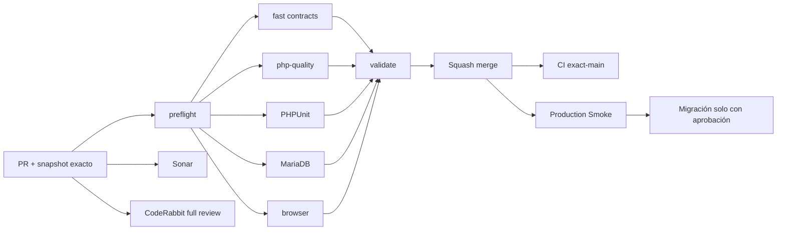

# GrindFlow — Último deploy

  
  
  

> **Development dashboard** · snapshot profesional de **solo el deploy actual**. CI, deploy y validación en producción son evidencias distintas.

## Estado del deploy

| Señal | Estado actual | Evidencia |
| --- | --- | --- |
| Work line | 🟠 **GF-FR-006A · Traffic + Distribution handoff** | IMPLEMENTED en rama enfocada |
| Base exacta | ✅ **main** | `1d9d148bca14c3095b7a439112e5213bfeb84e57` |
| Dependencias | ✅ **Scheduler, Traffic, Distribution merged** | PR #67, #70 y #73 |
| CI del SHA exacto de main | ⚪ **no observable por el conector** | PR validation se separa de exact-main |
| Producción | ⚪ **sin cambios** | sin providers ni publicaciones reales |
| Migración | 🟠 **una tabla opcional nueva** | `scheduled_publication_links`; no aplicada automáticamente |

## Huella del cambio

<!-- grindflow:git-delta -->

| Archivos | Inserciones | Eliminaciones | Neto |
| ---: | ---: | ---: | ---: |
| **13** | **+0000** | **−0000** | **+0000** |

La huella se calcula con `git diff --numstat`; CI rechaza este dashboard si queda desactualizado.

## Calidad y entrega

<!-- grindflow:gate-plan -->

| Control | Estado / contrato |
| --- | --- |
| Gates seleccionados | **preflight · fast[contracts] · php-quality · PHPUnit · MariaDB · browser** |
| GrindFlow CI | `validate` exige success real de cada gate seleccionado |
| Sonar | análisis independiente y comentario detallado del PR |
| CodeRabbit | revisión sobre head estable, findings revisados antes del merge |
| Migración | no se aplica desde este PR |
| Producción | no se habilitan providers ni mutaciones externas |

## Flujo de entrega

## Qué se hizo

- Añade `scheduled_publication_links` como asociación opcional y única por schedule.
- Las foreign keys compuestas protegen tenant entre schedule y tracked link, también en MariaDB.
- El Scheduler permite seleccionar un tracked link **activo** de la organización.
- Crea la asociación dentro de la transacción que crea la publicación; no crea schedule huérfano cuando falla la validación del link.
- Cross-tenant y links disabled se rechazan server-side, además de los permisos existentes.
- Sin la nueva tabla, GET y schedules sin tracked link siguen funcionando; POST con link devuelve 503.
- La lista de próximas publicaciones muestra el label del tracked link si existe.
- Distribution carga la asociación cuando está disponible y bloquea un link deshabilitado antes de provider I/O.
- Añade regresiones positivas, negativas, pre-migración, dispatch y FK cross-tenant en MariaDB.
- No crea adaptadores reales, pagos ni conexiones a plataformas externas.

## Archivos modificados en este deploy

- `AGENTS.md` — regla duradera de asociación tenant-aware.
- `README.md` — dashboard exacto de este slice.
- `app/Http/Controllers/Scheduling/SchedulerController.php` — lista y registra link opcional.
- `app/Http/Requests/Scheduling/StoreScheduledPublicationRequest.php` — UUID opcional.
- `app/Models/ScheduledPublication.php` — relación al link asociado.
- `app/Models/ScheduledPublicationLink.php` — modelo de asociación tenant-owned.
- `app/Models/TrackedLink.php` — relación inversa.
- `app/Services/Distribution/PublicationDeliveryManager.php` — revalidación pre-provider.
- `app/Services/Scheduling/ContentScheduler.php` — asociación transaccional/validación.
- `database/migrations/2026_09_19_053000_create_scheduled_publication_links.php` — FKs compuestas.
- `docs/REQUIREMENTS.md` — aceptación GF-FR-006A.
- `resources/views/scheduling/index.blade.php` — selector y lista de enlaces.
- `tests/Feature/ScheduleTrackedLinkTest.php` — tenant, migration-safe y distribución.

## Validación

- Estado: **IMPLEMENTED en `feat/traffic-distribution-link-v1`**, pendiente PR/gates.
- Base exacta: `1d9d148bca14c3095b7a439112e5213bfeb84e57`.
- Un mismo schedule solo puede guardar un link asociado.
- La migración es aditiva; schedules no vinculados conservan el comportamiento existente.
- El test MariaDB verifica que SQL directo tampoco enlaza registros de distintos tenants.
- No se modificó producción ni se ejecutó migración productiva.

## Qué sigue

| Lane | Trabajo |
| --- | --- |
| **NOW** | Abrir PR del handoff Traffic + Distribution y validar matriz completa + reviews. |
| **NEXT** | Squash merge, exact-main CI y Smoke como evidencias independientes. |
| **NEXT** | Adaptador real con credenciales seguras y contrato explícito del tracked URL. |
| **BLOCKED / EXTERNAL** | Migraciones productivas, FFmpeg y S3-compatible requieren configuración/aprobación. |
| **LATER** | Payouts/invoices y retiro progresivo del legacy. |

## Panorama general pendiente

| Lane | Frente | Estado |
| --- | --- | --- |
| **NOW** | Traffic + Distribution | asociación implementada · pendiente CI/review |
| **NEXT** | Distribution providers | adapters reales + auth/reconnect |
| **NEXT** | Finance | ledger v1 merged, conciliación pendiente |
| **BLOCKED / EXTERNAL** | Producción | Scheduling/Distribution/Traffic/Finance migrations + Smoke |
| **BLOCKED / EXTERNAL** | Hosting / storage | FFmpeg real + S3-compatible |
| **LATER** | Legacy retirement | solo tras GF-MIG |
