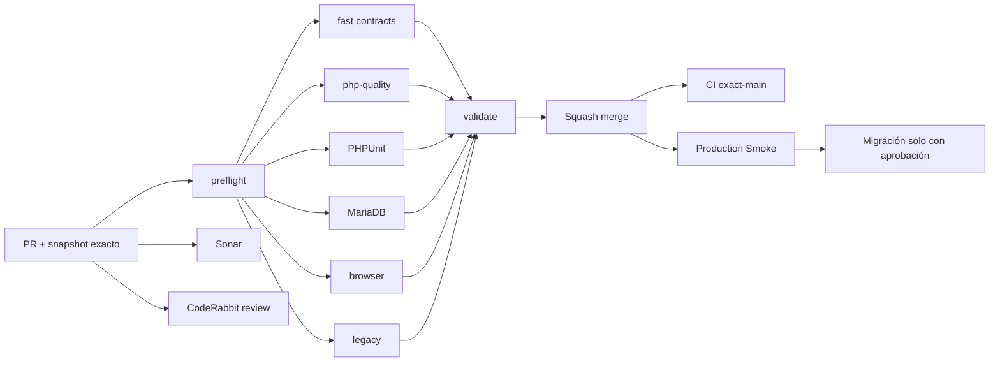

# GrindFlow — Último deploy

  
  
  

> **Development dashboard** · snapshot profesional de **solo el deploy actual**. CI, deploy y validación en producción son evidencias distintas.

## Estado del deploy

| Señal | Estado actual | Evidencia |
| --- | --- | --- |
| Work line | ✅ **GF-OPS · Migration manifest read-only** | PR #85 MERGED en `main` |
| Feature merge SHA | ✅ **main** | `a5c05147d14d4b7ad01077772ff9eec2fb8ebf72` |
| CI del PR | ✅ **GrindFlow CI #361 / validate** | fast, php-quality, PHPUnit, MariaDB, browser y legacy pasaron |
| Sonar | ✅ **Quality Gate OK** | PR #85: 0 issues / 0 hotspots tras corrección de parser |
| CodeRabbit | 🟠 **advisory sin aprobación final verificada** | no threads visibles al merge |
| CI exact-main | ⚪ **sin evidencia confirmada aquí** | PR y push de merge son controles distintos |
| Production Smoke | 🟠 **BLOCKED: seis migraciones identificadas** | run #35423144507, SHA `a5c05147…`, artifact de tres días |
| Migraciones | 🟠 **no ejecutadas** | no hay backup externo restaurable verificado ni aprobación del lote |

## Huella del cambio

<!-- grindflow:git-delta -->

| Archivos | Inserciones | Eliminaciones | Neto |
| ---: | ---: | ---: | ---: |
| **1** | **+0** | **−0** | **+0** |

La huella se calcula con `git diff --numstat`; CI rechaza este dashboard si queda desactualizado.

## Calidad y entrega

<!-- grindflow:gate-plan -->

| Control | Estado / contrato |
| --- | --- |
| Gates seleccionados | **preflight · fast[contracts]** |
| GrindFlow CI | docs-only: dashboard exacto y contratos |
| Sonar / CodeRabbit | controles separados del feature PR #85 |
| Migración | el manifiesto se obtiene por lectura, sin ejecutar schema changes |
| Producción | Smoke confirmó inventario; no confirma deploy Hostinger del SHA ni backup restaurable |

## Flujo de entrega

## Qué se hizo

- Registró el squash merge del extractor read-only de migraciones como `a5c05147…`.
- El nuevo Smoke autenticado confirmó `MIGRATION_INVENTORY_STATUS=verified` con seis nombres y SHA-256 del lote en el artefacto privado de tres días.
- El lote contiene Scheduling (1), Distribution (1), Traffic (1), Finance (2) y asociación de enlaces (1); su orden respeta referencias entre tablas.
- La guardia evita emitir HTML, CSRF, credenciales o manifest parcial cuando el inventario no es válido.
- Este PR documental no ejecuta migraciones ni modifica datos, backups, secrets o storage de producción.

## Archivos modificados en este deploy

- `README.md` — registra el manifiesto comprobado y la siguiente decisión operativa.

## Validación

- PR #85 fusionado: `a5c05147d14d4b7ad01077772ff9eec2fb8ebf72`; CI #361 `validate` y gates seleccionados en success.
- Sonar Quality Gate OK tras eliminar lectura de rutas CLI arbitrarias: parser usa stdin acotado; CodeRabbit final no verificado al merge.
- Production Smoke run `35423144507`: seis pendientes, nombres y checksum de lote verificados desde Admin > System, salida temprana sin repetición del login.
- El artefacto contiene el manifest completo, no la copia de base de datos. No se ha comprobado backup restaurable ni ejecutado migraciones.

## Qué sigue

| Lane | Trabajo |
| --- | --- |
| **NOW** | Confirmar CI exact-main y deploy Hostinger del SHA `a5c05147…`. |
| **NEXT** | Verificar respaldo externo restaurable de MariaDB y revisar lote exacto + fingerprint en Admin > System. |
| **NEXT** | Solo tras aprobación explícita del operador, ejecutar migraciones y repetir Smoke autenticado. |
| **BLOCKED / EXTERNAL** | Backup/aprobación, object storage S3 y FFmpeg. |
| **LATER** | Providers reales en sandbox y conciliación Finance. |

## Panorama general pendiente

| Lane | Frente | Estado |
| --- | --- | --- |
| **NOW** | Exact-main + despliegue | merge #85 validado en PR; comprobar estado independiente |
| **NEXT** | Migraciones productivas | seis nombres verificados; backup + aprobación pendientes |
| **NEXT** | Scheduling/Distribution/Traffic/Finance | schema productivo por aplicar |
| **BLOCKED / EXTERNAL** | Hosting/storage | S3 + FFmpeg |
| **LATER** | Provider adapters | sandbox y credenciales cifradas |
| **LATER** | Legacy retirement | tras GF-MIG |
