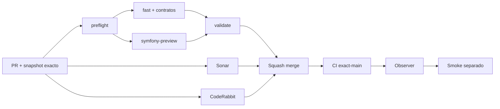

# GrindFlow — Último deploy

> **Candidato v0.1.118: contrato HTTP tenant-safe para staging de media grande.** Base exacta main v0.1.117 `c67a0f0eedcf4c5138d1060817963dccfc7d9ffa`. No configura proveedor, no crea assets grandes y no acredita despliegue Symfony.

## Progress convention
- ✅ ~~Completado~~ = verificado; 🚧 Pendiente = en curso; ⛔ bloqueado = dependencia externa.

## Fuentes de verdad
[AGENTS.md](AGENTS.md) · [Spec](docs/GRINDFLOW-SPEC.md) · [Requisitos](docs/REQUIREMENTS.md) · [Transición](docs/STACK-TRANSITION-SYMFONY.md) · [Roadmap #2](https://github.com/pl0n3r/GrindFlow/issues/2)

## Estado del deploy
| Señal | Estado | Evidencia |
| --- | --- | --- |
| Versión objetivo | 🚧 **v0.1.118** | `config/version.php`; candidata, no publicada |
| Base exacta | ✅ ~~main v0.1.117~~ | `c67a0f0eedcf4c5138d1060817963dccfc7d9ffa` |
| CI del PR | 🚧 Pendiente | `validate` sobre HEAD final |
| Sonar del PR | 🚧 Pendiente | Quality Gate sobre HEAD final |
| CodeRabbit del PR | 🚧 Pendiente | Full review terminal del mismo SHA |
| CI exact-main de la base | ✅ ~~success~~ | #35896670636 sobre `c67a0f0…` |
| Deploy Observer base | ✅ ~~Marcador observado~~ | #35896670601; no acredita SHA remoto |
| Production Smoke | ⛔ Bloqueo externo #73 | #35896670356 failure |
| Symfony en Hostinger | ⛔ NO desplegado | Sin cutover |
| Datos productivos | ✅ ~~No tocados~~ | Solo cambios de código, test y documentos |

## Huella del cambio
<!-- grindflow:git-delta -->
| Archivos | Inserciones | Eliminaciones | Neto |
| ---: | ---: | ---: | ---: |
| **7** | **+0** | **−0** | **+0** |

## Calidad y entrega
<!-- grindflow:gate-plan -->
| Control | Estado / contrato |
| --- | --- |
| Gates seleccionados | **preflight · fast[operational contracts + automation syntax + README dashboard] · symfony-preview** |
| Gate agregador obligatorio | **validate**: todos los seleccionados; Sonar y CodeRabbit aparte |
| Alcance | GF-FR-021: contrato HTTP de intent y verificación de staging |
| Revisiones | CI/Sonar/CodeRabbit HEAD; exact-main, Observer y Smoke separados |

## Flujo de entrega

## Qué se hizo
- Nuevos POST JSON `/api/admin/vault/direct-upload/intent` y `/complete` con sesión, organización seleccionada, permiso de preparación y CSRF del Vault.
- Intent acepta metadatos cerrados de archivo entre >8 MiB y ≤2 GiB; complete recibe solo token cifrado de longitud acotada.
- Sin object storage, ambos POST devuelven 503 sanitizado y sin I/O externo; el quick upload local ≤8 MiB sigue intacto.
- El resultado positivo de complete solo certifica staging: `verified_staging_only` y `registered=false`, sin promocionar blob, añadir catálogo ni publicar.
- PHPUnit/MariaDB sintético cubre autenticación, organización, rol, revocación, CSRF, JSON acotado, MIME, tamaño y headers privados.
- No hay S3, navegador de media grande, credenciales reales, FFmpeg ni cambios en Hostinger.

## Archivos modificados en esta entrega candidata
Inventario exclusivo de esta entrega candidata, no prueba publicación:
<!-- grindflow:changed-files -->
- `README.md`
- `config/version.php`
- `docs/GRINDFLOW-SPEC.md`
- `docs/REQUIREMENTS.md`
- `docs/SYMFONY-VAULT-STORAGE.md`
- `symfony/src/Http/Controller/DirectUploadController.php`
- `symfony/tests/php/DirectUploadHttpTest.php`

## Validación
- Exigir `preflight`, `fast`, `symfony-preview`, `validate`, Sonar y CodeRabbit sobre HEAD final.
- Exact-main se verifica después del squash; Production Smoke #73 permanece separado.
- No se ejecutan migraciones, presign ni uploads productivos en esta entrega.

## Qué sigue
[Roadmap canónico #2](https://github.com/pl0n3r/GrindFlow/issues/2)

## Panorama general pendiente
| Lane | Frente | Estado |
| --- | --- | --- |
| **NOW** | 🚧 GF-FR-021: API tenant-safe de staging | 🚧 v0.1.118 candidata |
| **NEXT** | 🚧 Adaptador S3-compatible + catálogo transaccional | 🚧 pendiente |
| **BLOCKED / EXTERNAL** | ⛔ Smoke autenticado Laravel | ⛔ #73 |
| **LATER** | 🚧 Cutover Symfony por módulo | 🚧 sin deploy |
