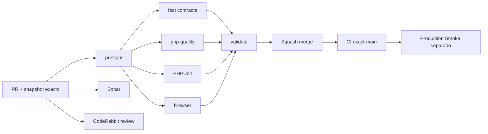

# GrindFlow — Último deploy

> **Snapshot PR v0.1.19: solo el deploy actual.** Base `main` v0.1.18 `52113e921408a7d1cc44445963c66c8855977179`: CI exact-main #35464332836 success. El Smoke v0.1.17 #35464138681 observó **producción v0.1.14**, incidente [#106](https://github.com/drpipe1098-commits/GrindFlow/issues/106). Ningún CI confirma el checkout remoto.

## Progress convention
- ✅ ~~Completado~~ = concluido y verificado por las compuertas aplicables.
- 🚧 Pendiente = por hacer o en curso, sin tachado.
- ⛔ Bloqueado = dependencia externa real.

## Fuentes de verdad
[AGENTS.md](AGENTS.md) · [Gobierno](docs/GOVERNANCE.md) · [Especificaciones](docs/GRINDFLOW-SPEC.md) · [Roadmap #88](https://github.com/drpipe1098-commits/GrindFlow/issues/88)

## Estado del deploy
| Señal | Estado | Evidencia |
| --- | --- | --- |
| Work line | 🚧 **Distribution: historial completo paginado** | GF-FR-005D |
| Base exacta | ✅ **main v0.1.18** | `52113e921408a7d1cc44445963c66c8855977179` |
| Version | 🚧 **v0.1.19 objetivo** | config/version.php |
| Version observada en producción | ⛔ **v0.1.14 obsoleta** | Smoke #35464138681; #106 |
| CI del PR | 🚧 **pendiente** | validate |
| Sonar | 🚧 **pendiente** | Quality Gate |
| CodeRabbit | 🚧 **pendiente** | full review |
| CI del SHA exacto de main | ✅ **base v0.1.18** | #35464332836 |
| Production Smoke | ⛔ **v0.1.17 falló** | Release v0.1.14 observada |
| Deploy v0.1.19 | 🚧 **no confirmado** | Hostinger pendiente |
| Migraciones | ✅ **sin SQL nuevo** | paginación sobre tablas existentes |
| ZIP | ✅ **sin entregables ZIP** | cambios GitHub |

## Huella del cambio
<!-- grindflow:git-delta -->
| Archivos | Inserciones | Eliminaciones | Neto |
| ---: | ---: | ---: | ---: |
| **8** | **+0** | **−0** | **+0** |

## Calidad y entrega
<!-- grindflow:gate-plan -->
| Control | Estado / contrato |
| --- | --- |
| Gates seleccionados | **preflight · fast[contracts] · php-quality · PHPUnit · browser** |
| Acceso | TenantScope en entregas, destinos y relaciones |
| Historial | SQL 25/página, `created_at DESC, id DESC`; sin corte 100 |
| Paginación | Total real, página y filtros conservados, recuperación fuera de rango |
| Timeline | Audit solo para página visible; fallback sin tabla |
| Tests | 106 entregas locales y una ajena, cinco páginas y filtros |
| Producción | Sin migraciones, POST, uploads ni publicación externa |

## Flujo de entrega

## Qué se hizo
- Distribution elimina `limit(100)` y usa páginas de 25 con orden estable y conteo SQL real para el tenant activo.
- Prev/Next conserva únicamente filtros validados; una página posterior al final permite regresar a la primera.
- Las métricas globales no se confunden con los resultados filtrados. Audit y relaciones se cargan solo para la página visible.
- Regresión HTTP con 106 entregas locales, otra organización, filtros combinados, página profunda e inputs inválidos.
- Especificaciones y reglas de agente actualizadas; versión humana v0.1.19.

## Archivos modificados en este deploy
- `AGENTS.md` — contrato de paginación Distribution.
- `README.md` — estado exacto de esta entrega.
- `app/Http/Controllers/Distribution/DistributionController.php` — consulta paginada.
- `config/version.php` — v0.1.19.
- `docs/GRINDFLOW-SPEC.md` — comportamiento de Distribution.
- `docs/REQUIREMENTS.md` — GF-FR-005D.
- `resources/views/distribution/index.blade.php` — navegación y recuperación.
- `tests/Feature/DistributionTest.php` — regresión >100 y cross-tenant.

## Validación
- Base v0.1.18: CI #35464332836 success; Smoke anterior observó v0.1.14.
- Este candidato requiere CI/Sonar/CodeRabbit; producción se verifica por separado.
- Los tests sintéticos no identifican SHA del checkout Hostinger ni prueban publicaciones reales.

## Qué sigue
| Lane | Trabajo |
| --- | --- |
| **NOW** | 🚧 Completar Distribution v0.1.19; [Roadmap #88](https://github.com/drpipe1098-commits/GrindFlow/issues/88) |
| **NEXT** | 🚧 Actualizar Hostinger y resolver [#106](https://github.com/drpipe1098-commits/GrindFlow/issues/106) |
| **LATER** | 🚧 Storage/FFmpeg [#40](https://github.com/drpipe1098-commits/GrindFlow/issues/40) |
| **BLOCKED / EXTERNAL** | 🚧 SHA de checkout Hostinger no observado |

## Panorama general pendiente
| Lane | Frente | Estado |
| --- | --- | --- |
| **DONE** | ✅ ~~CI exact-main v0.1.18~~ | ✅ ~~validate verde~~ |
| **NOW** | 🚧 Historial Distribution v0.1.19 | 🚧 pruebas y gates |
| **NEXT** | 🚧 Deploy reciente | 🚧 #106 |
| **LATER** | 🚧 Almacenamiento directo | 🚧 #40 |
| **BLOCKED / EXTERNAL** | 🚧 Checkout Hostinger | 🚧 sin prueba |
