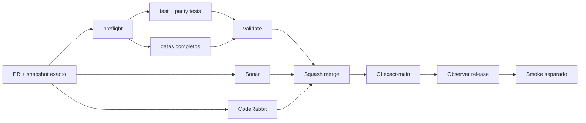

# GrindFlow — Último deploy

> **Candidato v0.1.90: paridad estructural offline del esquema Symfony `gf_*`.** Base exacta `main` v0.1.89 `d816d131d2a5ed5dd5bf136d625174c940a4ab0b`; compara columnas, índices, FKs y triggers sin conectar MariaDB ni ejecutar cutover.

## Progress convention
- ✅ ~~Completado~~ = verificado; 🚧 Pendiente = en curso; ⛔ bloqueado = dependencia externa.

## Fuentes de verdad
[AGENTS.md](AGENTS.md) · [Spec](docs/GRINDFLOW-SPEC.md) · [Requisitos](docs/REQUIREMENTS.md) · [Transición](docs/STACK-TRANSITION-SYMFONY.md) · [Roadmap #2](https://github.com/pl0n3r/GrindFlow/issues/2)

## Estado del deploy
| Señal | Estado | Evidencia |
| --- | --- | --- |
| Version objetivo | 🚧 **v0.1.90** | `config/version.php`; no publicada |
| Base exacta | ✅ ~~main v0.1.89~~ | `d816d131d2a5ed5dd5bf136d625174c940a4ab0b` |
| CI / Sonar / CodeRabbit del PR | 🚧 Pendiente | Revalidar HEAD final |
| CI del SHA exacto de main | 🚧 No observado para v0.1.89 | Señal post-merge separada |
| Deploy Observer | 🚧 Pendiente | No inferir checkout remoto |
| Production Smoke | ⛔ Login E2E no validado | #73 sigue independiente |
| Symfony en Hostinger | ⛔ NO desplegado | Sin cutover |
| Datos productivos | ✅ ~~No tocados~~ | Fuente + comparación offline de metadatos |

## Huella del cambio
<!-- grindflow:git-delta -->
| Archivos | Inserciones | Eliminaciones | Neto |
| ---: | ---: | ---: | ---: |
| **8** | **+747** | **−26** | **+721** |

## Calidad y entrega
<!-- grindflow:gate-plan -->
| Control | Estado / contrato |
| --- | --- |
| Gates seleccionados | **preflight · fast[contracts] · php-quality · PHPUnit · MariaDB · browser · real-stack · legacy · symfony-preview** |
| Gate agregador obligatorio | **validate**: todos los seleccionados; Sonar y CodeRabbit aparte |
| Alcance | Paridad estructural Symfony `gf_*`: columnas, índices, FKs y triggers |
| Revisiones | CI/Sonar/CodeRabbit HEAD; exact-main, Observer y Smoke separados |

## Flujo de entrega

## Qué se hizo
- Nuevo `scripts/symfony-schema-structure.py`: extrae estructura canónica directamente de las migraciones Doctrine, sin conexión a base de datos.
- Nuevo `scripts/data-schema-structure-parity.py`: compara esa fuente con un snapshot metadata-only recibido por stdin.
- La comparación cubre columnas (tipo/nulabilidad), índices (unicidad/orden), claves foráneas (referencias/`ON DELETE`) y triggers (tabla/timing/evento).
- Tablas no `gf_*` permanecen informativas; un `gf_*` inesperado o cualquier diferencia estructural falla cerrado.
- 10 pruebas nuevas cubren parser SQL, comas anidadas, prefijo `gf_`, estructura exacta, columnas, índices, tablas, triggers, row-data y fuente inconsistente.
- El gate `fast` compila y ejecuta ambos contratos estructurales; al tocar workflow se exige la matriz completa.
- No se ejecutan migraciones productivas, consultas MariaDB, restore, cutover ni cambio de writer.

## Archivos modificados en este deploy
Inventario de solo el deploy actual: candidato, no evidencia de publicación:
<!-- grindflow:changed-files -->
- `.github/workflows/grindflow-ci.yml`
- `README.md`
- `config/version.php`
- `docs/DATA-CUTOVER-INVENTORY.md`
- `scripts/data-schema-structure-parity.py`
- `scripts/symfony-schema-structure.py`
- `tests/test_data_schema_structure_parity.py`
- `tests/test_symfony_schema_structure.py`

## Validación
- La rama debe pasar la matriz completa seleccionada por el cambio del workflow, `validate`, Sonar y revisión final CodeRabbit sobre el mismo HEAD.
- El reporte estructural cubre **solo el esquema Symfony `gf_*` declarado en migraciones**. No acredita defaults/check constraints, conteos, contenido, versión de migraciones aplicada, backup restaurable, tenant isolation productivo ni SHA Hostinger.
- Ningún snapshot real se incluye en el repositorio por esta entrega.

## Qué sigue
[Roadmap canónico #2](https://github.com/pl0n3r/GrindFlow/issues/2)

| Lane | Trabajo | Estado |
| --- | --- | --- |
| **NOW** | 🚧 Validar paridad estructural Symfony contra snapshot seguro | 🚧 v0.1.90 candidata |
| **NEXT** | 🚧 Captura read-only autorizada + restore drill descartable | 🚧 GF-ARCH-002 |
| **LATER** | 🚧 Conmutación Symfony por módulo | 🚧 Sin deploy |
| **BLOCKED / EXTERNAL** | ⛔ Resolver login E2E productivo | ⛔ #73 |

## Panorama general pendiente
| Lane | Frente | Estado |
| --- | --- | --- |
| **DONE** | ✅ ~~v0.1.89 fusionada~~ | ✅ ~~paridad table-level + README autogenerado~~ |
| **NOW** | 🚧 Structural parity Symfony | 🚧 v0.1.90 |
| **NEXT** | 🚧 Snapshot real autorizado + backup restaurado | 🚧 Sin cutover |
| **LATER** | 🚧 Symfony en Hostinger | 🚧 No desplegado |
| **BLOCKED / EXTERNAL** | ⛔ Smoke autenticado Laravel | ⛔ #73 |
