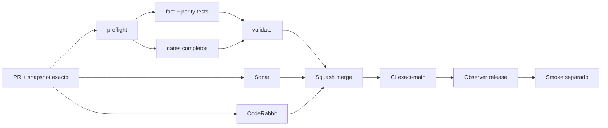

# GrindFlow — Último deploy

> **Candidato v0.1.94: aislamiento cross-tenant/IDOR verificado después del restore.** Base exacta `main` v0.1.93 `a9ddf45215c50df9397f257f6e822f9fa29816ea`; reutiliza regresiones de Vault, clasificación masiva, papelera, organización y autorización sobre la MariaDB restaurada.

## Progress convention
- ✅ ~~Completado~~ = verificado; 🚧 Pendiente = en curso; ⛔ bloqueado = dependencia externa.

## Fuentes de verdad
[AGENTS.md](AGENTS.md) · [Spec](docs/GRINDFLOW-SPEC.md) · [Requisitos](docs/REQUIREMENTS.md) · [Transición](docs/STACK-TRANSITION-SYMFONY.md) · [Roadmap #2](https://github.com/pl0n3r/GrindFlow/issues/2)

## Estado del deploy
| Señal | Estado | Evidencia |
| --- | --- | --- |
| Version objetivo | 🚧 **v0.1.94** | `config/version.php`; no publicada |
| Base exacta | ✅ ~~main v0.1.93~~ | `a9ddf45215c50df9397f257f6e822f9fa29816ea` |
| CI / Sonar / CodeRabbit del PR | 🚧 Pendiente | Revalidar HEAD final |
| CI del SHA exacto de main | 🚧 No observado para v0.1.93 | Señal post-merge separada |
| Deploy Observer | 🚧 Pendiente | No inferir checkout remoto |
| Production Smoke | ⛔ Login E2E no validado | #73 sigue independiente |
| Symfony en Hostinger | ⛔ NO desplegado | Sin cutover |
| Datos productivos | ✅ ~~No tocados~~ | Regresiones post-restore solo sobre DB CI descartable |

## Huella del cambio
<!-- grindflow:git-delta -->
| Archivos | Inserciones | Eliminaciones | Neto |
| ---: | ---: | ---: | ---: |
| **8** | **+95** | **−26** | **+69** |

## Calidad y entrega
<!-- grindflow:gate-plan -->
| Control | Estado / contrato |
| --- | --- |
| Gates seleccionados | **preflight · fast[contracts] · php-quality · PHPUnit · MariaDB · browser · real-stack · legacy · symfony-preview** |
| Gate agregador obligatorio | **validate**: todos los seleccionados; Sonar y CodeRabbit aparte |
| Alcance | Cross-tenant/IDOR post-restore: Vault, bulk, trash, organización y autorización |
| Revisiones | CI/Sonar/CodeRabbit HEAD; exact-main, Observer y Smoke separados |

## Flujo de entrega

## Qué se hizo
- Nuevo `scripts/symfony-post-restore-tenant-guard.sh`: ejecuta regresiones de aislamiento únicamente después del restore drill.
- Reutiliza `VaultTest` para comprobar 404 en detalle/preview/download de activos ajenos y bloqueo tras revocar membresía.
- Añade `VaultBulkUsageTest` post-restore para exigir rechazo atómico de lotes con IDs de otro tenant, sin mutación parcial.
- Añade `VaultTrashTest` post-restore para comprobar aislamiento y privacidad al mover/restaurar recursos.
- Reutiliza `OrganizationSettingsTest` para rechazar mutaciones IDOR mediante `organization_id`, roles insuficientes y CSRF inválido.
- Reutiliza `DistributionAuthorizationTest` para impedir autorizar recursos de otra organización.
- El guard exige `APP_ENV=test` y `CI=true`; un contrato shell prueba ambas barreras antes de depender de PHPUnit.
- `symfony-preview` ejecuta estas regresiones **después** de restaurar MariaDB + Vault y antes de arrancar el preview HTTP.
- `ci-scope.sh` fuerza el gate Symfony si cambia cualquiera de los scripts del guard.

## Archivos modificados en este deploy
Inventario de solo el deploy actual: candidato, no evidencia de publicación:
<!-- grindflow:changed-files -->
- `.github/workflows/grindflow-ci.yml`
- `README.md`
- `config/version.php`
- `docs/DATA-CUTOVER-INVENTORY.md`
- `docs/REQUIREMENTS.md`
- `scripts/ci-scope-contract.sh`
- `scripts/ci-scope.sh`
- `scripts/symfony-post-restore-tenant-guard-contract.sh`
- `scripts/symfony-post-restore-tenant-guard.sh`

## Validación
- La rama debe pasar la matriz completa seleccionada por el cambio del workflow, `validate`, Sonar y revisión final CodeRabbit sobre el mismo HEAD.
- Las cinco regresiones crean y destruyen datos sintéticos y se ejecutan **solo después del restore** sobre MariaDB descartable.
- Esta entrega no acredita datos productivos, RPO/RTO, secretos/configuración restaurados ni SHA Hostinger.

## Qué sigue
[Roadmap canónico #2](https://github.com/pl0n3r/GrindFlow/issues/2)

| Lane | Trabajo | Estado |
| --- | --- | --- |
| **NOW** | 🚧 Verificar aislamiento tenant después del restore | 🚧 v0.1.94 candidata |
| **NEXT** | 🚧 Inventario real autorizado + contrato de cutover por módulo | 🚧 GF-ARCH-002 |
| **LATER** | 🚧 Conmutación Symfony por módulo | 🚧 Sin deploy |
| **BLOCKED / EXTERNAL** | ⛔ Resolver login E2E productivo | ⛔ #73 |

## Panorama general pendiente
| Lane | Frente | Estado |
| --- | --- | --- |
| **DONE** | ✅ ~~v0.1.93 fusionada~~ | ✅ ~~reversión automática de todas las migraciones~~ |
| **NOW** | 🚧 Post-restore tenant isolation | 🚧 v0.1.94 |
| **NEXT** | 🚧 Snapshot real autorizado + contrato de cutover | 🚧 Sin cutover |
| **LATER** | 🚧 Symfony en Hostinger | 🚧 No desplegado |
| **BLOCKED / EXTERNAL** | ⛔ Smoke autenticado Laravel | ⛔ #73 |
