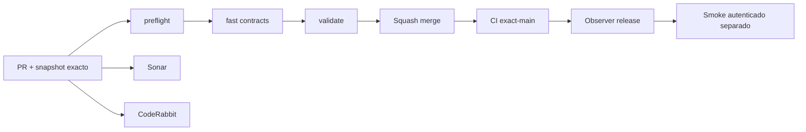

# GrindFlow — Último deploy

> **Candidato v0.1.64: límite de intentos de cambio de contraseña personal Symfony.** El alcance «solo el deploy actual» sigue siendo Laravel en Hostinger; Symfony continúa aislado. Base exacta `main` v0.1.63 `993293b06607bd31bcea622f906008a9f081d769`, CI exact-main success (run 35572662055). Ningún dato ni migración productiva fue modificado.

## Progress convention
- ✅ ~~Completado~~ = verificado; 🚧 Pendiente = en curso; ⛔ bloqueado = dependencia externa.

## Fuentes de verdad
[AGENTS.md](AGENTS.md) · [Spec](docs/GRINDFLOW-SPEC.md) · [Requisitos](docs/REQUIREMENTS.md) · [Transición](docs/STACK-TRANSITION-SYMFONY.md) · [Roadmap #2](https://github.com/pl0n3r/GrindFlow/issues/2)

## Estado del deploy
| Señal | Estado | Evidencia |
| --- | --- | --- |
| Version objetivo | 🚧 **v0.1.64** | `config/version.php` |
| Base exacta | ✅ ~~main v0.1.63~~ | `993293b06607bd31bcea622f906008a9f081d769` |
| CI del PR | 🚧 Head v0.1.64 por validar | `GrindFlow CI / validate` |
| Sonar | 🚧 Pendiente | SonarCloud PR |
| CodeRabbit | 🚧 Pendiente | PR |
| CI del SHA exacto de main | 🚧 Después del merge | CI PR no lo sustituye |
| Deploy Observer | 🚧 Release humano por observar | No prueba Symfony remoto |
| Production Smoke | ⛔ Credencial E2E productiva pendiente | [Issue #1](https://github.com/pl0n3r/GrindFlow/issues/1) |
| Symfony S2 en Hostinger | ⛔ NO desplegado | Solo entorno aislado CI |
| Migraciones | ✅ ~~Ningún esquema productivo modificado~~ | DB Symfony descartable |

## Huella del cambio
<!-- grindflow:git-delta -->
| Archivos | Inserciones | Eliminaciones | Neto |
| ---: | ---: | ---: | ---: |
| **9** | **+000** | **−000** | **+000** |

## Calidad y entrega
<!-- grindflow:gate-plan -->
| Control | Estado / contrato |
| --- | --- |
| Gates seleccionados | **preflight · fast[contracts] · symfony-preview** |
| Alcance | S1: ocho solicitudes con CSRF válido por cuenta y ventana móvil de 15 minutos; bloqueo 429 |
| Revisiones | CI/Sonar/CodeRabbit, exact-main y Hostinger independientes |

## Flujo de entrega

## Qué se hizo
- Protección de la cuenta Symfony: limitador independiente del login y de la sesión del navegador, con clave derivada del actor autenticado en el servidor.
- Respuesta `429` con código estable, `Retry-After` y `Cache-Control: no-store` antes de volver a calcular hashes o escribir SQL; CSRF inválido no consume cupo.
- Pruebas PHPUnit/MariaDB cubren límite tras cerrar y volver a abrir sesión; Chromium móvil comprueba mensaje de bloqueo y limpieza de contraseñas. Sin cambiar el runtime Laravel.
- Cache por defecto `cache.rate_limiter`; limpiar cache reinicia ventanas. Varias instancias Symfony requerirían cache compartido antes del cutover.

## Archivos modificados en este deploy
Inventario del **cambio candidato en PR**, NO prueba de deploy de Symfony en Hostinger.
- `README.md`
- `config/version.php`
- `docs/GRINDFLOW-SPEC.md`
- `docs/REQUIREMENTS.md`
- `symfony/README.md`
- `symfony/config/packages/framework.yaml`
- `symfony/src/Http/Controller/AccountSecurityController.php`
- `symfony/tests/e2e/preview.spec.mjs`
- `symfony/tests/php/AccountSecurityTest.php`

## Validación
- CI/Sonar/CodeRabbit del candidato v0.1.64 por verificar; CI exact-main v0.1.63 success.
- Sin checkout local de PHP/MariaDB/Chromium; GitHub Actions valida el cambio. Producción intacta.

## Qué sigue
[Roadmap canónico #2](https://github.com/pl0n3r/GrindFlow/issues/2)

| Lane | Trabajo | Estado |
| --- | --- | --- |
| **NOW** | 🚧 Validar seguridad de cuenta v0.1.64 | 🚧 CI y revisión |
| **NEXT** | 🚧 Contrato de revocación multi-sesión y recuperación verificable de MariaDB | 🚧 Sin suponer sesiones globales |
| **LATER** | 🚧 Paridad Symfony y cutover reversible | 🚧 Planificado |
| **BLOCKED / EXTERNAL** | ⛔ Cutover sin paridad/datos migrados; Smoke sin credencial | ⛔ Dependencia externa |

## Panorama general pendiente
| Lane | Frente | Estado |
| --- | --- | --- |
| **DONE** | ✅ ~~Dashboard Laravel v0.1.30~~ | ✅ ~~Esquema Symfony S1 v0.1.31~~ |
| **NOW** | 🚧 Límite de intentos por identidad v0.1.64 | 🚧 CI y revisión |
| **NEXT** | 🚧 Backup MariaDB y ensayo integral de restauración | 🚧 Retención y operación pendientes |
| **LATER** | 🚧 Paridad del monolito modular | 🚧 S2–S5 |
| **BLOCKED / EXTERNAL** | ⛔ Sin cutover Symfony | ⛔ Sin credencial Smoke |
