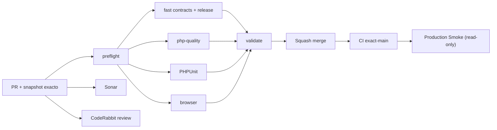

# GrindFlow — Último deploy

  
  
  

> **Snapshot PR v0.1.17: solo el deploy actual.** Base `main` v0.1.16 `79567348473cfa22cabd76675873dd7cbb739e71`: exact-main CI #35463437820 success, Production Smoke #35463437826 falló por versión **esperada** no presente en HTML. Incidente [#106](https://github.com/drpipe1098-commits/GrindFlow/issues/106). Nuevo diagnóstico sin integrar ni desplegar.

## Progress convention
- ✅ ~~Completado~~ = concluido y verificado por las compuertas aplicables.
- 🚧 Pendiente = por hacer o en curso, sin tachado.
- ⛔ Bloqueado = dependencia externa real.

## Fuentes de verdad
[AGENTS.md](AGENTS.md) · [Gobierno](docs/GOVERNANCE.md) · [Especificaciones](docs/GRINDFLOW-SPEC.md) · [Glosario](GLOSARIO.md) · [Roadmap #88](https://github.com/drpipe1098-commits/GrindFlow/issues/88)

## Estado del deploy
| Señal | Estado | Evidencia |
| --- | --- | --- |
| Work line | 🚧 **Observabilidad release producción** | Incidente #106 |
| Base exacta | ✅ **main v0.1.16** | `79567348473cfa22cabd76675873dd7cbb739e71` |
| Version | 🚧 **v0.1.17 objetivo** | marcador HTML + smoke |
| Version desplegada | ⛔ **no identificada** | Smoke v0.1.15 y v0.1.16 sin observación real |
| CI del PR | 🚧 **pendiente** | head final |
| Sonar | 🚧 **pendiente** | Quality Gate |
| CodeRabbit | 🚧 **pendiente** | review head estable |
| CI del SHA exacto de main | ✅ **base v0.1.16** | #35463437820 |
| Production Smoke | ⛔ **base v0.1.16 falló** | #35463437826, #106 |
| Deploy v0.1.17 | 🚧 **no confirmado** | smoke posterior |
| Migraciones | ✅ **sin SQL nuevo** | solo observabilidad |
| Formato de entrega | ✅ **sin generar ZIP** | GitHub + archivos individuales |

## Huella del cambio
<!-- grindflow:git-delta -->
| Archivos | Inserciones | Eliminaciones | Neto |
| ---: | ---: | ---: | ---: |
| **7** | **+124** | **−68** | **+56** |

## Calidad y entrega
<!-- grindflow:gate-plan -->
| Control | Estado / contrato |
| --- | --- |
| Gates seleccionados | **preflight · fast[contracts] · php-quality · PHPUnit · browser** |
| Smoke de versión | Distingue esperada de observada; `unknown` si no es identificable |
| Reintentos | Diferencia de release termina código 6, sin 15 logins repetidos |
| Seguridad | Sin HTML de Admin System ni credenciales en logs; producción read-only |
| Pruebas | Mock de release actual, antigua y ausente + aserción PHP |
| Entrega | CI, Sonar, CodeRabbit, exact-main y Production Smoke por separado |

## Flujo de entrega

## Qué se hizo
- Investigados logs privados de v0.1.15 y v0.1.16: ambos repitieron 15 login, `VAULT_READ_ONLY=ok`, `MEDIA_STORAGE_READY=0` y fallaron comparando versión esperada.
- Nuevo `data-grindflow-release` en Admin System; parser estricto y fallback textual para releases antiguos.
- Registros `RELEASE_UI_OBSERVED` y `RELEASE_UI_EXPECTED`, sin afirmar SHA Hostinger ni volcar HTML.
- Fallos de versión desconocida o distinta sin reiterar requests; regresiones mock y test Laravel del marcador.
- Nueva regla: no generar ni entregar archivos ZIP.

## Archivos modificados en este deploy
- `AGENTS.md` — regla sin ZIP y diagnóstico de release.
- `README.md` — snapshot de esta entrega.
- `config/version.php` — objetivo v0.1.17.
- `resources/views/admin/system.blade.php` — marcador de versión.
- `scripts/production-smoke-contract.sh` — contratos de release.
- `scripts/production-smoke.sh` — lectura y comparación segura.
- `tests/Feature/AdminSystemTest.php` — aserción de marcador.

## Validación
- Base v0.1.16: CI #35463437820 success; Production Smoke #35463437826 failure.
- Este código aún requiere CI/Sonar/CodeRabbit, exact-main y Production Smoke. El smoke no ejecuta writes.
- Los tests sintéticos no prueban versión real de Hostinger ni el checkout SHA.

## Qué sigue
| Lane | Trabajo |
| --- | --- |
| **NOW** | 🚧 Instrumentación v0.1.17 e incidente [#106](https://github.com/drpipe1098-commits/GrindFlow/issues/106); [Roadmap #88](https://github.com/drpipe1098-commits/GrindFlow/issues/88) |
| **NEXT** | 🚧 Verificar versión observada y despliegue Hostinger |
| **LATER** | 🚧 Storage/FFmpeg [#40](https://github.com/drpipe1098-commits/GrindFlow/issues/40) |
| **BLOCKED / EXTERNAL** | 🚧 SHA checkout Hostinger y object storage |

## Panorama general pendiente
| Lane | Frente | Estado |
| --- | --- | --- |
| **DONE** | ✅ ~~CI exact-main v0.1.16~~ | ✅ ~~validación de código~~ |
| **NOW** | 🚧 Smoke versionado v0.1.17 | 🚧 por validar |
| **NEXT** | 🚧 Deploy Hostinger y prod smoke #106 | 🚧 observación |
| **LATER** | 🚧 Direct upload y FFmpeg | 🚧 #40 |
| **BLOCKED / EXTERNAL** | 🚧 Checkout SHA del runtime | 🚧 no observado |
