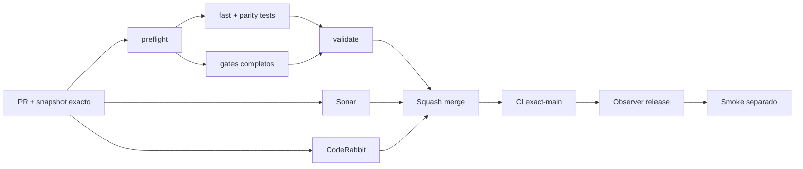

# GrindFlow — Último deploy

> **Candidato v0.1.114: GitHub Actions sobre runtime Node 24.** Base exacta `main` v0.1.113 `8f93a1e9e821ee498dc875ca71dd4fb8d7de3ec2`; acciones oficiales se migran a majors compatibles y CI bloquea referencias Node 20 conocidas.

## Progress convention
- ✅ ~~Completado~~ = verificado; 🚧 Pendiente = en curso; ⛔ bloqueado = dependencia externa.

## Fuentes de verdad
[AGENTS.md](AGENTS.md) · [Spec](docs/GRINDFLOW-SPEC.md) · [Requisitos](docs/REQUIREMENTS.md) · [Transición](docs/STACK-TRANSITION-SYMFONY.md) · [Roadmap #2](https://github.com/pl0n3r/GrindFlow/issues/2)

## Estado del deploy
| Señal | Estado | Evidencia |
| --- | --- | --- |
| Version objetivo | 🚧 **v0.1.114** | `config/version.php`; no publicada |
| Base exacta | ✅ ~~main v0.1.113~~ | `8f93a1e9e821ee498dc875ca71dd4fb8d7de3ec2` |
| CI del PR | 🚧 Pendiente | Exigir `validate` del HEAD final en `success` |
| Sonar del PR | 🚧 Pendiente | Exigir `SonarCloud Code Analysis` del HEAD final en `success` |
| CodeRabbit del PR | 🚧 Pendiente | Exigir revisión CodeRabbit completada del HEAD final |
| CI del SHA exacto de main | ✅ **VALIDATED IN CODE** | `35854276513` success sobre `8f93a1e9e821ee498dc875ca71dd4fb8d7de3ec2` |
| Deploy Observer | ✅ ~~Marcador humano observado~~ | `35854276670` success; no acredita SHA remoto |
| Production Smoke | ⛔ Login E2E no validado | `35854276470` failure, #73; independiente |
| Symfony en Hostinger | ⛔ NO desplegado | Sin cutover |
| Datos productivos | ✅ ~~No tocados~~ | Cambio de workflows/CI; sin cuentas ni datos reales |

## Huella del cambio
<!-- grindflow:git-delta -->
| Archivos | Inserciones | Eliminaciones | Neto |
| ---: | ---: | ---: | ---: |
| **9** | **+0** | **−0** | **+0** |

## Calidad y entrega
<!-- grindflow:gate-plan -->
| Control | Estado / contrato |
| --- | --- |
| Gates seleccionados | **preflight · fast[operational contracts + automation syntax + README dashboard] · php-quality · PHPUnit · MariaDB · browser · real-stack · legacy · symfony-preview** |
| Gate agregador obligatorio | **validate**: todos los seleccionados; Sonar y CodeRabbit aparte |
| Alcance | GF-OPS-013: acciones oficiales GitHub compatibles con runtime Node 24 |
| Revisiones | CI/Sonar/CodeRabbit HEAD; exact-main, Observer y Smoke separados |

## Flujo de entrega

## Qué se hizo
- `actions/checkout` pasa a v5, `actions/cache` a v5, `actions/setup-node` a v5 y `actions/upload-artifact` a v6 en los workflows que aún dependían de majors Node 20.
- Los pins SHA existentes de checkout/upload-artifact se actualizan a releases Node 24 compatibles; permisos, triggers, secretos y comandos de aplicación no cambian.
- `scripts/workflow-syntax-check.rb` rechaza referencias oficiales Node 20 conocidas antes de ejecutar la matriz y conserva los contratos de seguridad del smoke y del observer.
- GF-OPS-013 documenta el contrato durable. No cambia runtime de aplicación, datos, Laravel, Hostinger ni cutover Symfony.

## Archivos modificados en esta entrega candidata
Inventario exclusivo de esta entrega candidata; no prueba publicación:
<!-- grindflow:changed-files -->
- `.github/workflows/grindflow-ci.yml`
- `.github/workflows/production-diagnostics.yml`
- `.github/workflows/production-migration.yml`
- `.github/workflows/production-smoke.yml`
- `.github/workflows/sonar-pr-details.yml`
- `README.md`
- `config/version.php`
- `docs/REQUIREMENTS.md`
- `scripts/workflow-syntax-check.rb`

## Validación
- Exigir `validate`, Sonar y revisión CodeRabbit completada del HEAD final; después CI exact-main.
- La matriz completa debe demostrar checkout, cache, setup-node y upload-artifact con los majors nuevos, manteniendo los mismos inputs y contratos.
- Production Smoke #73 permanece separado; esta entrega no autoriza cambios de producción ni reintentos de credenciales.

## Qué sigue
[Roadmap canónico #2](https://github.com/pl0n3r/GrindFlow/issues/2)

## Panorama general pendiente
| Lane | Frente | Estado |
| --- | --- | --- |
| **NOW** | 🚧 GF-OPS-013: acciones oficiales sobre Node 24 | 🚧 v0.1.114 candidata |
| **NEXT** | 🚧 Siguiente hardening CI priorizado en roadmap | 🚧 por seleccionar tras exact-main |
| **BLOCKED / EXTERNAL** | ⛔ Smoke autenticado Laravel | ⛔ #73 |
| **LATER** | 🚧 Cutover Symfony por módulo | 🚧 sin deploy |
