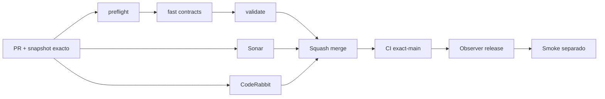

# GrindFlow — Último deploy

> **Candidato v0.1.88: inventario reproducible y guardas de coexistencia de datos.** Base exacta `main` v0.1.87 `e70b723d68e44ab1f182a01ae937ea21294f1aa4`; no conecta MariaDB, no ejecuta migraciones y no realiza cutover.

## Progress convention
- ✅ ~~Completado~~ = verificado; 🚧 Pendiente = en curso; ⛔ bloqueado = dependencia externa.

## Fuentes de verdad
[AGENTS.md](AGENTS.md) · [Spec](docs/GRINDFLOW-SPEC.md) · [Requisitos](docs/REQUIREMENTS.md) · [Transición](docs/STACK-TRANSITION-SYMFONY.md) · [Roadmap #2](https://github.com/pl0n3r/GrindFlow/issues/2)

## Estado del deploy
| Señal | Estado | Evidencia |
| --- | --- | --- |
| Version objetivo | 🚧 **v0.1.88** | `config/version.php`; no publicada |
| Base exacta | ✅ ~~main v0.1.87~~ | `e70b723d68e44ab1f182a01ae937ea21294f1aa4` |
| CI / Sonar / CodeRabbit del PR | 🚧 Pendiente | Revalidar HEAD final |
| CI del SHA exacto de main | 🚧 Pendiente | Se valida solo después del merge |
| Deploy Observer | 🚧 Pendiente | No inferir checkout remoto |
| Production Smoke | ⛔ Login E2E no validado | #73 sigue independiente |
| Symfony en Hostinger | ⛔ NO desplegado | Sin cutover |
| Migraciones | ✅ ~~No ejecutadas~~ | Inventario source-only |

## Huella del cambio
<!-- grindflow:git-delta -->
| Archivos | Inserciones | Eliminaciones | Neto |
| ---: | ---: | ---: | ---: |
| **4** | **+24** | **−46** | **−22** |

## Calidad y entrega
<!-- grindflow:gate-plan -->
| Control | Estado / contrato |
| --- | --- |
| Gates seleccionados | **preflight · fast[contracts]** |
| Gate agregador obligatorio | **validate**: todos los seleccionados; Sonar y CodeRabbit aparte |
| Alcance | Inventario estático de tablas y frontera de escritores Laravel/Symfony |
| Revisiones | CI/Sonar/CodeRabbit HEAD; exact-main, Observer y Smoke separados |

## Flujo de entrega

## Qué se hizo
- `scripts/data-schema-inventory.py` inventaría tablas declaradas por migraciones Laravel y Symfony sin abrir `DATABASE_URL` ni conectarse a una base.
- La guardia falla cerrado ante colisiones nominales y ante tablas Symfony nuevas que no respeten el prefijo `gf_`.
- El resultado JSON estable `gf-arch-002-source-inventory-v1` registra tabla, migración y escritor para revisión reproducible.
- `docs/DATA-CUTOVER-INVENTORY.md` fija frontera de escritores, requisitos de backup/restauración, ensayo descartable, verificación y rollback antes de cualquier cutover.
- GF-ARCH-002 permanece abierto: este cambio reduce riesgo pero no acredita paridad con datos productivos.

## Archivos modificados en este deploy
Inventario de solo el deploy actual: candidata, no evidencia de publicación:
- `README.md`
- `config/version.php`
- `docs/DATA-CUTOVER-INVENTORY.md`
- `scripts/data-schema-inventory.py`

## Validación
- La rama debe pasar `preflight`, `fast[contracts]`, `validate`, Sonar y revisión final CodeRabbit sobre el mismo HEAD.
- El inventario source-only **no** acredita MariaDB productiva, contenido real, restauración, paridad cross-tenant, SHA Hostinger ni cutover.

## Qué sigue
[Roadmap canónico #2](https://github.com/pl0n3r/GrindFlow/issues/2)

| Lane | Trabajo | Estado |
| --- | --- | --- |
| **NOW** | 🚧 Validar inventario/paridad source-only | 🚧 v0.1.88 candidata |
| **NEXT** | 🚧 Inventario real restaurado + pruebas de paridad | 🚧 GF-ARCH-002 |
| **LATER** | 🚧 Conmutación Symfony por módulo | 🚧 Sin deploy |
| **BLOCKED / EXTERNAL** | ⛔ Resolver login E2E productivo | ⛔ #73 |

## Panorama general pendiente
| Lane | Frente | Estado |
| --- | --- | --- |
| **DONE** | ✅ ~~v0.1.87 fusionada~~ | ✅ ~~readiness Symfony segura~~ |
| **NOW** | 🚧 Guardia de coexistencia de esquema | 🚧 v0.1.88 |
| **NEXT** | 🚧 Paridad/propietario de escritura por módulo | 🚧 Sin cutover |
| **LATER** | 🚧 Symfony en Hostinger | 🚧 No desplegado |
| **BLOCKED / EXTERNAL** | ⛔ Smoke autenticado Laravel | ⛔ #73 |
