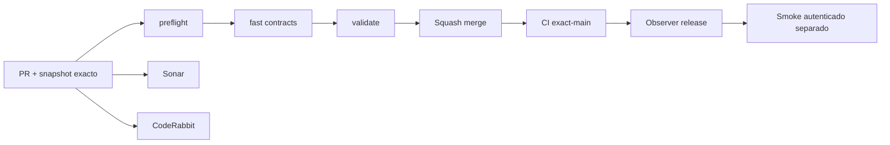

# GrindFlow — Último deploy

> **Candidato v0.1.72: agenda S4 persistida y cancelable.** Base exacta `main` v0.1.71 `52fd656a3e9e501085d54d4d246dada1d15330d7`, con CI exact-main success. Symfony sigue aislado: este slice reserva capacidad interna y conserva historial, pero no crea deliveries, jobs ni publicaciones externas.

## Progress convention
- ✅ ~~Completado~~ = verificado; 🚧 Pendiente = en curso; ⛔ bloqueado = dependencia externa.

## Fuentes de verdad
[AGENTS.md](AGENTS.md) · [Spec](docs/GRINDFLOW-SPEC.md) · [Requisitos](docs/REQUIREMENTS.md) · [Transición](docs/STACK-TRANSITION-SYMFONY.md) · [Roadmap #2](https://github.com/pl0n3r/GrindFlow/issues/2)

## Estado del deploy
| Señal | Estado | Evidencia |
| --- | --- | --- |
| Version objetivo | 🚧 **v0.1.72** | `config/version.php` |
| Base exacta | ✅ ~~main v0.1.71~~ | `52fd656a3e9e501085d54d4d246dada1d15330d7` |
| CI del PR | 🚧 Head v0.1.72 por validar | `GrindFlow CI / validate` |
| Sonar | 🚧 Pendiente | SonarCloud PR |
| CodeRabbit | 🚧 Pendiente | PR |
| CI del SHA exacto de main | ✅ ~~v0.1.71 success~~ | run `35628433067` |
| Deploy Observer | ✅ ~~v0.1.71 observado~~ | run `35628432905`; versión humana, no prueba Symfony ni SHA remoto |
| Production Smoke | ⛔ Credencial E2E productiva pendiente | run `35628432820`; [Issue #1](https://github.com/pl0n3r/GrindFlow/issues/1) |
| Symfony S3 en Hostinger | ⛔ NO desplegado | Solo entorno aislado CI |
| Migraciones | 🚧 Agenda S4 + triggers de historial en MariaDB descartable | Producción intacta |

## Huella del cambio
<!-- grindflow:git-delta -->
| Archivos | Inserciones | Eliminaciones | Neto |
| ---: | ---: | ---: | ---: |
| **16** | **+1341** | **−84** | **+1257** |

## Calidad y entrega
<!-- grindflow:gate-plan -->
| Control | Estado / contrato |
| --- | --- |
| Gates seleccionados | **preflight · fast[contracts] · php-quality · PHPUnit · MariaDB · browser · real-stack · legacy · symfony-preview** |
| Alcance | S4: borradores tenant-safe, capacidad, cancelación e historial; sin entrega externa |
| Revisiones | CI/Sonar/CodeRabbit, exact-main y Hostinger independientes |

## Flujo de entrega

## Qué se hizo
- Nuevo contrato S4 para persistir un recurso elegible en un próximo slot semanal derivado por el servidor, con CSRF y revalidación tenant/rol/regla/revisión/autorización dentro de la transacción.
- La capacidad del slot se serializa por organización; repetir el mismo recurso+slot activo es idempotente y un slot lleno falla cerrado.
- Cancelar libera capacidad sin borrar historia. MariaDB solo permite `draft → cancelled` y bloquea DELETE o reescrituras posteriores del borrador.
- React móvil crea/cancela borradores y muestra el historial de la organización. Todo permanece `review_only`: no hay delivery, job, proveedor ni publicación externa.

## Archivos modificados en este deploy
Inventario de solo el deploy actual (candidato); no prueba despliegue Symfony en Hostinger.
- `.github/workflows/grindflow-ci.yml`
- `README.md`
- `config/version.php`
- `docs/GRINDFLOW-SPEC.md`
- `docs/REQUIREMENTS.md`
- `symfony/frontend/admin/AdminApp.tsx`
- `symfony/frontend/admin/ScheduleDraftPanel.tsx`
- `symfony/frontend/admin/WeeklyPlannerPanel.tsx`
- `symfony/frontend/admin/admin.css`
- `symfony/migrations/Version20260921173000.php`
- `symfony/src/Http/Controller/AdminContextController.php`
- `symfony/src/Http/Controller/ContentRuleController.php`
- `symfony/src/Http/Controller/ScheduleDraftController.php`
- `symfony/src/Scheduling/WeeklySlotCalculator.php`
- `symfony/tests/e2e/preview.spec.mjs`
- `symfony/tests/php/ScheduleDraftTest.php`

## Validación
- CI/Sonar/CodeRabbit del candidato v0.1.72 por verificar; la base v0.1.71 tiene CI exact-main success.
- El gate Symfony debe probar migración reversible, PHPUnit/MariaDB, TypeScript/Vite y Chromium móvil. Producción permanece intacta.

## Qué sigue
[Roadmap canónico #2](https://github.com/pl0n3r/GrindFlow/issues/2)

| Lane | Trabajo | Estado |
| --- | --- | --- |
| **NOW** | 🚧 Validar agenda persistida S4 v0.1.72 | 🚧 CI y revisión |
| **NEXT** | 🚧 S4 salida manual/auditable desde borradores | 🚧 Sin proveedor externo |
| **LATER** | 🚧 Distribución autorizada + Traffic Symfony | 🚧 S4–S5 |
| **BLOCKED / EXTERNAL** | ⛔ Cutover sin paridad/datos migrados; Smoke sin credencial | ⛔ Dependencia externa |

## Panorama general pendiente
| Lane | Frente | Estado |
| --- | --- | --- |
| **DONE** | ✅ ~~Dashboard Laravel v0.1.30~~ | ✅ ~~Vault Symfony clasificación v0.1.63~~ |
| **NOW** | 🚧 Borradores persistidos S4 v0.1.72 | 🚧 CI y revisión |
| **NEXT** | 🚧 Salida manual/auditable de S4 | 🚧 Sin proveedor |
| **LATER** | 🚧 Distribución + Traffic Symfony | 🚧 S4–S5 |
| **BLOCKED / EXTERNAL** | ⛔ Sin cutover Symfony | ⛔ Sin credencial Smoke |
