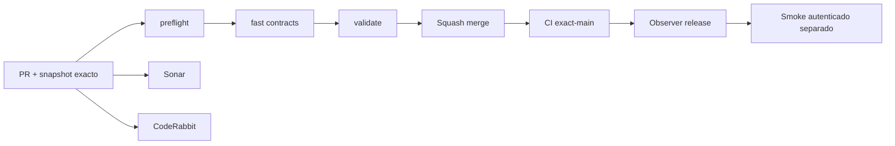

# GrindFlow — Último deploy

> **Snapshot v0.1.26: solo el deploy actual.** Base `main` v0.1.25 `fe0eea406de8b3325ff9bc37e5add85cafbdf7c9`. El home nuevo ya estaba fusionado en v0.1.25; este cambio fuerza a cargar su CSS nuevo y el estilo de los footers en cada versión. **No se declara Hostinger actualizado sin observarlo.**

## Progress convention
- ✅ ~~Completado~~ = verificado; 🚧 Pendiente = en curso; ⛔ bloqueado = dependencia externa.

## Fuentes de verdad
[AGENTS.md](AGENTS.md) · [Especificación](docs/GRINDFLOW-SPEC.md) · [Transición](docs/STACK-TRANSITION-SYMFONY.md) · [Roadmap #2](https://github.com/pl0n3r/GrindFlow/issues/2)

## Estado del deploy
| Señal | Estado | Evidencia |
| --- | --- | --- |
| Version objetivo | 🚧 **v0.1.26** | `config/version.php` |
| Base exacta | ✅ ~~main v0.1.25~~ | `fe0eea406de8b3325ff9bc37e5add85cafbdf7c9` |
| CI del PR | 🚧 Pendiente de head final | Gate `validate` |
| Sonar | 🚧 Pendiente de head final | PR nuevo |
| CodeRabbit | 🚧 Revisión por comprobar | PR nuevo |
| CI del SHA exacto de main | 🚧 Después de fusión | No inferir del PR |
| Deploy Observer | ⛔ No verificado en Hostinger | Release remoto independiente |
| Production Smoke | ⛔ Credencial E2E ausente | [Issue #1](https://github.com/pl0n3r/GrindFlow/issues/1) |
| Producción v0.1.26 | ⛔ No confirmada | CI ≠ despliegue |
| Migraciones | ✅ ~~Sin cambios de esquema~~ | CSS/Blade/metadatos |

## Huella del cambio
<!-- grindflow:git-delta -->
| Archivos | Inserciones | Eliminaciones | Neto |
| ---: | ---: | ---: | ---: |
| **14** | **+0** | **−0** | **+0** |

## Calidad y entrega
<!-- grindflow:gate-plan -->
| Control | Estado / contrato |
| --- | --- |
| Gates seleccionados | **preflight · fast[contracts] · php-quality · PHPUnit · browser · real-stack** |
| Alcance | Cache-busting de CSS en home, login, workspace y módulos; versionado y tests |
| Revisiones | CI/Sonar/CodeRabbit y exact-main independientes |

## Flujo de entrega

## Qué se hizo
- Los estilos de home/login y backend usan `css/grindflow.css?v=0.1.26` generado desde la configuración: cada release refresca CSS, sin cambiar endpoints ni datos.
- La versión humana sigue visible en front y backend, mediante un único `config/version.php`; incremento consecutivo **0.1.25 → 0.1.26**.
- AGENTS.md registra entregas pequeñas, visibles y verificables; prueba PHP obliga a mantener la URL CSS versionada.

## Archivos modificados en este deploy
- `AGENTS.md`
- `README.md`
- `config/version.php`
- `resources/views/admin/diagnostics.blade.php`
- `resources/views/admin/system.blade.php`
- `resources/views/auth/login.blade.php`
- `resources/views/dashboard.blade.php`
- `resources/views/distribution/index.blade.php`
- `resources/views/finance/index.blade.php`
- `resources/views/scheduling/index.blade.php`
- `resources/views/traffic/index.blade.php`
- `resources/views/vault/index.blade.php`
- `resources/views/welcome.blade.php`
- `tests/Feature/VisualShellTest.php`

## Validación
- Comprobar CI/Sonar del PR y CI exact-main tras merge, luego presencia de v0.1.26 en Hostinger.
- El footer informa versión humana, **no** demuestra el SHA del checkout remoto.

## Qué sigue
| Lane | Trabajo |
| --- | --- |
| **NOW** | 🚧 Confirmar CSS y footer v0.1.26, [roadmap #2](https://github.com/pl0n3r/GrindFlow/issues/2) |
| **NEXT** | 🚧 Primer avance pequeño S1 Symfony: login/tenant |
| **LATER** | 🚧 Biblioteca → reglas → distribución → Traffic |
| **BLOCKED / EXTERNAL** | ⛔ Observación Hostinger y credenciales E2E |

## Panorama general pendiente
| Lane | Frente | Estado |
| --- | --- | --- |
| **DONE** | ✅ ~~Home producto v0.1.25 fusionado~~ | ✅ ~~CI exact-main v0.1.25~~ |
| **NOW** | 🚧 CSS/footers sin caché vieja | 🚧 Confirmación remota |
| **NEXT** | 🚧 S1 identidad | 🚧 Backend Symfony |
| **LATER** | 🚧 Piloto | 🚧 Recorrido completo |
| **BLOCKED / EXTERNAL** | ⛔ Producción | ⛔ Sin verificación |
