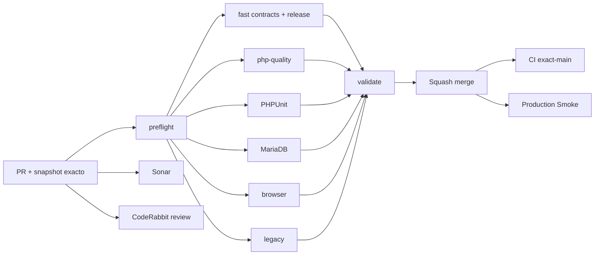

# GrindFlow — Último deploy

  
  
  

> **Development dashboard** de **solo el deploy actual**. Implementado, CI, deploy y validación productiva son estados distintos.

## Progress convention

- ✅ ~~Completado~~ = concluido y verificado por las compuertas que correspondan.
- 🚧 Pendiente = por hacer o en curso, sin tachado.

## Estado del deploy

| Señal | Estado | Evidencia |
| --- | --- | --- |
| Work line | 🚧 **GF-OPS · Operating model** | [Roadmap #88](https://github.com/drpipe1098-commits/GrindFlow/issues/88) |
| Base exacta | ✅ **VALIDATED IN CODE** | #87 squash en `9a1b2525b6d6eae5a15fbb3ab2c3a02844c82f5a`; PR #87 CI #400 `validate` verde |
| Version | 🚧 **v0.1.0** | bootstrap de versión humana; SHA desplegado independiente |
| CI del PR | 🚧 **por verificar** | core CI modificado: matriz completa del head final |
| Sonar | 🚧 **por verificar** | Quality Gate sobre head final |
| CodeRabbit | 🚧 **por revisar** | full review sobre head estable |
| CI del SHA exacto de main | 🚧 **por verificar** | independiente del CI del PR |
| Production Smoke | 🚧 **schema bloqueado** | [#69](https://github.com/drpipe1098-commits/GrindFlow/issues/69): seis pendientes en Smoke #35427532347 del SHA #87 |
| Migraciones | 🚧 **no ejecutadas** | backup externo restaurable + lote + aprobación explícita |

## Huella del cambio

<!-- grindflow:git-delta -->

| Archivos | Inserciones | Eliminaciones | Neto |
| ---: | ---: | ---: | ---: |
| **11** | **+453** | **−100** | **+353** |

## Calidad y entrega

<!-- grindflow:gate-plan -->

| Control | Estado / contrato |
| --- | --- |
| Gates seleccionados | **preflight · fast[contracts] · php-quality · PHPUnit · MariaDB · browser · legacy** |
| CI | comprueba versión semántica y README exacto; nunca escribe metadatos de release |
| Sonar + CodeRabbit | paralelo sobre head final |
| E2E | entorno sintético autenticado para validación realista; no muta producción |
| Deployment | Hostinger debe probar SHA remoto; versión no sustituye ese dato |

## Flujo de entrega

## Qué se hizo

- Se crea el [roadmap único #88](https://github.com/drpipe1098-commits/GrindFlow/issues/88) para prioridades, entregas tachadas y traspaso entre sesiones sin depender del chat.
- Se incorpora versión humana inicial `v0.1.0` en Admin > System, independiente del SHA exacto de Hostinger y del estado de migraciones.
- CI valida cada transición posterior de versión (patch +1 o minor deliberado) y prueba casos inválidos sin hacer commits automáticos.
- `AGENTS.md` y el modelo de desarrollo incorporan la regla expresa del propietario: Principal Software Engineer + Technical Executor, nueve capacidades multidisciplinarias simultáneas, ownership completo, decisiones reversibles autónomas y límites productivos protegidos.
- El README verifica el estado visual ✅/🚧, versión exacta y enlace al roadmap; sigue siendo un snapshot, no un changelog.

## Archivos modificados en este deploy

- `.github/workflows/grindflow-ci.yml` — compuerta de versión en fast.
- `AGENTS.md` — reglas durables de operación, progreso y entrega.
- `README.md` — snapshot exacto del PR.
- `config/version.php` — versión humana v0.1.0.
- `docs/DEVELOPMENT-MODEL.md` — entregas autónomas y versionadas.
- `docs/GRINDFLOW-SPEC.md` — contrato producto/version/deploy.
- `resources/views/admin/system.blade.php` — visualización v0.1.0.
- `scripts/ci-scope-contract.sh` — clasificador versión fast-only para PR futuros.
- `scripts/ci-scope.sh` — evita gates pesados por cambio de número aislado.
- `scripts/readme-dashboard.py` — valida progreso, roadmap y versión.
- `scripts/release-version.py` — valida transición semántica y self-tests.

## Validación

- Bootstrap de versión inicial: `0.1.0`; ningún dato productivo modificado.
- Cambios de CI core fuerzan matriz completa; revisión del PR y validaciones exact-main se registran por separado.
- El último Production Smoke verificado para #87 indica **seis** migraciones pendientes; la nueva política no las ejecuta.

## Qué sigue

| Lane | Trabajo |
| --- | --- |
| **NOW** | 🚧 Validar el PR de operación, Sonar, CodeRabbit y exact-main; cerrar fase 0 en [#88](https://github.com/drpipe1098-commits/GrindFlow/issues/88). |
| **NEXT** | 🚧 Auditar artefactos [#69](https://github.com/drpipe1098-commits/GrindFlow/issues/69), backup y lote de migraciones. |
| **LATER** | 🚧 Providers reales en sandbox y auditoría por intento. |
| **BLOCKED / EXTERNAL** | 🚧 Backup/aprobación del esquema, S3/FFmpeg y validación productiva. |

## Panorama general pendiente

| Lane | Frente | Estado |
| --- | --- | --- |
| **DONE** | ✅ ~~Scheduling + Distribution + Traffic en código PR #87~~ | ✅ ~~CI PR aprobado; no equivale a producción~~ |
| **NOW** | 🚧 Modelo de entrega/versionado | 🚧 [#88](https://github.com/drpipe1098-commits/GrindFlow/issues/88) |
| **NEXT** | 🚧 Migraciones y storage | 🚧 [#34](https://github.com/drpipe1098-commits/GrindFlow/issues/34) · [#40](https://github.com/drpipe1098-commits/GrindFlow/issues/40) |
| **LATER** | 🚧 Finance y paridad del legado | 🚧 Tras esquema/productividad |
| **BLOCKED / EXTERNAL** | 🚧 Producción | 🚧 Backup restaurable, autorización y SHA desplegado |
