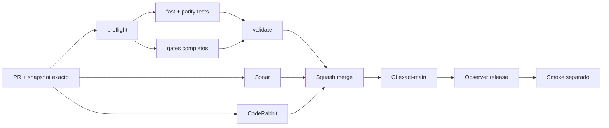

# GrindFlow — Último deploy

> **Candidato v0.1.104: menú móvil coherente entre preview y admin Symfony.** Base exacta `main` v0.1.103 `47e712461d59707fd4b987cbfac94840e831414e`; al cambiar sección o anchura, la opción activa permanece visible sin desplazar el documento por el menú.

## Progress convention
- ✅ ~~Completado~~ = verificado; 🚧 Pendiente = en curso; ⛔ bloqueado = dependencia externa.

## Fuentes de verdad
[AGENTS.md](AGENTS.md) · [Spec](docs/GRINDFLOW-SPEC.md) · [Requisitos](docs/REQUIREMENTS.md) · [Transición](docs/STACK-TRANSITION-SYMFONY.md) · [Roadmap #2](https://github.com/pl0n3r/GrindFlow/issues/2)

## Estado del deploy
| Señal | Estado | Evidencia |
| --- | --- | --- |
| Version objetivo | 🚧 **v0.1.104** | `config/version.php`; no publicada |
| Base exacta | ✅ ~~main v0.1.103~~ | `47e712461d59707fd4b987cbfac94840e831414e` |
| CI del PR | 🚧 Pendiente | Exigir `validate` del HEAD final |
| Sonar del PR | 🚧 Pendiente | Exigir Quality Gate del HEAD final |
| CodeRabbit del PR | 🚧 Pendiente | Exigir full review del HEAD final |
| CI del SHA exacto de main | ✅ **VALIDATED IN CODE** | `35809023720` success sobre `47e712461d59707fd4b987cbfac94840e831414e` |
| Deploy Observer | 🚧 Pendiente | No inferir checkout remoto |
| Production Smoke | ⛔ Login E2E no validado | `35809023690` failure, #73; independiente de esta mejora |
| Symfony en Hostinger | ⛔ NO desplegado | Sin cutover |
| Datos productivos | ✅ ~~No tocados~~ | Pruebas en Symfony/MariaDB descartable; sin cambio de cuentas reales |

## Huella del cambio
<!-- grindflow:git-delta -->
| Archivos | Inserciones | Eliminaciones | Neto |
| ---: | ---: | ---: | ---: |
| **6** | **+0** | **−0** | **+0** |

## Calidad y entrega
<!-- grindflow:gate-plan -->
| Control | Estado / contrato |
| --- | --- |
| Gates seleccionados | **preflight · fast[operational contracts + automation syntax + README dashboard] · symfony-preview** |
| Gate agregador obligatorio | **validate**: todos los seleccionados; Sonar y CodeRabbit aparte |
| Alcance | GF-UX-001: visibilidad de sección activa y menú horizontal a 360 px |
| Revisiones | CI/Sonar/CodeRabbit HEAD; exact-main, Observer y Smoke separados |

## Flujo de entrega

## Qué se hizo
- `WorkspaceNavigation` compartido revela dentro del scroll horizontal la opción activa cuando cambia la sección o el viewport; nunca usa `scrollIntoView` sobre el documento.
- Menú móvil a 360 px añade pista visible para desplazar horizontalmente y scrollbar fino, conservando la misma marca, jerarquía y estados `aria-pressed` / `aria-current` en preview y admin.
- Chromium sintético ejercita selección fuera de pantalla sin scroll automático del tester, regreso a primera opción, reducción 820→360 px y menú privado tras cambio de hash; confirma ausencia de overflow de la página.
- GF-UX-001 actualizado sin tocar sesiones, datos, permisos, Laravel, Hostinger ni cutover.

## Archivos modificados en esta entrega candidata
Inventario de solo esta entrega candidata: no constituye evidencia de publicación:
<!-- grindflow:changed-files -->
- `README.md`
- `config/version.php`
- `docs/REQUIREMENTS.md`
- `symfony/frontend/admin/WorkspaceNavigation.tsx`
- `symfony/frontend/admin/workspace-navigation.css`
- `symfony/tests/e2e/preview.spec.mjs`

## Validación
- Exigir `validate`, Sonar y full review CodeRabbit sobre el HEAD final; después CI exact-main.
- `symfony-preview` compila React/TypeScript y ejecuta Chromium a 360 y 820 px sobre build aislado.
- El release no demuestra deployment Symfony ni resuelve Production Smoke #73 del Laravel operativo.

## Qué sigue
[Roadmap canónico #2](https://github.com/pl0n3r/GrindFlow/issues/2)

| Lane | Trabajo | Estado |
| --- | --- | --- |
| **NOW** | 🚧 Visibilidad del menú móvil compartido | 🚧 v0.1.104 candidata |
| **NEXT** | 🚧 Verificación autorizada de cuenta E2E | 🚧 #2 |
| **LATER** | 🚧 Conmutación Symfony por módulo | 🚧 Sin deploy |
| **BLOCKED / EXTERNAL** | ⛔ Resolver login E2E productivo | ⛔ #2 |

## Panorama general pendiente
| Lane | Frente | Estado |
| --- | --- | --- |
| **DONE** | ✅ ~~v0.1.103 fusionada~~ | ✅ ~~contrato JSON uniforme en Symfony~~ |
| **NOW** | 🚧 Navegación activa responsive preview/admin | 🚧 v0.1.104 |
| **NEXT** | 🚧 Evidencia revisada fuera de banda + autorización separada | 🚧 GF-ARCH-002 sin cutover |
| **LATER** | 🚧 Symfony en Hostinger | 🚧 No desplegado |
| **BLOCKED / EXTERNAL** | ⛔ Smoke autenticado Laravel | ⛔ #2 |
