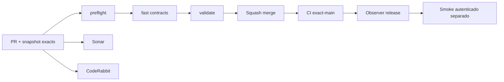

# GrindFlow — Último deploy

> **Candidato v0.1.73: handoff manual auditado S4.** Base exacta `main` v0.1.72 `c78d311e0339c26d555eb76b9d0a9bd524055e87`, con CI exact-main success. El handoff registra preparación/resultado humano sin llamar proveedores ni afirmar publicación externa.

## Progress convention
- ✅ ~~Completado~~ = verificado; 🚧 Pendiente = en curso; ⛔ bloqueado = dependencia externa.

## Fuentes de verdad
[AGENTS.md](AGENTS.md) · [Spec](docs/GRINDFLOW-SPEC.md) · [Requisitos](docs/REQUIREMENTS.md) · [Transición](docs/STACK-TRANSITION-SYMFONY.md) · [Roadmap #2](https://github.com/pl0n3r/GrindFlow/issues/2)

## Estado del deploy
| Señal | Estado | Evidencia |
| --- | --- | --- |
| Version objetivo | 🚧 **v0.1.73** | `config/version.php` |
| Base exacta | ✅ ~~main v0.1.72~~ | `c78d311e0339c26d555eb76b9d0a9bd524055e87` |
| CI del PR | 🚧 Head v0.1.73 por validar | `GrindFlow CI / validate` |
| Sonar | 🚧 Pendiente | SonarCloud PR |
| CodeRabbit | 🚧 Pendiente | PR |
| CI del SHA exacto de main | ✅ ~~v0.1.72 success~~ | run `35641498049` |
| Deploy Observer | ✅ ~~v0.1.72 observado~~ | run `35641498057`; versión humana, no prueba Symfony ni SHA remoto |
| Production Smoke | ⛔ Credencial E2E productiva pendiente | run `35641498009`; [Issue #1](https://github.com/pl0n3r/GrindFlow/issues/1) |
| Symfony S3 en Hostinger | ⛔ NO desplegado | Solo entorno aislado CI |
| Migraciones | 🚧 Ledger manual + FK compuesto + triggers append-only en MariaDB descartable | Producción intacta |

## Huella del cambio
<!-- grindflow:git-delta -->
| Archivos | Inserciones | Eliminaciones | Neto |
| ---: | ---: | ---: | ---: |
| **16** | **+903** | **−40** | **+863** |

## Calidad y entrega
<!-- grindflow:gate-plan -->
| Control | Estado / contrato |
| --- | --- |
| Gates seleccionados | **preflight · fast[contracts] · php-quality · PHPUnit · MariaDB · browser · real-stack · legacy · symfony-preview** |
| Alcance | S4: prepare/complete/fail manual auditado; sin proveedor ni publicación automática |
| Revisiones | CI/Sonar/CodeRabbit, exact-main y Hostinger independientes |

## Flujo de entrega

## Qué se hizo
- Nuevo ledger `gf_manual_handoff_events` tenant-safe y append-only, con transición humana `prepare → complete/fail` y retry explícito `fail → prepare`.
- Admin/Studio registran handoff con CSRF dedicado; Editor/Model conservan lectura sin permiso de cierre manual.
- `complete`/`fail` solo se aceptan cuando el horario UTC ya llegó. Un handoff preparado o completado bloquea la cancelación del borrador para evitar historiales contradictorios.
- React móvil muestra estado y acciones de handoff. Cada respuesta confirma `publishes=false`, `provider_calls=false` y `external_evidence=false`.

## Archivos modificados en este deploy
Inventario de solo el deploy actual (candidato); no prueba despliegue Symfony en Hostinger.
- `.github/workflows/grindflow-ci.yml`
- `README.md`
- `config/version.php`
- `docs/GRINDFLOW-SPEC.md`
- `docs/REQUIREMENTS.md`
- `symfony/frontend/admin/AdminApp.tsx`
- `symfony/frontend/admin/ScheduleDraftPanel.tsx`
- `symfony/frontend/admin/WeeklyPlannerPanel.tsx`
- `symfony/frontend/admin/admin.css`
- `symfony/migrations/Version20260921193000.php`
- `symfony/src/Http/Controller/AdminContextController.php`
- `symfony/src/Http/Controller/ManualHandoffController.php`
- `symfony/src/Http/Controller/ScheduleDraftController.php`
- `symfony/src/Identity/Application/MembershipContext.php`
- `symfony/tests/e2e/preview.spec.mjs`
- `symfony/tests/php/ManualHandoffTest.php`

## Validación
- CI/Sonar/CodeRabbit del candidato v0.1.73 por verificar; la base v0.1.72 tiene CI exact-main success.
- El gate Symfony debe probar migración reversible, PHPUnit/MariaDB, TypeScript/Vite y Chromium móvil. Producción permanece intacta.

## Qué sigue
[Roadmap canónico #2](https://github.com/pl0n3r/GrindFlow/issues/2)

| Lane | Trabajo | Estado |
| --- | --- | --- |
| **NOW** | 🚧 Validar handoff manual S4 v0.1.73 | 🚧 CI y revisión |
| **NEXT** | 🚧 S4 destino manual explícito / cola interna | 🚧 Sin proveedor real |
| **LATER** | 🚧 Distribución autorizada + Traffic Symfony | 🚧 S4–S5 |
| **BLOCKED / EXTERNAL** | ⛔ Cutover sin paridad/datos migrados; Smoke sin credencial | ⛔ Dependencia externa |

## Panorama general pendiente
| Lane | Frente | Estado |
| --- | --- | --- |
| **DONE** | ✅ ~~Dashboard Laravel v0.1.30~~ | ✅ ~~Vault Symfony clasificación v0.1.63~~ |
| **NOW** | 🚧 Handoff manual S4 v0.1.73 | 🚧 CI y revisión |
| **NEXT** | 🚧 Destino manual explícito / cola interna | 🚧 Sin proveedor real |
| **LATER** | 🚧 Distribución + Traffic Symfony | 🚧 S4–S5 |
| **BLOCKED / EXTERNAL** | ⛔ Sin cutover Symfony | ⛔ Sin credencial Smoke |
