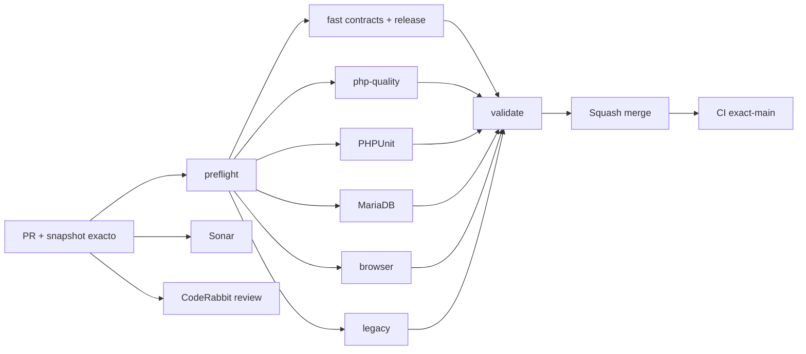

# GrindFlow — Último deploy

  
  
  

> **Snapshot del PR candidato operativo v0.1.5; no es evidencia de deploy. El contrato «solo el deploy actual» aplica al publicarse.** `main` v0.1.4 validado en CI; Production Smoke reporto siete migraciones pendientes.

## Progress convention
- ✅ ~~Completado~~ = concluido y verificado por compuertas aplicables.
- 🚧 Pendiente = por hacer o en curso, sin tachado.

## Estado del deploy
| Señal | Estado | Evidencia |
| --- | --- | --- |
| Work line | 🚧 **GF-OPS · Owner-approved migration bridge** | [Roadmap #88](https://github.com/drpipe1098-commits/GrindFlow/issues/88) |
| Base exacta | ✅ **v0.1.4 · PR #94** | `main` `d7c26ac25f83efb0b3d48514a0190320b5bb1ccf` |
| Version | 🚧 **v0.1.5** | parche operativo del bridge de migraciones |
| CI del PR | 🚧 **pendiente** | full matrix por cambio en CI core |
| Sonar | 🚧 **pendiente** | Quality Gate del head estable |
| CodeRabbit | 🚧 **pendiente** | review del head estable |
| CI del SHA exacto de main | ✅ **v0.1.4 validado** | validate #35450874894 |
| Production Smoke | 🚧 **schema bloqueado** | 7 migraciones; Vault read-only OK |
| Migraciones | 🚧 **accion expresa** | lote siete, backup confirmado por operador |

## Huella del cambio
<!-- grindflow:git-delta -->
| Archivos | Inserciones | Eliminaciones | Neto |
| ---: | ---: | ---: | ---: |
| **6** | **+248** | **−72** | **+176** |

## Calidad y entrega
<!-- grindflow:gate-plan -->
| Control | Estado / contrato |
| --- | --- |
| Gates seleccionados | **preflight · fast[contracts] · php-quality · PHPUnit · MariaDB · browser · legacy** |
| Disparador | owner-only, issue #34, comando exacto para lote aprobado |
| Precheck | conteo 7, formulario unico, token CSRF y fingerprint validos |
| Escritura | un solo POST sin retry, backup confirmado y texto MIGRAR |
| Postcheck | consulta autenticada y conteo restante 0; fallo no se declara exito |

## Flujo de entrega

## Qué se hizo
- El bridge preserva el comando historico de una migracion y admite siete solo con comando exacto del owner y backup confirmado.
- Antes de modificar produccion valida el conteo exacto, formulario unico, CSRF y fingerprint del lote pendiente.
- El formulario Laravel recibe los tres campos obligatorios y CSRF. Un POST ambiguo no se reintenta.
- El contrato HTTP sintetico cubre 7→0, conteo distinto, fingerprint duplicado y POST rechazado.
- El resultado auditado solo muestra conteos y estado; no almacena credenciales ni HTML interno.

## Archivos modificados en este deploy propuesto (v0.1.5; no desplegado)
- `.github/workflows/grindflow-ci.yml` — contrato de migracion en fast CI.
- `.github/workflows/production-migration.yml` — aprobacion owner-only para lote siete.
- `README.md` — snapshot exacto del bridge v0.1.5.
- `config/version.php` — patch operativo v0.1.5.
- `scripts/production-migration-contract.py` — tests HTTP sinteticos.
- `scripts/run-production-migrations.sh` — preflight y POST autenticado con fingerprint.

## Validación
- `main` v0.1.4 exacto `d7c26ac25f83efb0b3d48514a0190320b5bb1ccf`: CI validate #35450874894 success.
- El bridge v0.1.5 aun requiere CI, Sonar y CodeRabbit del head estable.
- Production Smoke #35450874881: siete migraciones pendientes, GET autenticado del Vault OK.
- Ninguna migracion de produccion se ejecuta durante CI, PR, merge o deploy automatico.

## Qué sigue
| Lane | Trabajo |
| --- | --- |
| **NOW** | 🚧 Validar bridge, fusionar y ejecutar lote aprobado; [roadmap #88](https://github.com/drpipe1098-commits/GrindFlow/issues/88). |
| **NEXT** | 🚧 Revalidar Product Smoke autenticado en produccion. |
| **LATER** | 🚧 Retomar Distribution audit PR #95 con version rebasada. |
| **BLOCKED / EXTERNAL** | 🚧 Produccion: abortar si conteo/fingerprint cambia o servidor no tiene codigo revisado. |

## Panorama general pendiente
| Lane | Frente | Estado |
| --- | --- | --- |
| **DONE** | ✅ ~~PR #94 y CI exact-main~~ | ✅ ~~v0.1.4 validado en codigo~~ |
| **NOW** | 🚧 Bridge controlado de siete migraciones | 🚧 v0.1.5 |
| **NEXT** | 🚧 Distribution audit | 🚧 PR #95 pendiente |
| **LATER** | 🚧 Storage S3 y paridad del legado | 🚧 #40 |
| **BLOCKED / EXTERNAL** | 🚧 Estado productivo | 🚧 schema y deploy verificable |
